# Python 教程

## BBC Miciro:bt和Makecode

### 第1小节 Micro:bit主板的介绍

Micro:bit主板是英国广播公司设计的，旨在帮助7年级（11-12岁）及以上的孩子更好地学习编程。Micro:bit主板拥有丰富的板资源，包括一个5\*5 LED点阵、2个可编程按钮、指南针、Micro USB端口、蓝牙模块等。它只有信用卡一半大小(4cm×5cm)，但功能非常强大。它可以用于编写电子游戏，声光互动，机器人控制，科学实验，可穿戴装置开发等，可以实现任何酷炫的小发明，无论是机器人还是乐器，没有做不到只有想不到。

新款的Micro:bit V2.2主板上有一个可触摸感应的Logo和MEMS麦克风。背面还添加了一个蜂鸣器，这样就可以在没有外部设备的情况下播放各种声音。底部的金手指加上齿轮设计，方便用户更好地固定鳄鱼夹。此外，Micro:bit V2.2主板还支持休眠模式，用户可以长按Micro:bit V2.2主板后面的复位&电源按钮，使其进入睡眠模式，降低电池功耗。最重要的特点是Micro:bit V2.2主板的CPU性能比V1.5版本好得多，外加更多的RAM。所以Micro:bit V2.2允许用户扩展更多的功能，创造更多的创意作品。

（2）Micro:bit主板硬件分布图介绍：

 Micro:bit V2.2主板

有关更多内容，请参阅：[<u>https://tech.microbit.org/hardware/</u>](https://tech.microbit.org/hardware/)

<https://microbit.org/new-microbit/>

[<u>https://www.microbit.org/get-started/user-guide/overview/</u>](https://www.microbit.org/get-started/user-guide/overview/)

[<u>https://microbit.org/get-started/user-guide/features-in-depth/</u>](https://microbit.org/get-started/user-guide/features-in-depth/)

（3）Micro:bit引脚配置介绍，如下图所示：

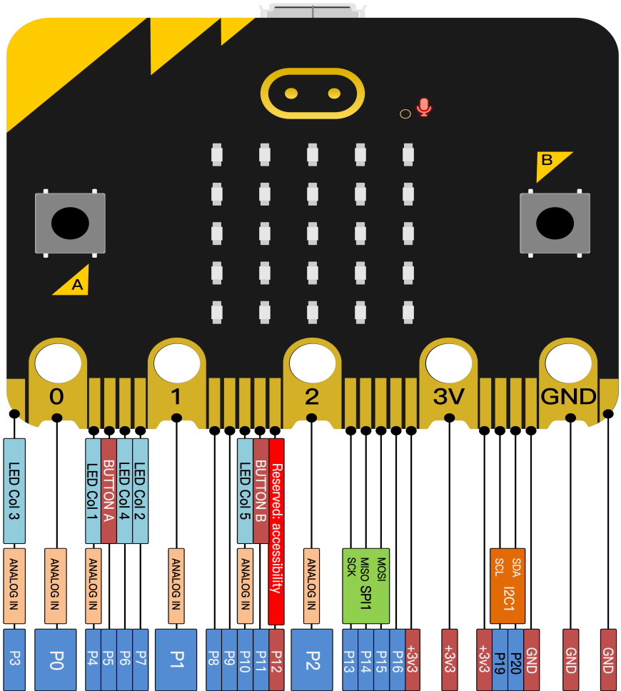

Micro:bit引出的引脚中，其引脚功能分类如下表所示：

|GPIO|P0，P1，P2，P3，P4，P5，P6，P7，P8，P9，P10，P11，P12，P13，P14，P15，P16，P19，P20|
|-|-|
|ADC/DAC|P0，P1，P2，P3，P4，P10|
|IIC|P19（SCL），P20（SDA）|
|SPI|P13（SCK），P14（MISO），P15（MOSI）|
|PWM（常用）|P0，P1，P2，P3，P4，P10|
|PWM（不常用）|P5、P6、P7、P8、P9、P11、P12、P13、P14、P15、P16、P19、P20|
|已占用|P3(LED Col3)，P4(LED Col1)，P5(Button A)，P6(LED Col4)，P7(LED Col2)，P10(LED Col5)，P11(Button B)|

详细信息请参考官方网站：[<u>https://tech.microbit.org/hardware/edgeconnector/</u>](https://tech.microbit.org/hardware/edgeconnector/)

<https://microbit.org/guide/hardware/pins/>

（4）新款Micro:bit V2.2主板使用注意事项：

- a. Micro:bit V2.2主板上有很多精密的电子元件，建议戴上硅胶保护套进行使用，防止短路。

- b. Micro:bit   V2.2主板的IO口驱动能力很弱，IO口电流不足300mA，请勿接大电流器件（例如大舵机MG995、直流电机），否则会烧坏Micro:bit   V2主板，使用前必须完全了解清楚你所使用的器件电流情况，一般建议配搭Micro:bit扩展板进行使用。

- c. 供电建议从Micro:bit   V2.2主板的USB口进行供电，或者Micro:bit V2.2主板上的3V电池座接口。Micro:bit V2.2主板本身IO口是3V电平，所以是不支持5V传感器的，如需支持5V传感器需要使用Micro:bit扩展板。

- d. 使用与Micro:bit   V2.2主板LED点阵的共用引脚（如P3、P4、P6、P7、P10），记得在代码中把LED点阵禁用掉，否则会有LED点阵显示杂乱和可能让所接传感器数据出错的现象。

- e. 3V电池座接口上不能使用超过3.3V电池，否则很容易会把Micro:bit V2.2主板烧坏。

- f. 禁止放在金属制品上使用，以免发生短路。

总结：Micro:bit V2.2主板就像是一台微型计算机，它使编程变得有形，并促进数字创造力。关于编程环境，BBC提供了一个在线编程网站：<https://microbit.org/code/>，该网站有一个易于使用的图形化程序MakeCode。

### 第2小节 Micro:bit驱动安装说明：

如果你已经安装过micro:bit驱动，就不需要再次安装micro:bit驱动。假如你是首次使用micro:bit主板，则你的电脑需要安装micro:bit驱动，我们提供的micro:bit驱动文件

和micro:bit驱动安装手册都在文件夹“安装Micro:bit驱动”里面，你可以进入相关文件夹中根据说明书进行安装。

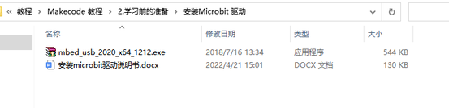

### 第3小节 快速开始

#### 3.1 Python介绍

以下的步骤说明基于Windows操作系统，如果你使用的是其他操作系统，可以将其作为参考。

本教程是为Python语言编写的，如果想要使用图形化代码编程，请参阅手册”Makecode教程”。代码文件是以“.py”结尾的文件。

Python是一种基于文本的语言，广泛应用于教育领域，也被数据科学和机器学习等领域的专业程序员使用。在庞大的教育者和计算专家社区的支持下，Python是继图形化编程之后的一个伟大的编程语言工具，是对基于文本编程的完美引入。

micro：bit可以用Python语言编程。由于micro：bit是一个微控制器，硬件的不同使得micro：bit不能完全支持Python。这里有一个是MicroPython，它是专门为micro：bit设计的，MicroPython是python3编程语言的一个精简而高效实现，它包含Python标准库的一小部分，并且经过优化，可以在micro：bit微控制器上运行。BBC micro:bit使用的Python版本称为MicroPython。
非常适合那些想要继续深入学习编程的人群，用一系列代码段、各种预制图像和音乐帮助你进行编程。BBC microbit MicroPython的官方说明链接：<https://microbit-micropython.readthedocs.io/en/latest/tutorials/introduction.html>

Python代码有两种类型的编辑器（web版和离线版）。

1.  Python代码编辑器的web版本（Micro:bit官方链接）如下：<https://python.microbit.org/v/1.1>

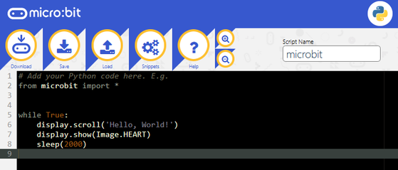

Micro:bit官方在线代码编写平台，使用常用浏览器直接打开上述网址即可使用。

2.  Micro:bit官方也推出了一个离线的编译工具Mu，方便在没有网络连接的时候也可以进行创意和教学

。对于Windows和MAC用户，可以使用独立软件Mu(离线的编译工具)     。 (Mu软件下载链接：<https://codewith.mu/en/download>)

本教程也基于在本地离线模式使用Mu软件作为Python代码编辑器来完成项目实验。

#### 3.2 Mu介绍

Mu的官方网站：[<u>https://codewith.mu/</u>](https://codewith.mu/)

Mu是一个面向初学者程序员的Python代码编辑器，它基于教师和学生。获得Mu最简单和最容易的方法是通过Windows或Mac OSX的官方安装程序(Mu不再支持32位Windows)。目前推荐的版本是Mu 1.1.1。建议你们通过每个支持的操作系统的链接更新到这个版本.（注意：micro:bit2.2主板需要MU1.1.1以上的版本才能兼容）

确定版本并且下载Mu安装程序

先了解您的计算机是Windows系统还是Mac OSX系统；再打开资源管理器，鼠标右键点击”此电脑”，并选择属性，了解您的Windows系统是32位还是64位。

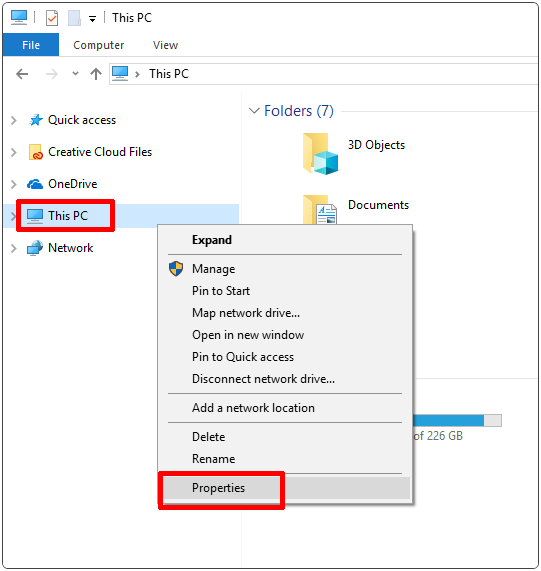

查看系统类别，类型将显示在操作系统下，64位系统或者32位系统：

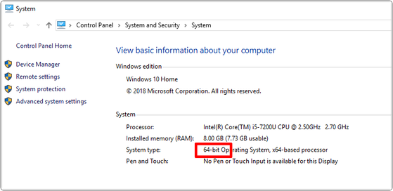

打开链接：<https://codewith.mu/en/download>下载对应的Mu软件版本。

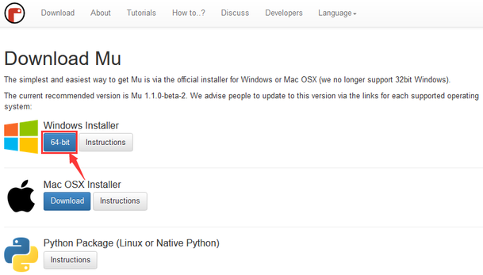

步骤2-运行安装程序：

Mac OSX系统安装Mu方法对应链接：[<u>https://codewith.mu/en/howto/1.1/install_macos</u>](https://codewith.mu/en/howto/1.1/install_macos)

Windows 10 系统

（1）找到你刚刚下载的安装程序（它可能在你的下载文件夹中），双击打开安装程序文件。

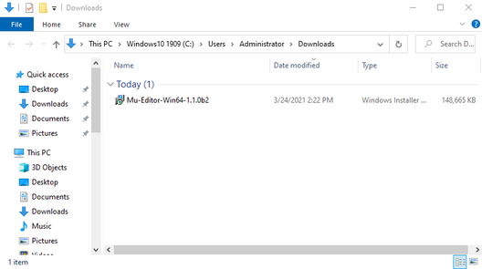

（2）检查许可证，选择复选框并单击“Install”。

(3)当Mu在你的电脑上安装时，需要几分钟。

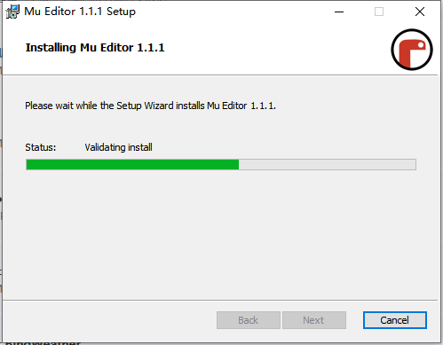

（4）安装已成功完成，请单击“完成”关闭安装程序。

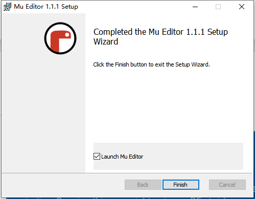

第9步-启动Mu

你可以点击开始菜单中的图标启动Mu，也可以在搜索框中输入Mu(下面两种方法都有显示)。在第一次开始时，这可能需要一些时间。

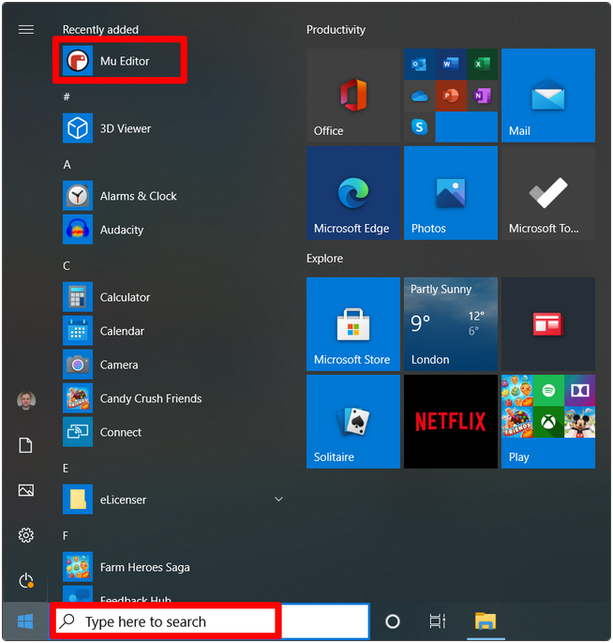

Mu的主界面如下图所示：

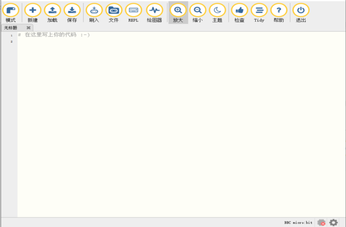

新建程序代码编辑区。

从计算机加载“ py”程序文件。

当您单击“保存”按钮时，该代码将以“ py”格式保存到您的计算机。

您需要确保已连接micro：bit到计算机，当您单击“
刷入”按钮时，代码将在micro：bit上运行（或在

micro：bit点矩阵上滚动看到错误消息）。

当你点击“Files”按钮，可以将电脑上的库文件移到micro:bit上。

当你先点击“REPL”按钮,再按下micro:bit后面的复位按钮，可以读取数字信号或模拟信号等。

 点击“
+”按钮将放大代码字体。

点击“-”按钮将缩小代码的字体。

单击“主题”在白天和黑夜主题之间切换。

编写代码后，单击“检查”按钮进行检查代码。

单击“帮助”按钮将在浏览器中弹出一个页面，该页面将为您提供一些帮助。

单击“退出”按钮关闭Mu软件。 关闭之前，Mu将确保您已保存程序文件。

#### 3.3上传第一个程序

实现功能：在micro：bit点矩阵上显示“心型” 图案

1.  通过micro USB电缆将micro：bit连接,选择micro:bit模式

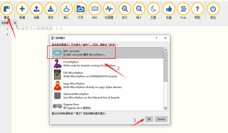

（2）您可以在编辑区域中编写代码，也可以点击加载我们提供的例程程序；

Note:

1 - 必须区分大写字母/小写字母！

2 - 正确拼写!

3 - 诸如＃之类的关键字在内容之间需要一个空格。

4 - 该程序以空白程序结尾.

5 - 与C语言相比，块主体（例如while的主体由缩进标记），Python完全消除了花括号（以及后缀的分号），并使用缩进结构来表示关系。

6 - 使用Tab键（tab）进行缩进。

（3）编写代码后，我们可以单击拇指图标的“检查”按钮来检查我们的代码。

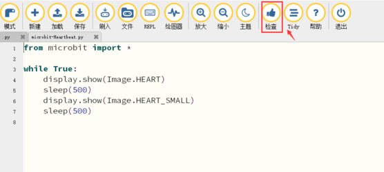

6\. 检查完成后，如果代码没有错误。 您需要单击“刷入”按钮。

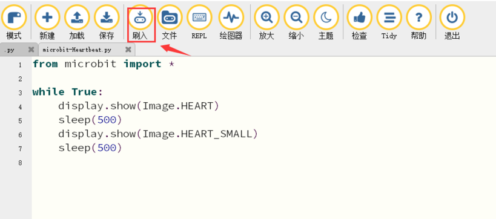

7.  单击“
刷入”后，您可以观察到micro：bit板上的指示灯正在闪烁，表明正在下载程序。
如下图所示。

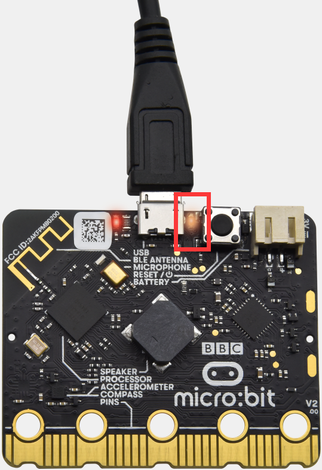

8.  指示灯点亮时，表示程序已成功下载。

9.  此时，您可以看到micro：bit上的LED点阵正在显示跳跃的“ 心型”。如下图所示。

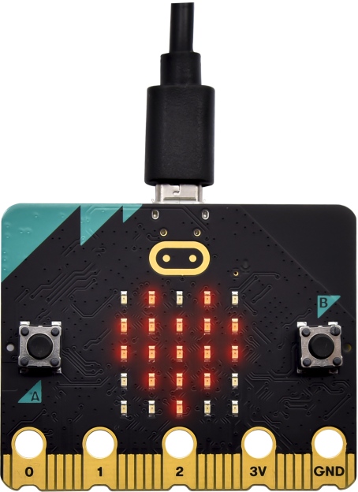
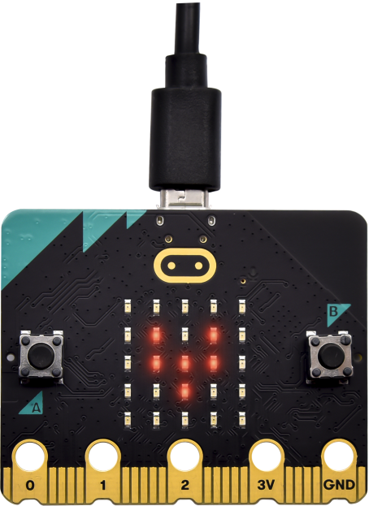
## 实验课程

### Microbit 基础课程

#### 第一课 闪烁的心

实验说明：

首先先来练习一个不需要其他辅助元件，只需要一块micro：bit主板和一根micro USB数据线的简单实验，让micro：bit显示“闪烁的心”，这是一个让micro：bit主板和PC机通信的实验，这也是一个入门实验，希望可以带领大家进入micro：bit的魔幻世界。

准备：

（1）通过micro USB线连接micro：bit和电脑。

（2）打开离线版本的Mu软件。

实验代码：

打开Mu软件，点击菜单栏中
“模式“按钮并在弹出对话框中选择“BBC micro：bit”之后，单击“OK”。

点击“加载”按钮，选择“第1课
闪烁的心.py”文件，然后单击“打开”。加载文件路径如下表所示：

|文件类型|路径|文件名|
|-|-|-|
|Python|Python 教程\3.实验课程\Microbit 基础课程\第1课闪烁的心\代码|第1课 闪烁的心.py|

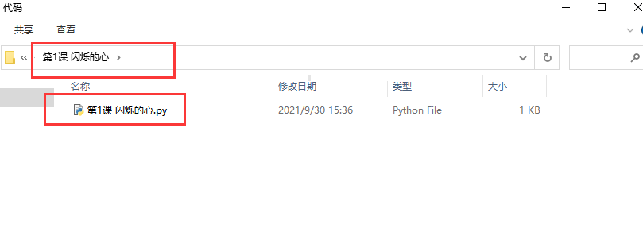

除了上述Mu软件加载（导入）代码方法之外，还有一种更简单的加载代码方法：先打开Mu软件，然后选中“第1课
闪烁的心.py”文件，并继续按下鼠标左键，将选中的文件拖动到Mu软件中。

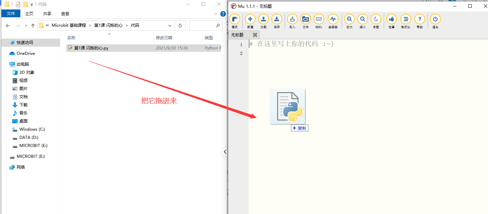

成功加载如下所示。你也可以自己在编辑窗口输入代码。（注意！所有英文及符号均须以英文填写，最后一行必须有空格。）

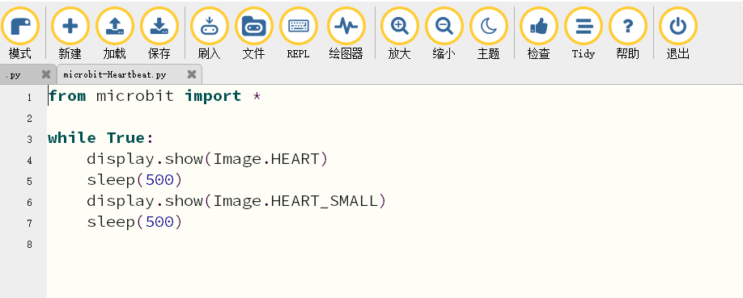

以下是内置图像的列表：

• Image.HEART

• Image.HEART_SMALL

• Image.HAPPY

• Image.SMILE

• Image.SAD

• Image.CONFUSED

• Image.ANGRY

• Image.ASLEEP

• Image.SURPRISED

• Image.SILLY

• Image.FABULOUS

• Image.MEH

• Image.YES

• Image.NO

• Image.CLOCK12, Image.CLOCK11, Image.CLOCK10, Image.CLOCK9, Image.CLOCK8, Image.CLOCK7, Image.CLOCK6, Image.CLOCK5,

Image.CLOCK4, Image.CLOCK3, Image.CLOCK2,Image.CLOCK1

• Image.ARROW_N, Image.ARROW_NE, Image.ARROW_E, Image.ARROW_SE, Image.ARROW_S, Image.ARROW_SW, Image.ARROW_W, Image.ARROW_NW

• Image.TRIANGLE

• Image.TRIANGLE_LEFT

• Image.CHESSBOARD

• Image.DIAMOND

• Image.DIAMOND_SMALL

• Image.SQUARE

• Image.SQUARE_SMALL

• Image.RABBIT

• Image.COW

• Image.MUSIC_CROTCHET

• Image.MUSIC_QUAVER

• Image.MUSIC_QUAVERS

• Image.PITCHFORK

• Image.PACMAN

• Image.TARGET

• Image.TSHIRT

• Image.ROLLERSKATE

• Image.DUCK

• Image.HOUSE

• Image.TORTOISE

• Image.BUTTERFLY

• Image.STICKFIGURE

• Image.GHOST

• Image.SWORD

• Image.GIRAFFE

• Image.SKULL

• Image.UMBRELLA

•
Image.SNAKE，Image.ALL_CLOCKS，Image.ALL_ARROWS

通过micro USB线连接micro：bit和电脑，点击“刷入”按钮将代码下载到micro：bit。

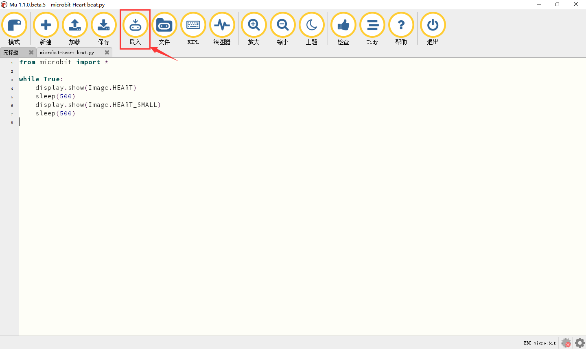

如果代码有错误，也可以将代码成功下载到micro：bit，但无法正常工作。如果sleep写为sleeps，点击“加载”按钮，代码也会被下载到micro：bit。

下载完成后，led矩阵提示一些错误信息，以及错误的行号。点击“REPL”按钮之后，再按下micro：bit的重置按钮（背面的复位按钮，不是A、B按键），错误信息将显示在REPL框中，如下所示：

再次单击“REPL”按钮，将关闭REPL模式，然后你就可以刷新新代码了。为了确保代码正确，完成代码后，单击“检查”按钮检查代码是否有错误。如下图所示，点击“检查”按钮，然后Mu将指示代码的错误。

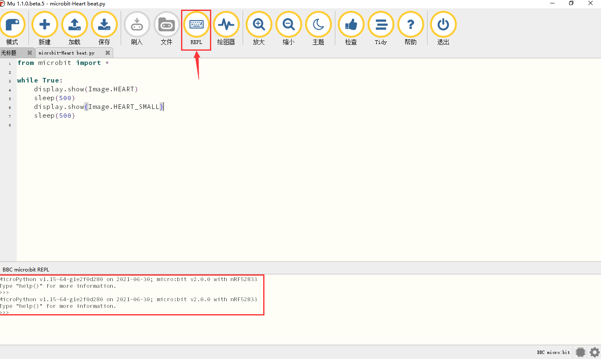

根据错误提示，正确修改代码。然后再点击“检查”按钮，Mu在下面的栏上显示没有问题。

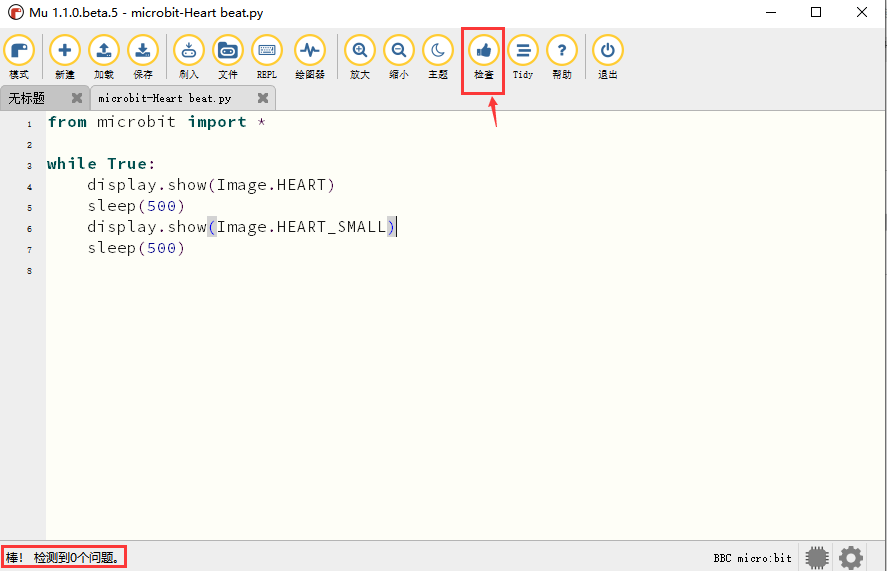

有关使用Mu的更多教程，请参阅：<https://codewith.mu/en/tutorials/>

实验结果:

代码完成之后，经过点击“检查”按钮检查代码无误后，再点击“刷入”按钮，将代码上传到micro：bit，micro USB数据线不要拔下来，利用micro USB数据线上电，就可以看到micro:bit上的LED点阵屏循环显示“❤”图案和“

”图案。

代码说明：

|from microbit import*|导入micro：bit的库文件|
|-|-|
|while True:|这是一个永久循环，它使micro：bit永远执行这个循环中的代码。|
|display.show(Image.HEART)|micro：bit上的LED点阵显示“❤”图案|
|sleep(500)|延时500毫秒|
|display.show(Image.HEART_SMALL)|micro：bit上的LED点阵显示“”图案|

#### 第二课 LED点阵中单个LED显示

实验说明：

micro：bit主板的LED点阵共由25个发光二极管组成，5个一组，分别对应X和Y方向，形成一个5×5的矩阵，且每个发光二极管是放置在行线（X）和列线（Y）的交叉点上，我们可以通过设置坐标点来实现对25个LED中某一个LED的控制。例如，想要LED点阵中第1行第1个LED点亮，可以设置坐标点为（0，0）；第1行第3个LED点亮，可以设置坐标点为（2，0）；第1列第5个LED点亮，可以设置坐标点为（0，4）；第3列第2个LED点亮，可以设置坐标点为（2，1），依此类推。

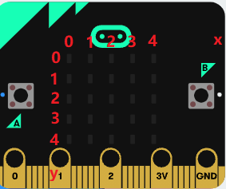

准备：

（1）通过micro USB线连接micro：bit和电脑。

（2）打开离线版本的Mu软件。

实验代码：

用Mu软件打开“LED点阵中单个LED显示.py“文件，加载代码的路径如下：

|文件类型|路径|文件名|
|-|-|-|
|Python|Python 教程\3.实验课程\Microbit 基础课程\第2课LED点阵中单个LED显示|LED点阵中单个LED显示.py|

加载完成后，如下图所示，你也可以打开Mu软件，在编辑窗口输入代码。（注意！所有英文及符号均须以英文填写，最后一行必须有空格。）

您需要单击“检测”按钮来检查代码是否有错误。如果一行出现光标或下划线，则表明该行的程序有错误。

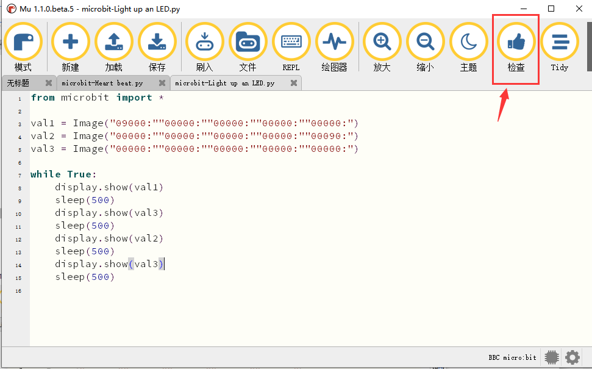

确定程序代码无误之后，你还需要确定micro USB线已连接到micro:bit和电脑，然后单击“刷入”按钮将代码下载到micro:bit。

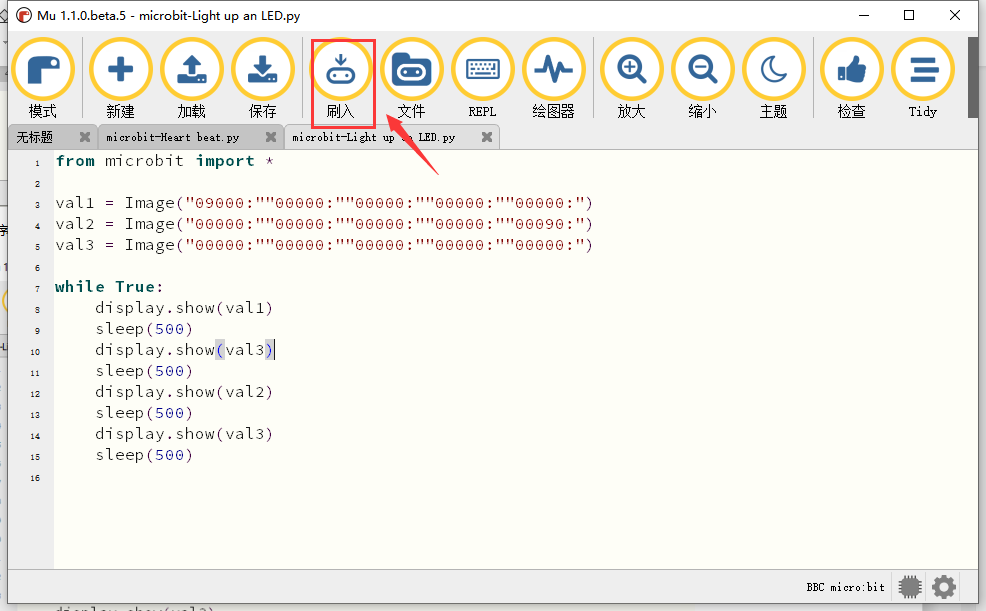

实验结果：

代码成功下载到micro：bit 之后，micro USB数据线不要拔下来，利用micro USB数据线上电，就可以看到micro:bit上处于坐标点(1,0)的LED的亮灭状态，持续0.5s；再次切换坐标点(3,4)的LED的亮灭状态，持续0.5s。循环进行。

参考文献：

关于休眠（延时）功能的细节，请参考链接[:
https://microbit-micropython.readthedocs.io/en/latest/utime.html](: https:/microbit-micropython.readthedocs.io/en/latest/utime.html)

#### 第三课 5\* 5 LED点阵图案显示

实验说明：

点阵在我们生活中很常见，很多都有用到它，比如LED广告显示屏，电梯显示楼层，公交车报站等等。

micro：bit主板的LED点阵共由25个发光二极管组成，上一课我们已经讲过通过设置坐标点来实现对LED点阵的25个LED中的某个LED的控制，这样可以通过设置多个坐标点控制多个LED的亮灭使得LED点阵能够显示图案、数字、字符串。我们也可以在特定代码中通过点击
LED点阵的灰白色小正方形点亮
LED点阵对应的LED来实现LED点阵显示图案、数字、字符串。除了上述方法还可以使用自定义图案使LED点阵显示图案。

准备：

（1）通过micro USB线连接micro：bit和电脑。

（2）打开离线版本的Mu软件。

实验代码：

代码1：

用Mu软件打开“LED点阵图案显示-1.py“文件;

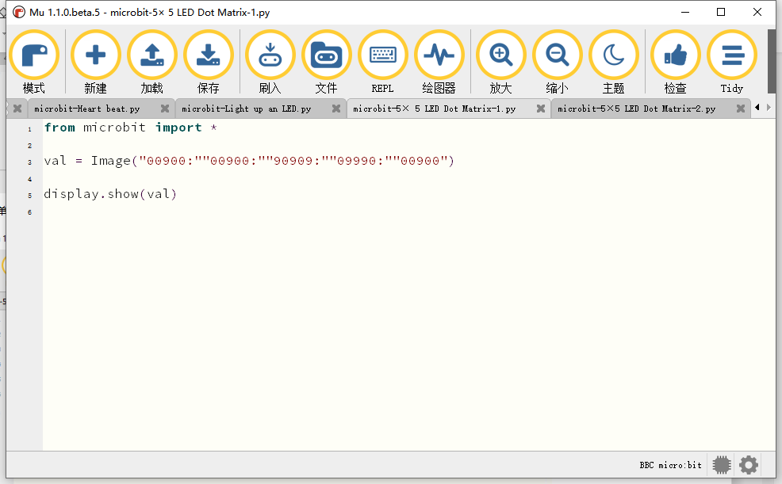

您需要单击“检查”按钮来检查代码是否有错误。如果一行出现光标或下划线，则表明该行的程序有错误。

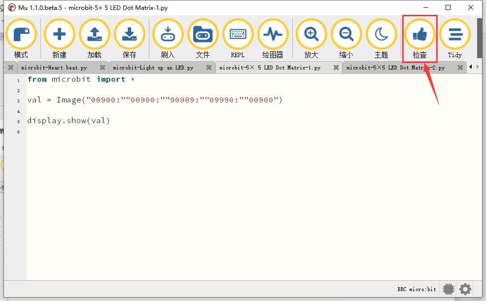

确定程序代码无误之后，你还需要确定micro USB线已连接到micro:bit和电脑，然后单击“刷入”按钮将代码下载到micro:bit。

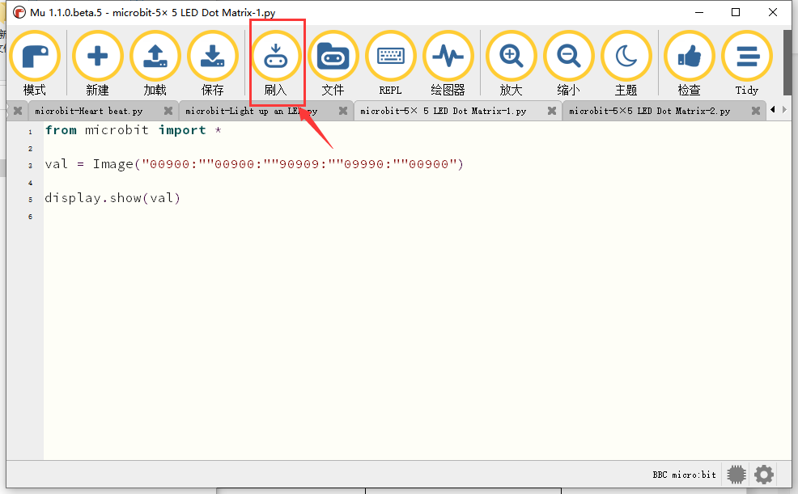

代码2：

用Mu软件打开“LED点阵图案显示-2.py;加载完成后，如下图所示。你也可以打开Mu软件，在编辑窗口输入代码。（注意！所有英文及符号均须以英文填写，最后一行必须有空格。）

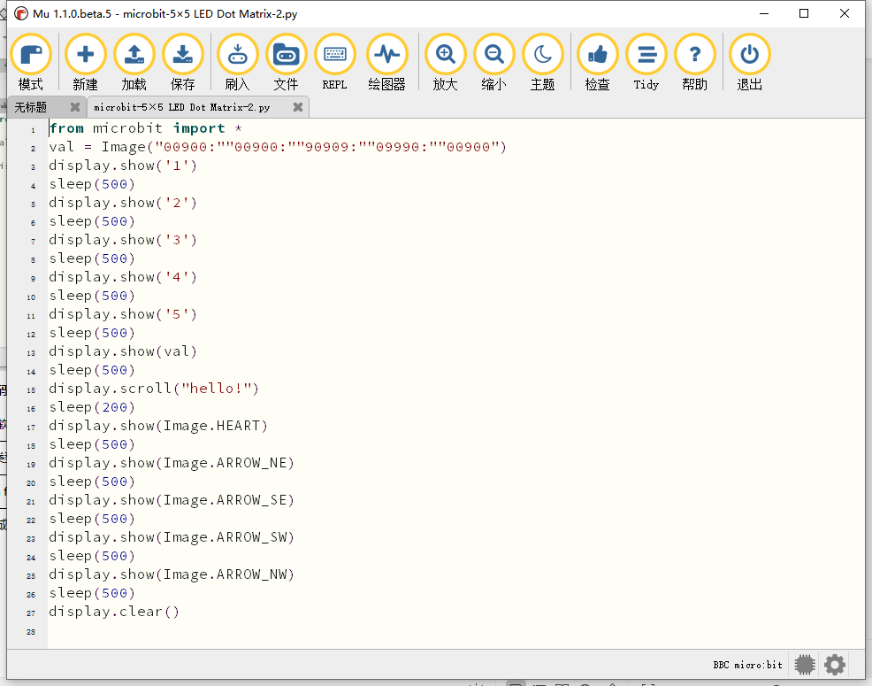

您需要单击“检测”按钮来检查代码是否有错误。如果一行出现光标或下划线，则表明该行的程序有错误。

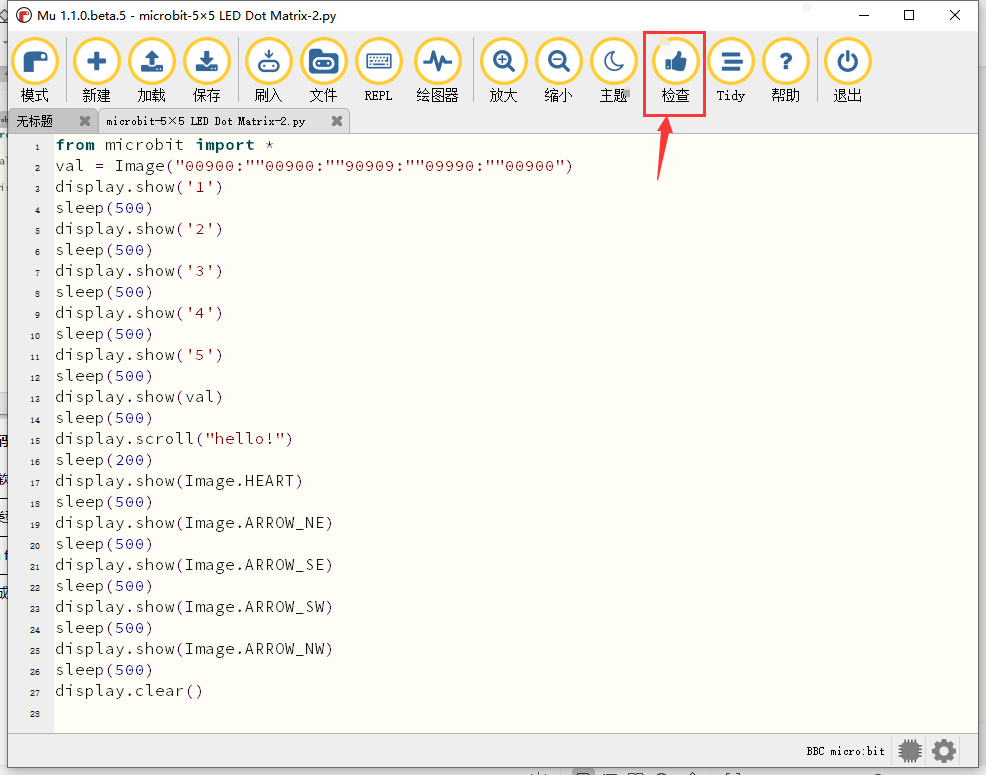

确定程序代码无误之后，你还需要确定micro USB线已连接到micro:bit和电脑，然后单击“刷入”按钮将代码下载到micro:bit。

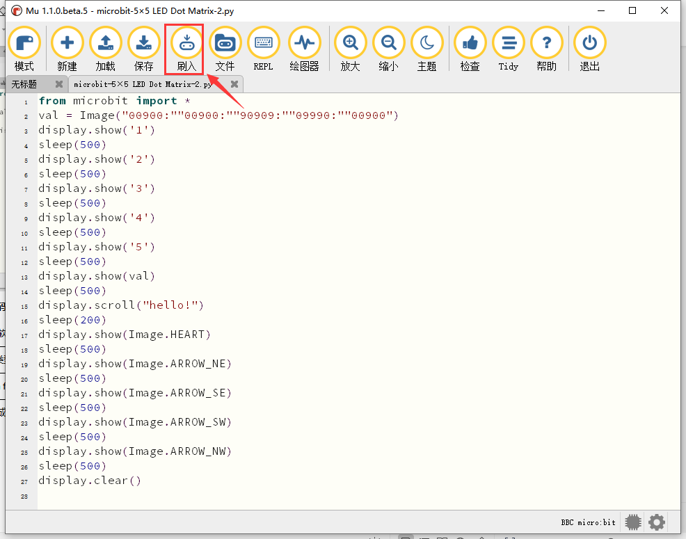

实验结果：

代码1成功下载到micro：bit 之后，micro USB数据线不要拔下来，利用micro USB数据线上电，就可以看到micro:bit上的5×5 LED点阵显示“向下”图案

；

代码2成功下载到micro：bit之后，micro USB数据线不要拔下来，利用micro USB数据线上电，就可以看到micro：bit主板的5×5 LED点阵开始显示数字1、2、3、4、5，然后循环显示“向下”图案

、字符串“Hello!”、“心”图案、“东北”方向图案、“东南”方向图案、“西南”方向图案和“西北”方向图案

。

参考文献：

display.scroll()
：在显示器上水平滚动数值。如果值是整数或浮点，则首先使用str（）将其转换为字符串。

有关详细信息，请参阅链接：[https://microbit-micropython.readthedocs.io/en/latest/utime.html](https://microbit-micropython.readthedocs.io/en/latest/utime.html)

#### 第四课 microbit的可编程按键

实验说明：

按键可以控制电路的通断，把按键接入电路中，不按下按键的时候电路是断开的，一按下按键电路就通啦，但是松开之后就又断了。可是为什么按下才通电呢？这得从按键的内部构造说起。没按下之前，电流从按键的一端过不去另一端，按键的两端就像两座山，中间隔着一条河，我们在这座山过不去另一座山；按下的时候，按键内部的金属片把两边连接起来让电流通过，就像搭了一座桥，把两座山连接起来。

按键内部结构如图：

，未按下按键之前，1、2就是导通的，3、4也是导通的，但是1、3或1、4或2、3或2、4是断开（不通）的；只有按下按键时，1、3或1、4或2、3或2、4才是导通的。

micro：bit主板有三个按键，反面的是复位按钮，正面的是两个可编程按键，通过对两个可编程按键组合可以有三种组合，作为输入元件。我们结合上节课的LED点阵，一起来学习按键吧。我们做一个按键三连，分别按A、B和AB同时按，对应显示屏分别显示A、B和AB。

准备：

（1）通过micro USB线连接micro：bit和电脑。

（2）打开离线版本的Mu软件。

实验代码：

代码1：

用Mu软件打开“microbit的可编程按键-1“文件.

加载完成后，如下图所示。你也可以打开Mu软件，在编辑窗口输入代码。（注意！所有英文及符号均须以英文填写，最后一行必须有空格。）

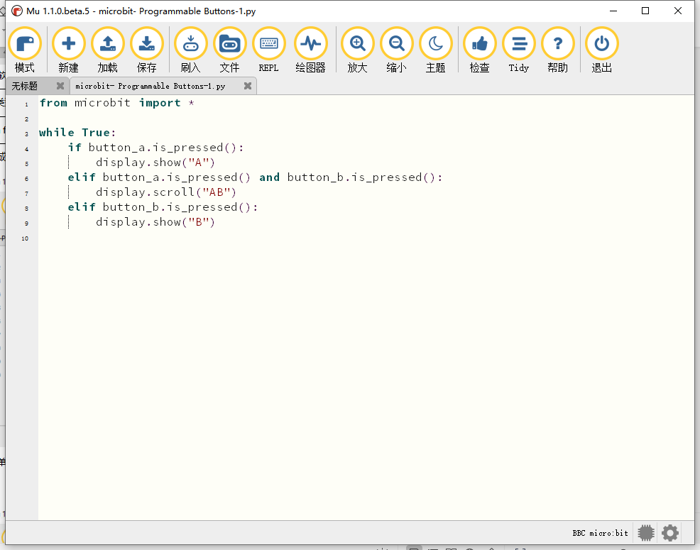

您需要单击“检查”按钮来检查代码是否有错误。如果一行出现光标或下划线，则表明该行的程序有错误。

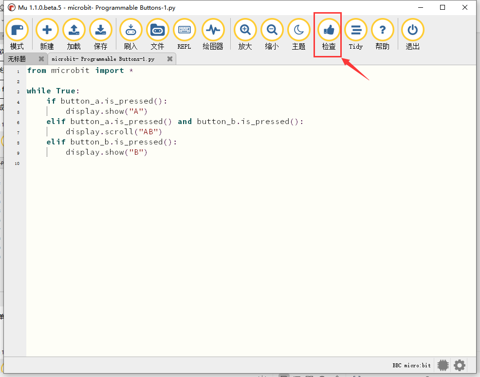

确定程序代码无误之后，你还需要确定micro USB线已连接到micro:bit和电脑，然后单击“刷入”按钮将代码下载到micro:bit。

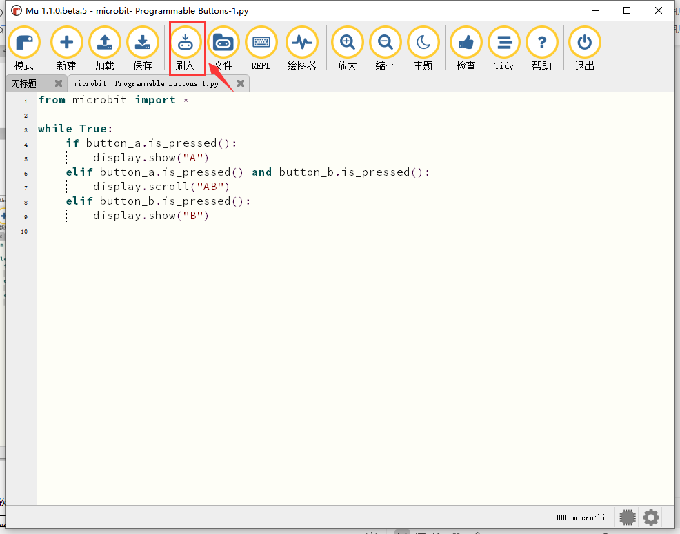

代码2：

用Mu软件打开“microbit的可编程按键-2.py“文件;

加载完成后，如下图所示。你也可以打开Mu软件，在编辑窗口输入代码。（注意！所有英文及符号均须以英文填写，最后一行必须有空格。）

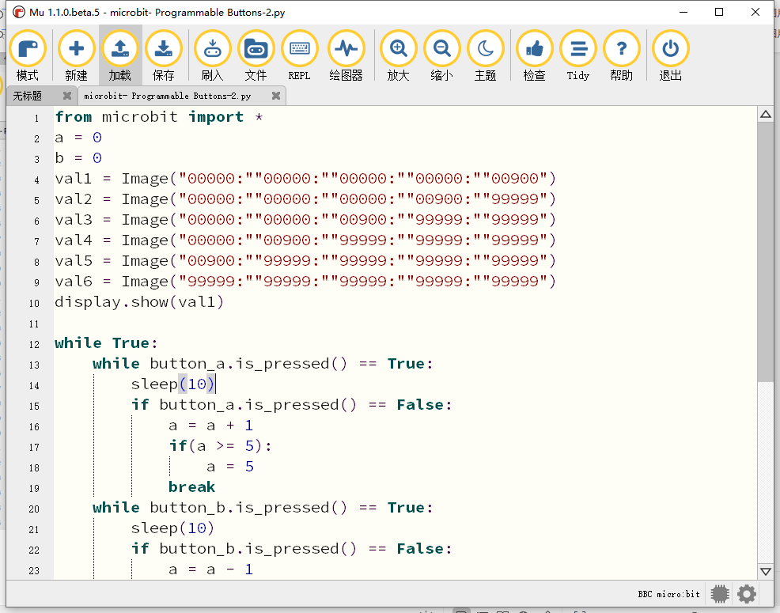

您需要单击“检查”按钮来检查代码是否有错误。如果一行出现光标或下划线，则表明该行的程序有错误。

确定程序代码无误之后，你还需要确定micro USB线已连接到micro:bit和电脑，然后单击“刷入”按钮将代码下载到micro:bit。

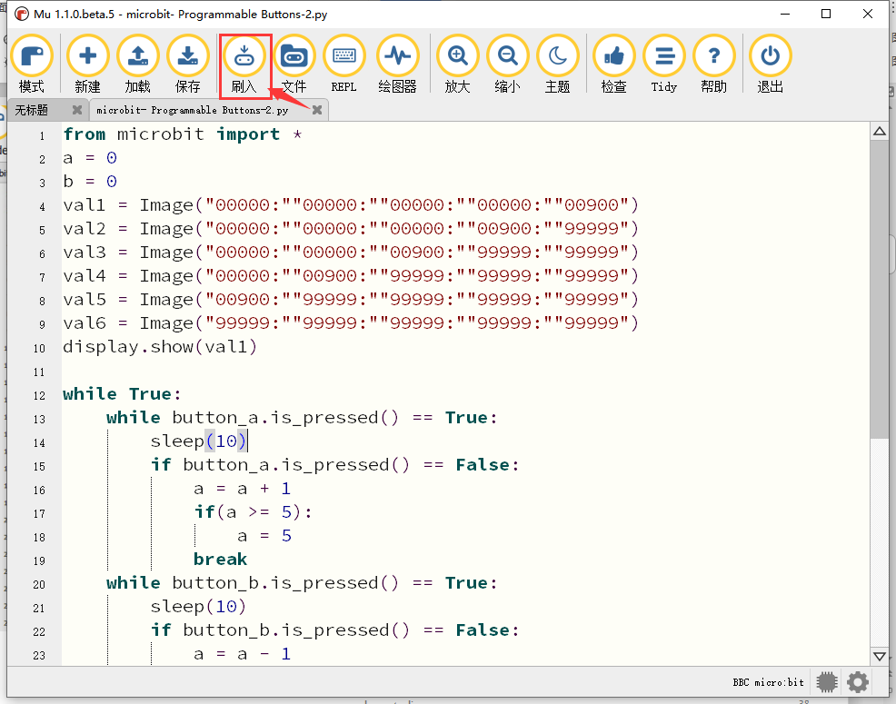

实验结果：

代码1成功下载到micro：bit 之后，micro USB数据线不要拔下来，利用micro USB数据线上电，按下micro：bit主板上正面按键A，我们可以看到5×5 LED点阵显示字符“A”；按下micro：bit主板上正面按键B，我们可以看到5×5 LED点阵显示字符“B”；同时按下micro：bit主板上正面按键A和B，我们就可以看到5×5 LED点阵显示字符“AB”。

代码2成功下载到micro：bit 之后，micro USB数据线不要拔下来，利用micro USB数据线上电，按下micro：bit主板上正面按键A，条形图高度值增加
，表现为LED点阵亮的行数增加；按下正面按键B，减少条形图高度，表现为LED点阵亮的行数减少。

#### 第五课 micro:bit学习测温度

实验说明：

micro:bit主板实际上并不带温度传感器，而是采用nRF52833芯片内置的温度传感器进行温度检测，所以检测的温度更接近芯片的温度，可能与周围环境温度存在一定的误差。在这一课程中，我们先利用该传感器测试当前环境中的温度，并将测试结果在显示数据(设备)中显示，再通过设置该传感器检测的温度范围来控制LED点阵显示不同的图案。

注意：micro:bit主板的温度传感器在这里：

准备：

（1）通过micro USB线连接micro：bit和电脑。

（2）打开离线版本的Mu软件。

实验代码：

代码1：

用Mu软件打开“microbit学习测温度-1.py“文件；

加载完成后，如下图所示。你也可以打开Mu软件，在编辑窗口输入代码。（注意！所有英文及符号均须以英文填写，最后一行必须有空格。）

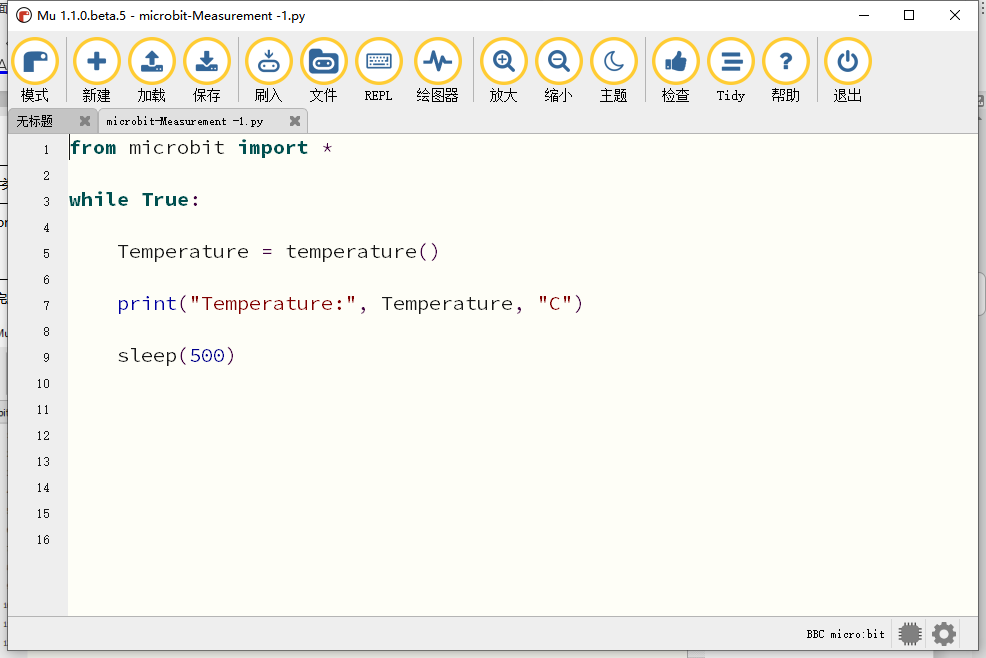

您需要单击“检查”按钮来检查代码是否有错误。如果一行出现光标或下划线，则表明该行的程序有错误。

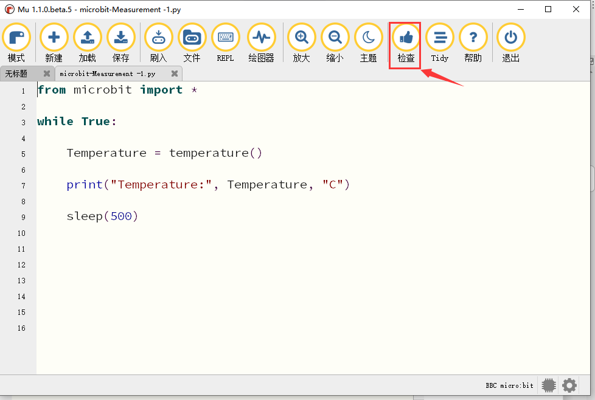

确定程序代码无误之后，你还需要确定micro USB线已连接到micro:bit和电脑，然后单击“刷入”按钮将代码下载到micro:bit。

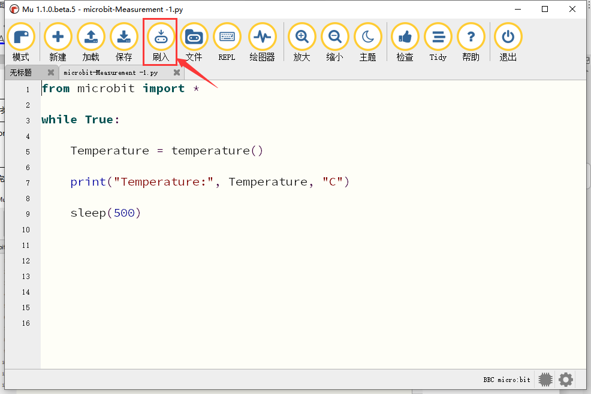

代码1成功下载到micro：bit之后，micro USB数据线不要拔下来，并且利用micro USB数据线上电。先点击“REPL”按钮，再按一下micro:bit后面的复位按钮，这样，BBC microbit REPL窗口打印并显示了micro：bit的温度传感器检测到当前环境中的温度值，如下图：（这里的字母C表示摄氏温度单位，而摄氏温度单位（℃）会导致乱码）

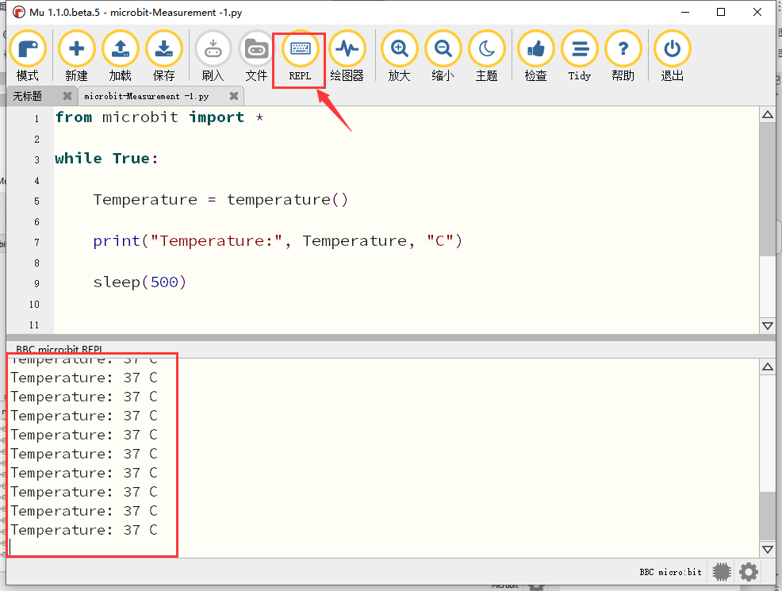

代码2：

用Mu软件打开“microbit学习测温度-2.py“文件；

加载完成后，如下图所示。你也可以打开Mu软件，在编辑窗口输入代码。（注意！所有英文及符号均须以英文填写，最后一行必须有空格。）

这里设置的温度值可以根据实际情况重新设置

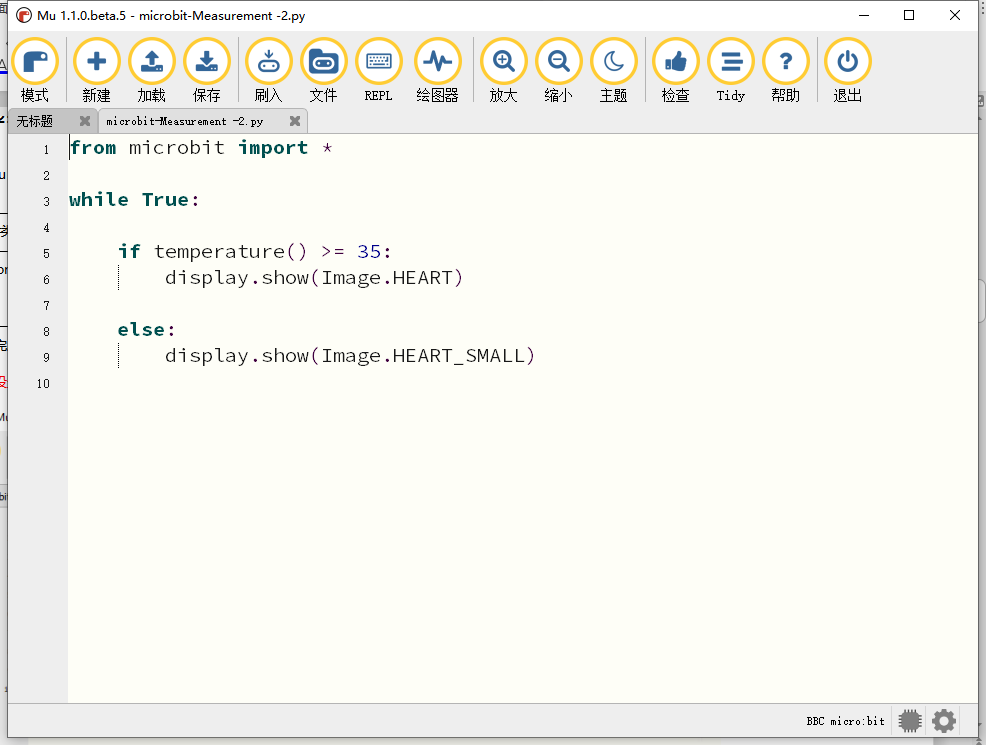

您需要单击“检查”按钮来检查代码是否有错误。如果一行出现光标或下划线，则表明该行的程序有错误。

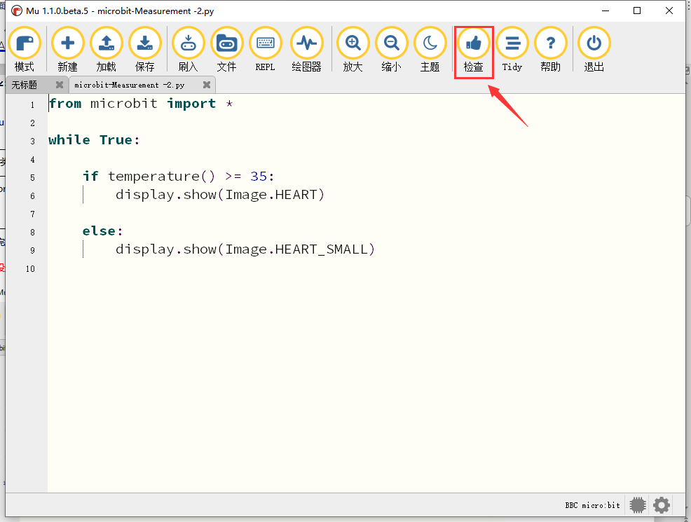

确定程序代码无误之后，你还需要确定micro USB线已连接到micro:bit和电脑，然后单击“刷入”按钮将代码下载到micro:bit。

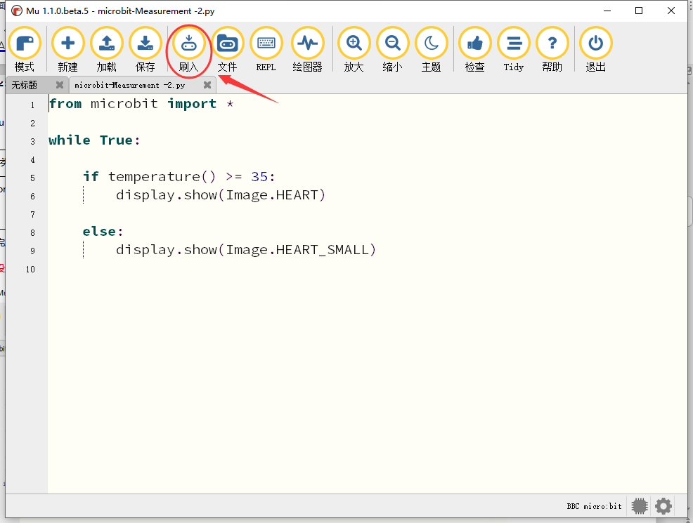

实验结果：

代码2成功下载到micro：bit之后，micro USB数据线不要拔下来，利用micro USB数据线上电，当外界环境中的温度小于35℃时，micro：bit主板的5×5 LED点阵中显示图案

；用手按住micro：bit主板的温度传感器，温度大于等于35℃时，5×5 LED点阵中显示图案

。

代码说明：

|from microbit import*|导入micro：bit的库文件|
|-|-|
|while True:|这是一个永久循环，它使micro：bit永远执行这个循环中的代码。|
|Temperature = temperature()|将temperature()赋给于变量Temperature|
|print("Temperature:", Temperature, "C")|BBC microbit REPL窗口打印温度值（℃）|
|sleep(500)|延时500毫秒|
|if temperature() >= 35:display.show(Image.HEART) else: display.show(Image.HEART_SMALL)|如果温度值≥35℃ 成立时 micro:bit上的LED点阵屏显示“♥”图案 否则温度值≥35℃ 未成立时 micro:bit上的LED点阵屏显示“”图案|

#### 第六课microbit的地磁传感器（磁力计指南针）

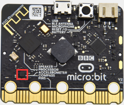

实验说明：

本实验项目主要介绍micro:bit地磁传感器的使用，地磁传感器除了检测地磁场强度外，还能当作指南针确定方向，同时也是航姿参考系统(AHRS)的重要组成部分。micro:bit V2主板采用的是LSM303AGR 地磁传感器，磁场动态范围为±50 gauss。在micro:bit V2主板中，磁力检测、指南针积木块均用到了磁力计模块，本实验中，将先介绍指南针，然后查看磁力计原始数据。常见的指南针主要部件是一根磁针，在地磁场的作用下可以转动并指向地磁北极（地磁北极是在地理南极附近），用来辨别方向。

micro:bit内部的一个地磁传感器（磁力计、指南针），我们可以读取这个磁力计的读数来判断方位，得到相对于北磁极的数值。返回值是0到360之间的数值，在磁力计首次开始工作（带到新位置后）时系统会自动要求我们对micro:bit主板校准，正确的校准方式是旋转micro:bit主板。需要注意的是，附近要是有金属物件可能会影响读数和校准准确性。

一些地球物理学家们确信，地球磁场是因为固态铁质内核被液态金属“海”所包围而形成的。磁力计指向的北是地磁北极，目前地磁南北极位置位于地理南北极地区，但并不与地球的南北极点完全重合，磁北极和真正的地理北极之间存在一个磁偏角。需要指出的是磁极位置是一直在变化的，历史上还出现过地磁逆转的情况。

我们称呼上的地磁南极，其实是物理上的磁北极，而地磁北极是物理上的磁南极，磁力线从磁北极出射，从磁南极进入，即地磁场从地理南极出来从地理北极进去。地磁南北级与地理南北级基本相反，但不在同一条线上也就是说地磁南极在地理北极附近，地磁北极在地理南极附近，地理南北极的连线和地磁南北级的连线构成磁偏角，即地磁北极（指南针指的方向）与地理北极间的夹角。

准备：

（1）通过micro USB线连接micro：bit和电脑。

（2）打开离线版本的Mu软件。

实验代码：

代码1：

按下按键A的时候，可以在屏幕上显示磁力计的读数。

用Mu软件打开“microbit的地磁传感器-1.py“文件；

加载完成后，如下图所示。你也可以打开Mu软件，在编辑窗口输入代码。（注意！所有英文及符号均须以英文填写，最后一行必须有空格。）

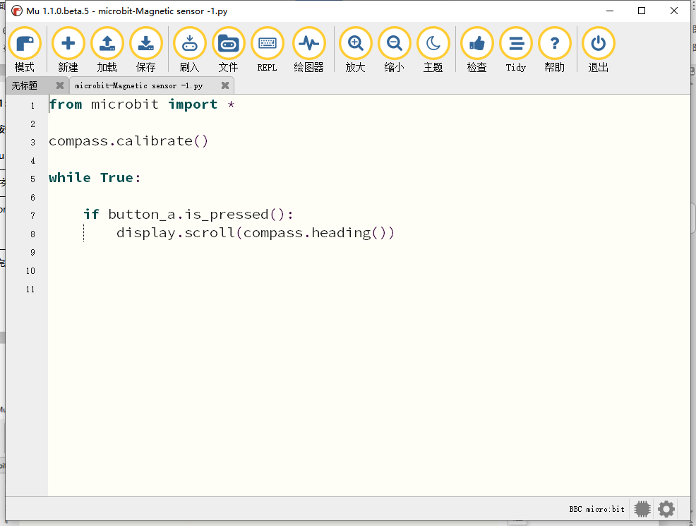

您需要单击“检测”按钮来检查代码是否有错误。如果一行出现光标或下划线，则表明该行的程序有错误。

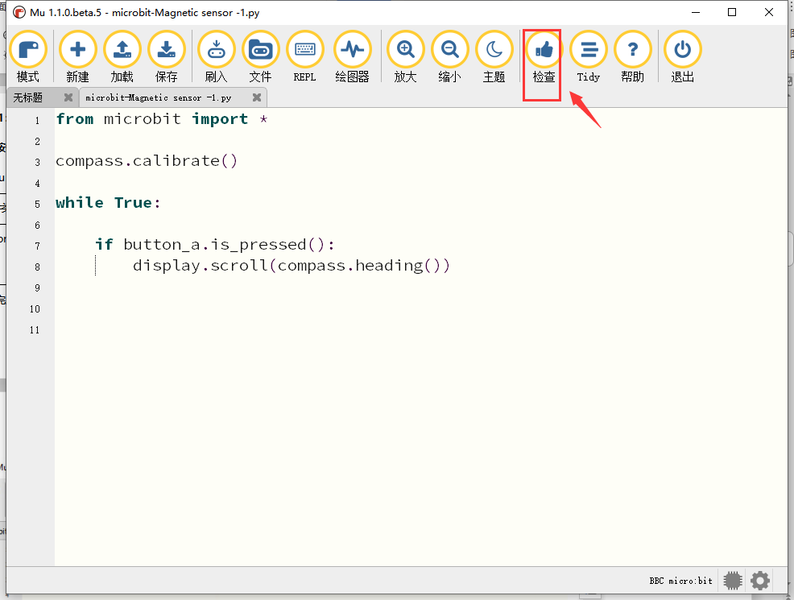

确定程序代码无误之后，你还需要确定micro USB线已连接到micro:bit和电脑，然后单击“刷入”按钮将代码下载到micro:bit。

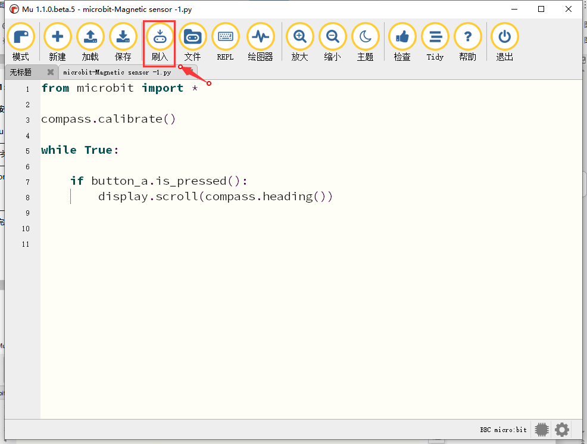

代码说明：首先必须对micro:bit进行校准，因为每个地方地磁场不同，对结果有比较大的的影响，如果是第一次使用指南针，micro:bit会自动提示需要校准。

代码1成功下载到micro：bit之后，micro USB数据线不要拔下来，利用micro USB数据线上电。按下micro:bit主板上正面按键A时，micro:bit主板首先提示校准，屏幕(LED点阵)提示:“TILT TO FILL SCREEN”,然后进入校准界面，校准方式为：旋转micro:bit主板，使得屏幕(LED点阵)画一个封闭的正方形（25个LED都点亮），如下图所示：

 

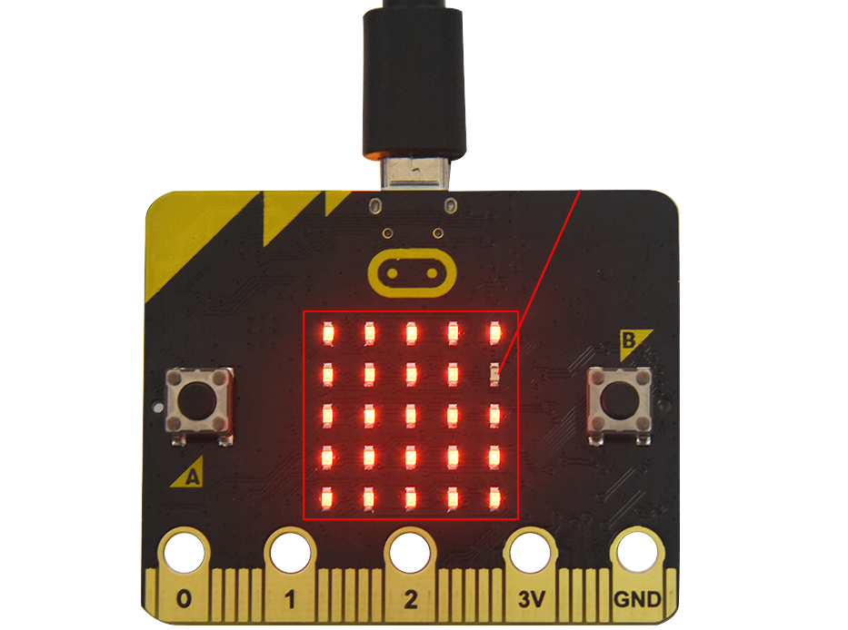

当封闭的正方形画好后，会显示一个“笑脸”图案

，表示校准完成。

校准完成后，当每次按下按键A的时候，直接在屏幕上显示磁力计读数，北、东、南、西对应0°、90°、180°、270°。

代码2：

朝不同的方向旋转磁力计，LED点阵显示对应的方向图案。

如图所示，如果读数在292.5和337.5之间，就让显示屏显示一个指向右上方的箭头，由于代码里不能输入0.5，所以取的判断数值是293和338。之后再加入其它逻辑加载完成后，如下图所示：

用Mu软件打开“microbit的地磁传感器-2.py“文件；

加载完成后，如下图所示。你也可以打开Mu软件，在编辑窗口输入代码。（注意！所有英文及符号均须以英文填写，最后一行必须有空格。）

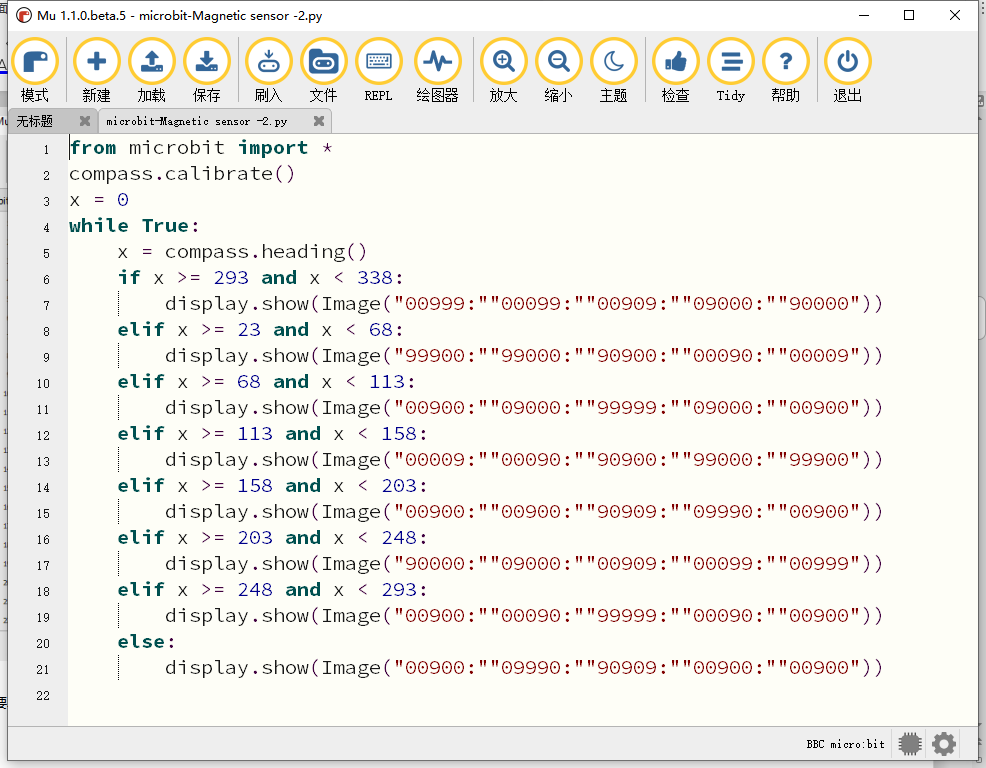

您需要单击“检查”按钮来检查代码是否有错误。如果一行出现光标或下划线，则表明该行的程序有错误。

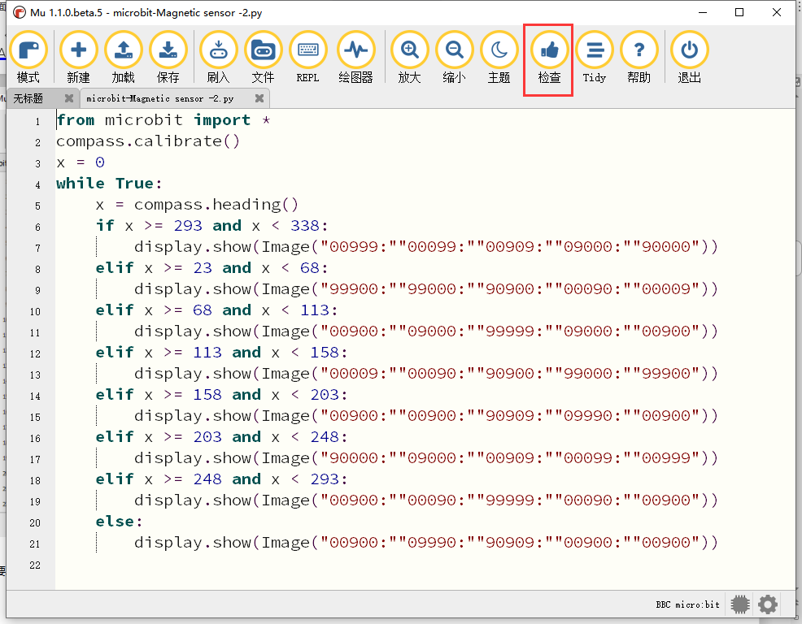

确定程序代码无误之后，你还需要确定micro USB线已连接到micro:bit和电脑，然后单击“刷入”按钮将代码下载到micro:bit。

实验结果：

代码2成功下载到micro：bit之后，micro USB数据线不要拔下来，利用micro USB数据线上电。micro:bit提示校准（校准方法请参考:上面代码1部分），校准完成后，旋转移动micro:bit主板，可以看到micro:bit主板上LED点阵显示方向图案。

代码说明：

|from microbit import*|导入micro：bit的库文件|
|-|-|
|compass.calibrate()|罗盘（指南针）校准|
|while True:|这是一个永久循环，它使micro：bit永远执行这个循环中的代码。|
|if button_a.is_pressed(): display.scroll(compass.heading())|当按下按键A时 micro:bit上的LED点阵滚动显示磁力计（罗盘）读数|
|x = 0|设置变量x=0|
|x = compass.heading()|将磁力计（罗盘）读数赋给于变量x|
|if...elif...else|条件判断语句：如果...否则如果...否则...|
|display.show(Image("00999:""00099:""00909:""09000:""90000")) display.show(Image("99900:""99000:""90900:""00090:""00009")) display.show(Image("00900:""09000:""99999:""09000:""00900")) display.show(Image("00009:""00090:""90900:""99000:""99900")) display.show(Image("00900:""00900:""90909:""09990:""00900")) display.show(Image("90000:""09000:""00909:""00099:""00999")) display.show(Image("00900:""00090:""99999:""00090:""00900")) display.show(Image("00900:""09990:""90909:""00900:""00900"))|micro:bit上的LED点阵显示指向右上角“→”图案（microbit正放时） micro:bit上的LED点阵显示指向左上角“→”图案（microbit正放时） micro:bit上的LED点阵显示指向左边“→”图案（microbit正放时） micro:bit上的LED点阵显示指向左下角“→”图案（microbit正放时） micro:bit上的LED点阵显示指向正下方“→”图案（microbit正放时） micro:bit上的LED点阵显示指向右下角“→”图案（microbit正放时） micro:bit上的LED点阵显示指向右边“→”图案（microbit正放时） micro:bit上的LED点阵显示指向正上方“→”图案（microbit正放时）|

#### 第七课 microbit的加速度传感器（加速度计）

实验说明：

micro:bit V2主板内置有LSM303AGR
重力加速度传感器（加速度计），其具有8/10/12 bits的分辨率，代码科设置量程为1g、2g、4g,、8g。

我们常使用加速度计来检测机器的姿态。

在本实验项目中，将介绍加速度传感器（加速度计）对几个特殊姿态的检测，之后来查看加速度传感器输出的三轴原始数据。

准备：

（1）通过micro USB线连接micro：bit和电脑。

（2）打开离线版本的Mu软件。

实验1

用Mu软件打开“microbit的加速度传感器-1.py“文件。

你也可以打开Mu软件，在编辑窗口输入代码。（注意！所有英文及符号均须以英文填写，最后一行必须有空格。）

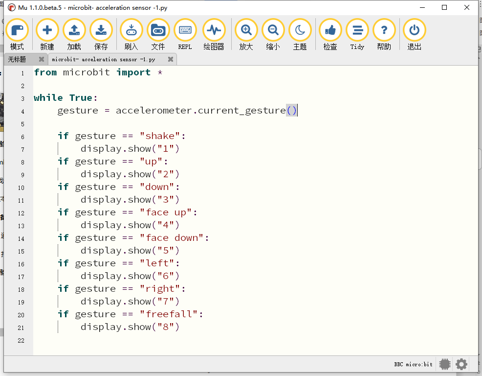

您需要单击“检测”按钮来检查代码是否有错误。如果一行出现光标或下划线，则表明该行的程序有错误。

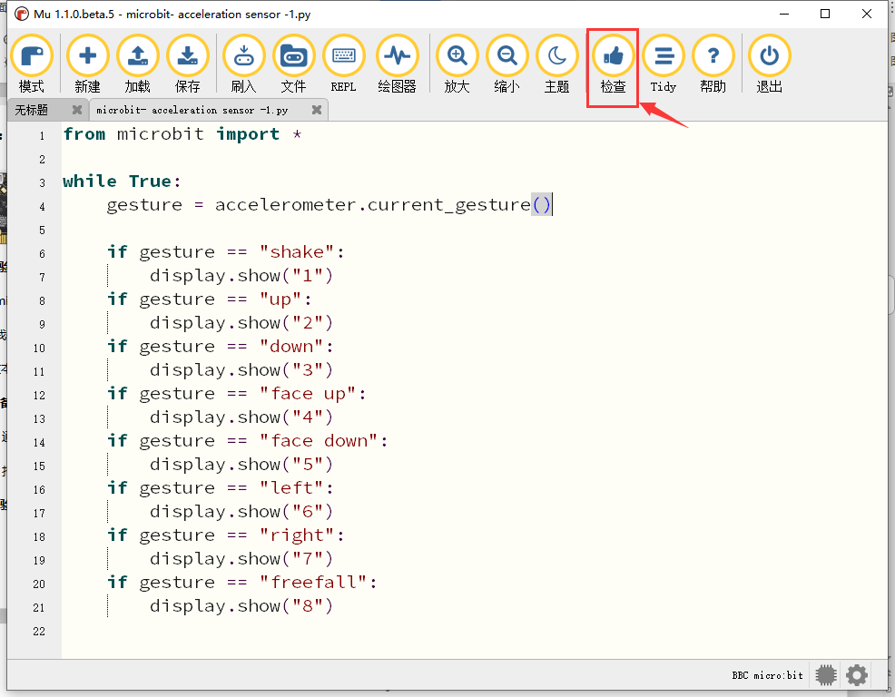

确定程序代码无误之后，你还需要确定micro USB线已连接到micro:bit和电脑，然后单击“刷入”按钮将代码下载到micro:bit。

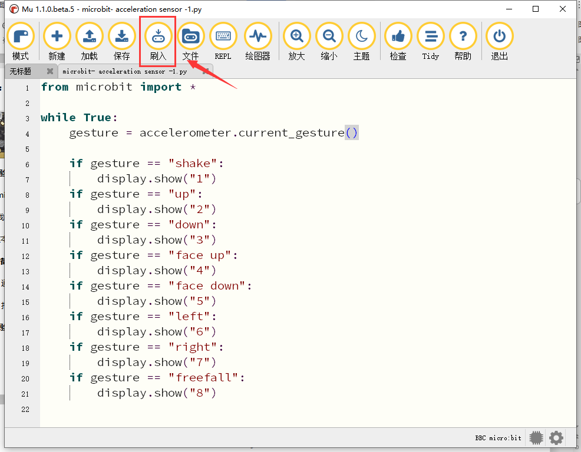

实验现象

代码1成功下载到micro：bit之后，micro USB数据线不要拔下来，利用micro USB数据线上电。将micro:bit主板晃动，则可见micro:bit显示数字1（表明只要有晃动，无论朝哪个方向晃动，该条件都将满足）。

当micro:bit主板的Logo朝上时，LED点阵显示数字2，Logo朝上示意图如下所示：

同理，micro:bit主板的Logo朝上时，LED点阵显示数字3(倒立的3)，Logo朝下示意图如下所示：

当屏幕朝上（指的是LED点阵朝上）时，LED点阵显示数字4。如下图所示：

同理，当屏幕朝下（指的是LED点阵朝下）时，LED点阵显示数字5。

当micro:bit
主板向左倾斜（是指LED点阵先朝上，然后再往左边倾斜）时，LED点阵显示数字6。如下图所示：

同理，当micro:bit主板向右倾斜（是指LED点阵先朝上，然后再往右边倾斜）时，LED点阵显示数字7。如下图所示：

当不小心碰到micro:bit主板使其从桌面掉落，则为做自由落体运动，此时，micro:bit主板满足自由落体的条件，则LED点阵显示数字8。（注意：此方法操作时，很容易把micro:bit主板摔坏，不建议操作）

注意：（3g、6g、8g，
如果需要满足此条件，则需要达到3倍，6倍，8倍重力加速度甩动micro:bit主板。如果你们有兴趣的话，这部分代码可以自己添加）

4实验2

检测加速度在X轴，Y轴，Z轴的不同的值

用Mu软件打开“microbit的加速度传感器-2.py“文件；

加载完成后，如下图所示。你也可以打开Mu软件，在编辑窗口输入代码。（注意！所有英文及符号均须以英文填写，最后一行必须有空格。）

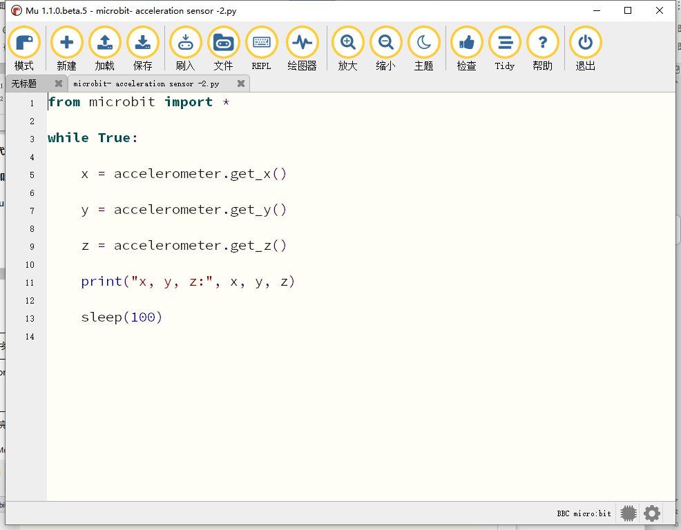

您需要单击“检查”按钮来检查代码是否有错误。如果一行出现光标或下划线，则表明该行的程序有错误。

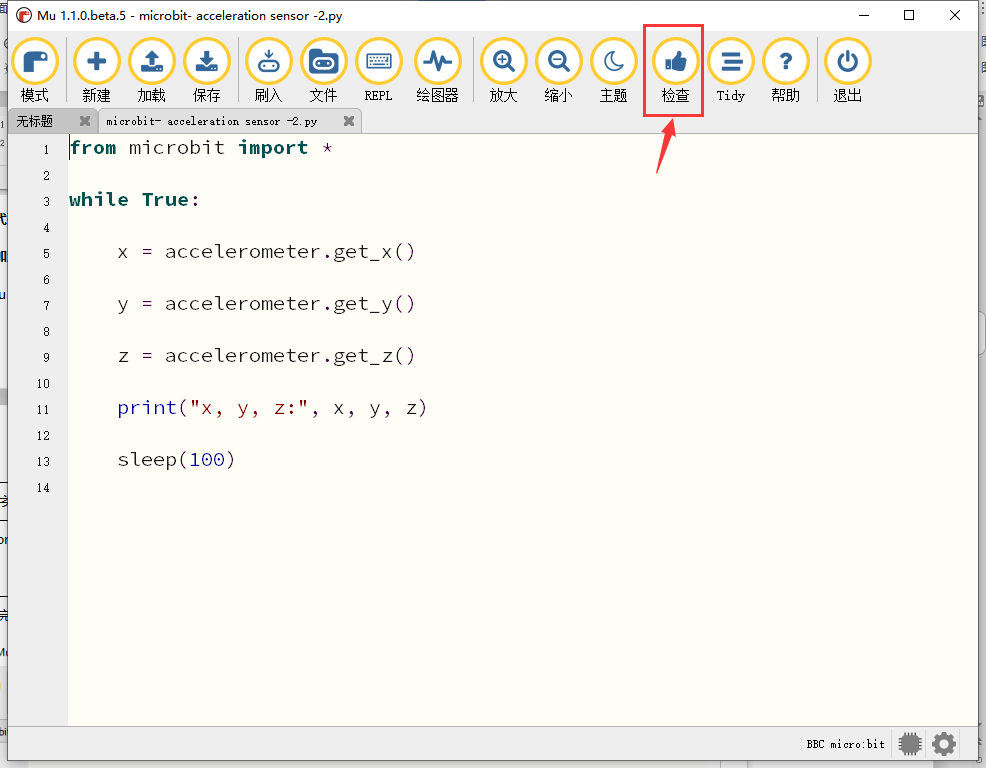

确定程序代码无误之后，你还需要确定micro USB线已连接到micro:bit和电脑，然后单击“刷入”按钮将代码下载到micro:bit。

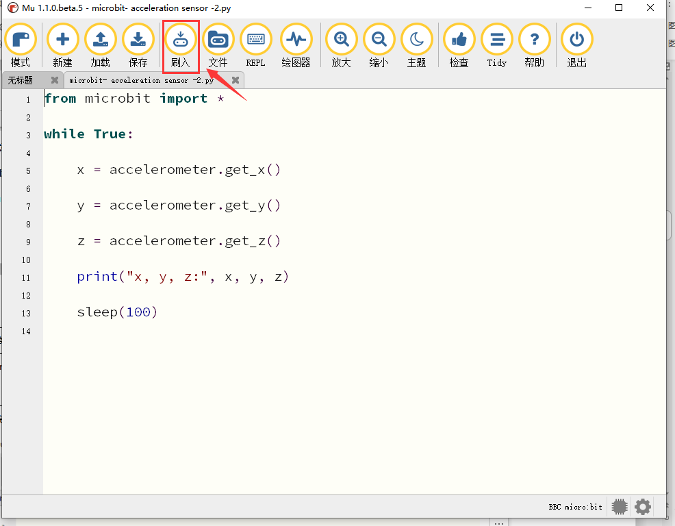

实验现象

首先，查阅MMA8653FC数据手册，以及micro:bit的硬件原理图得知，micro:bit加速度计坐标如下图所示：

代码2成功下载到micro：bit之后，micro USB数据线不要拔下来，利用micro USB数据线上电。先点击“REPL”按钮，再按一下micro:bit后面的复位按钮，这样，BBC microbit REPL窗口打印并显示了micro：bit的加速度在X轴、Y轴、Z轴的分解，可得数据变化如下图：

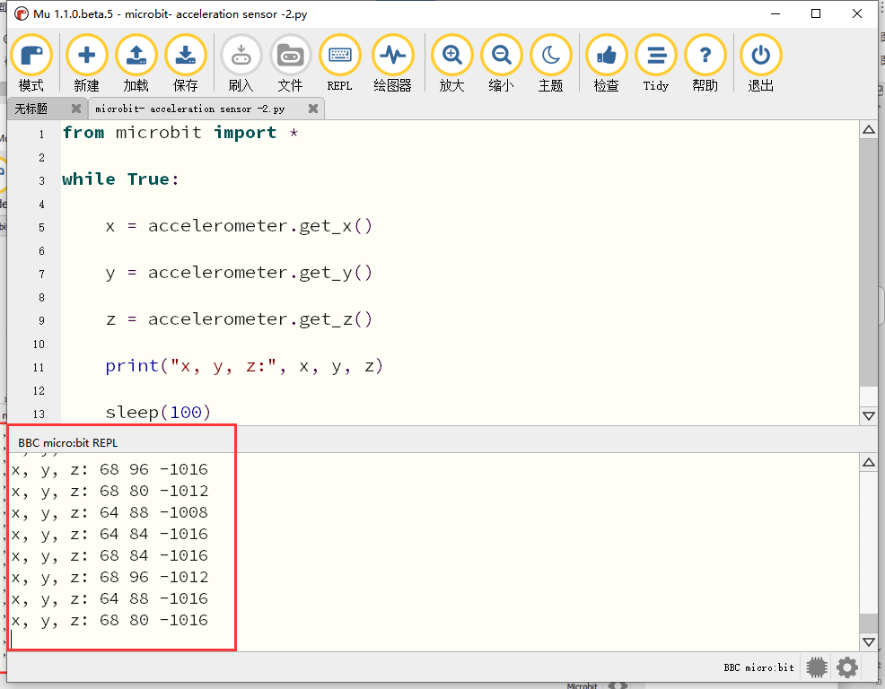

代码说明：

|from microbit import*|导入micro：bit的库文件|
|-|-|
|gesture = accelerometer.current_gesture()|将accelerometer.current_gesture()赋给于变量gesture|
|while True:|这是一个永久循环，它使micro：bit永远执行这个循环中的代码。|
|if gesture == "shake": display.show("1") if gesture == "up": display.show("2") if gesture == "down": display.show("3") if gesture == "face up": display.show("4") if gesture == "face down": display.show("5") if gesture == "left": display.show("6") if gesture == "right": display.show("7") if gesture == "freefall": display.show("8")|当振动microbit时 micro:bit上的LED点阵显示数字“1” 当microbit的徽标（Logo）朝上时 micro:bit上的LED点阵显示数字“2” 当microbit的徽标（Logo）朝下时 micro:bit上的LED点阵显示数字“3” 当microbit的屏幕（LED点阵）朝上时 micro:bit上的LED点阵显示数字“4” 当microbit的屏幕（LED点阵）朝下时 micro:bit上的LED点阵显示数字“5” 当microbit向左倾斜时 micro:bit上的LED点阵显示数字“6” 当microbit向右倾斜时 micro:bit上的LED点阵显示数字“7” 当microbit自由落体时 micro:bit上的LED点阵显示数字“8”|
|x = accelerometer.get_x() y = accelerometer.get_y() z = accelerometer.get_z()|读取x轴的加数度值（mg），返回值为一个整数，并将x轴读数赋给于变量x 读取y轴的加数度值（mg），返回值为一个整数，并将y轴读数赋给于变量y 读取z轴的加数度值（mg），返回值为一个整数，并将z轴读数赋给于变量z|
|print("x, y, z:", x, y, z)|BBC microbit REPL窗口打印x,y,z轴的加数度值(mg)读数|
|sleep(100)|延时100毫秒|

#### 第八课 micro:bit的光照强度检测

实验说明：

本实验将介绍micro:bit对外界光照强度的检测，由于micro:bit并不自带光敏传感器，对外界光照强度的检测是通过LED矩阵进行的，LED矩阵被用来感知周围的光，并反复地将LED转换成输入，并采样电压衰减时间。这样检测出来的光照强度是一个相对值。

准备：

（1）通过micro USB线连接micro：bit和电脑。

（2）打开离线版本的Mu软件。

实验代码：

用Mu软件打开“microbit的光照强度检测 .py“文件

加载完成后，如下图所示。你也可以打开Mu软件，在编辑窗口输入代码。（注意！所有英文及符号均须以英文填写，最后一行必须有空格。）

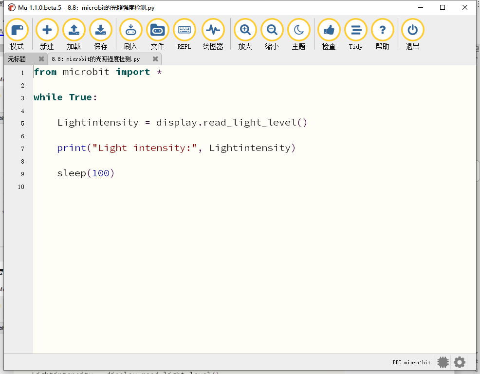

您需要单击“检查”按钮来检查代码是否有错误。如果一行出现光标或下划线，则表明该行的程序有错误。

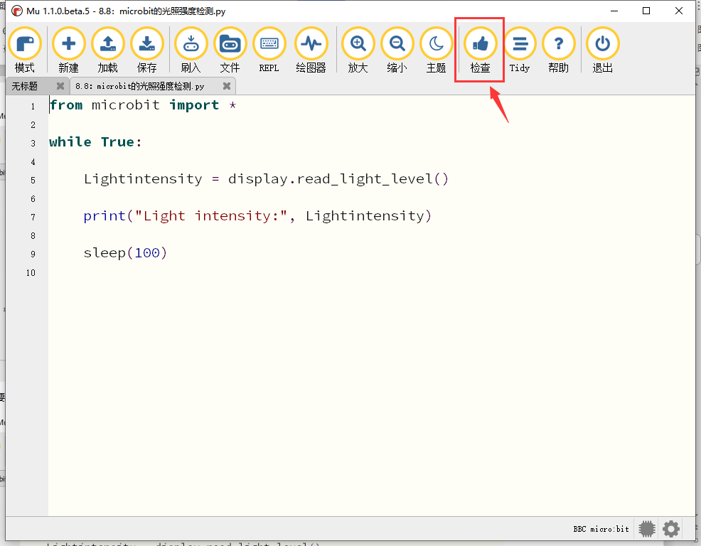

确定程序代码无误之后，你还需要确定micro USB线已连接到micro:bit和电脑，然后单击“刷入”按钮将代码下载到micro:bit。

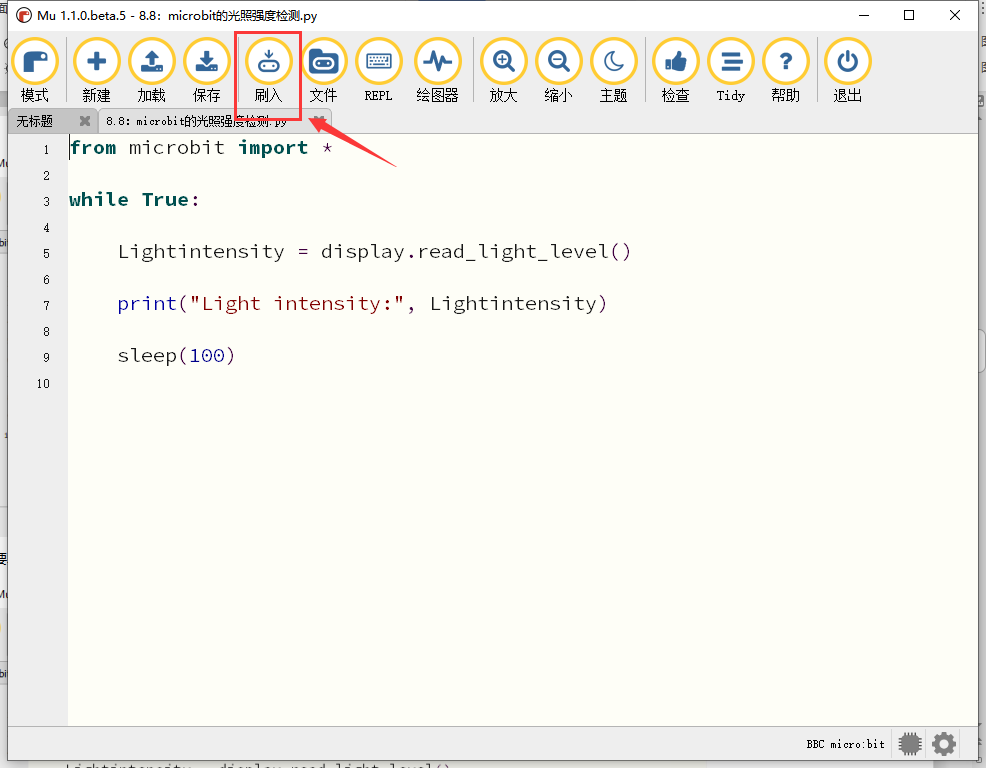

实验结果：

代码成功下载到micro：bit之后，micro USB数据线不要拔下来，利用micro USB数据线上电。先点击“REPL”按钮，再按一下micro:bit后面的复位按钮，这样，BBC microbit REPL窗口打印并显示了micro：bit中光线传感器检测到的环境中光线强度值，如下图所示。当用手全部遮住micro:bit的LED点阵，亮度级别约为0；然后将micro:bit的LED点阵放置于光照下，随着环境中的光线强度增强时，亮度级别值也在逐渐增大；反之，亮度级别值在逐渐减少。

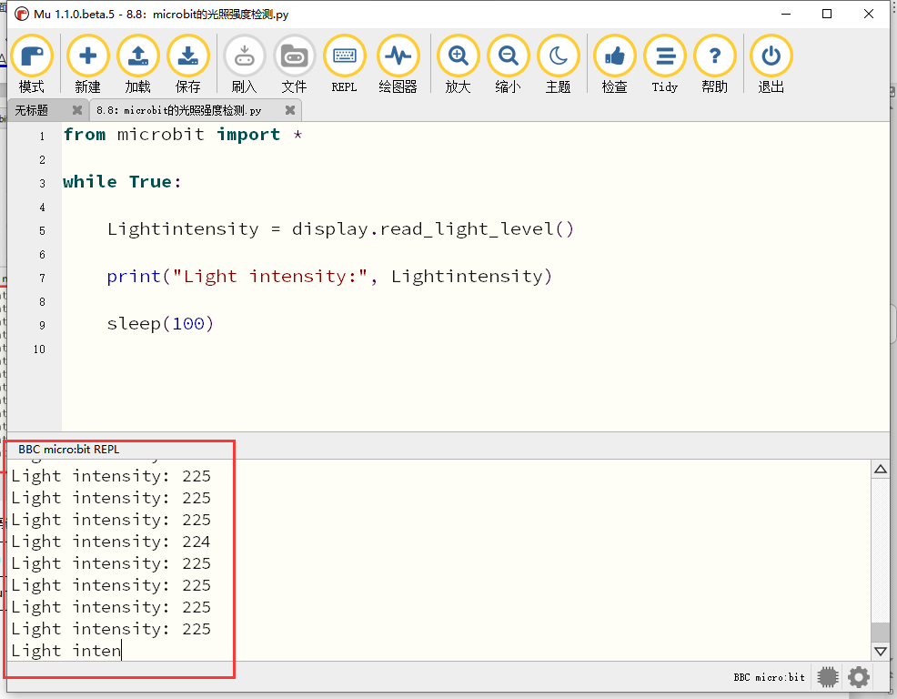

代码说明：

|from microbit import*|导入micro：bit的库文件|
|-|-|
|gesture = accelerometer.current_gesture()|将accelerometer.current_gesture()赋给于变量gesture|
|while True:|这是一个永久循环，它使micro：bit永远执行这个循环中的代码。|
|Lightintensity = display.read_light_level()|将display.read_light_level()赋给于变量Lightintensity|
|print("Light intensity:", Lightintensity)|BBC microbit REPL窗口打印光线传感器检测到的光线亮度级别值|
|sleep(100)|延时100毫秒|

#### 第9课 触摸感应logo

实验说明：

如果你有了micro:bit主板，你可以在你的项目中使用金色的触摸感应logo作为另一个输入，这就像多了一个按钮。触摸感应采用的是电容式触摸传感器，当你手指按下（或触摸）它时，它就能感应到电场的微小变化----就像你的手机或平板电脑屏幕一样。当你像按按钮一样按下它时，你可以在程序中触发事件。

准备：

（1）通过micro USB线连接micro：bit和电脑。

（2）打开离线版本的Mu软件。

实验代码：

用Mu软件打开“ 触摸感应logo.py“文件

加载完成后，如下图所示。你也可以打开Mu软件，在编辑窗口输入代码。（注意！所有英文及符号均须以英文填写，最后一行必须有空格。）

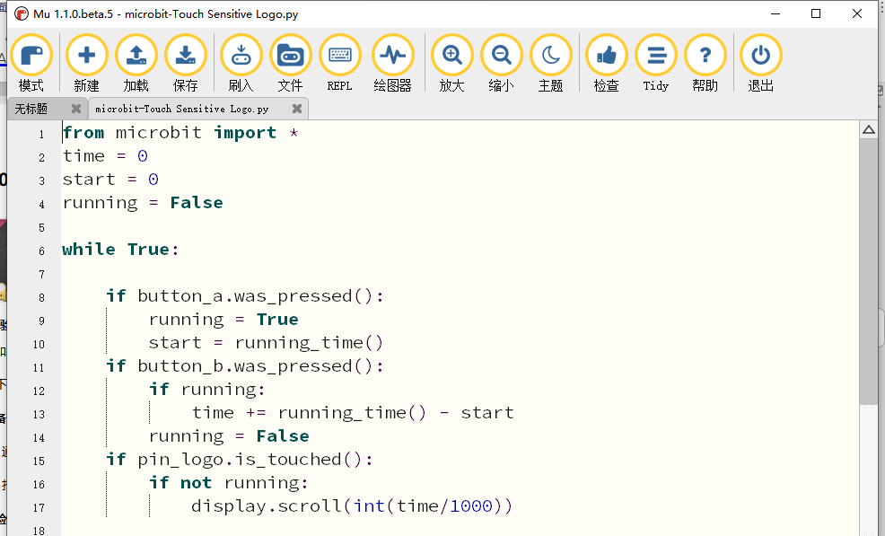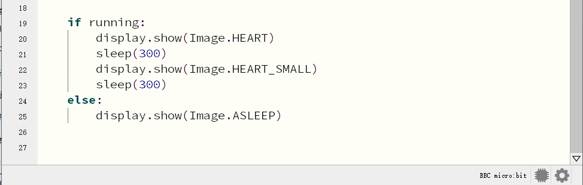

代码说明（怎样工作的？）：（1）micro:bit以毫秒(数千分一秒)记录它被启动的时间。这被称为运行时间。

（2）当你按下按钮A时，一个名为start的变量被设置为当前运行时间。

（3）当你按下按钮B时，开始时间将从新的运行时间中减去，以计算出从你启动秒表以来已经过去了多少时间。这个差异被加到总时间中，总时间存储在一个名为time的变量中。

（4）如果你按下金色LOGO图标，程序就会在LED显示屏上显示经过的总时间。它通过除以1000将时间从毫秒(千分之一秒)转换为秒。它使用整数除法运算符给出整数(整型)的结果。

（5）该程序还使用一个名为running的布尔变量来控制该程序。布尔变量只能有两个值:true或false。如果“running”为“true”，则表示秒表已经启动。如果“running”为假，则表示秒表未启动或已停止。

（6）如果“running”为真，则跳动的心脏循环显示在LED点阵屏。

（7）如果秒表已经停止，如果“running”为假时，当你按下金色LOGO图标时，它将只显示时间。

（8）如果秒表已经启动，如果“running”为真时，则确保只有按下按钮B时，时间变量才会更改，代码还可防止错误读数。

您需要单击“检查”按钮来检查代码是否有错误。如果一行出现光标或下划线，则表明该行的程序有错误。

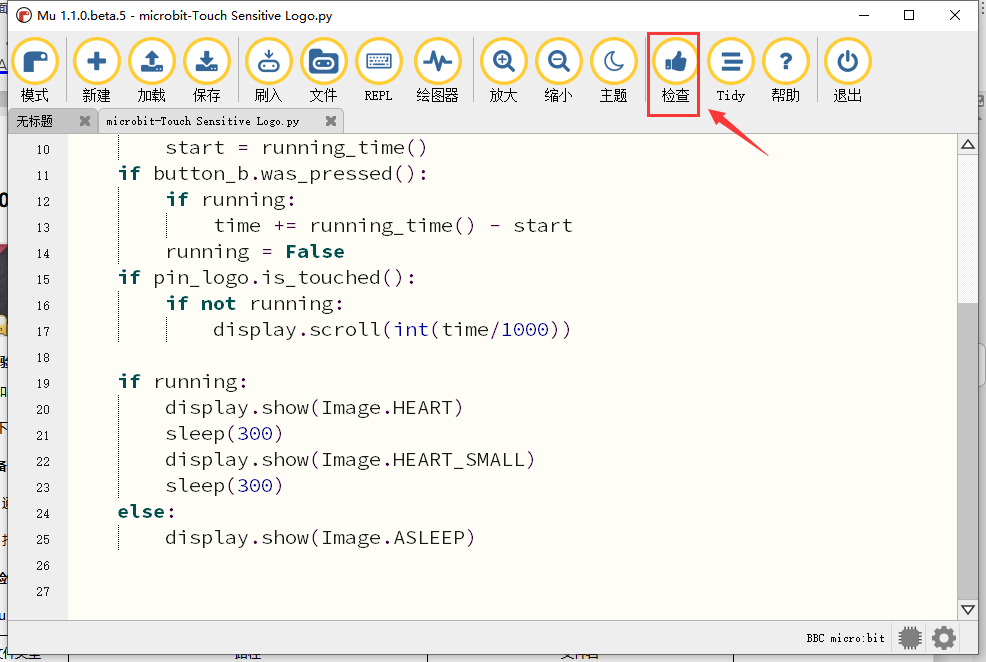

确定程序代码无误之后，你还需要确定micro USB线已连接到micro:bit和电脑，然后单击“刷入”按钮将代码下载到micro:bit。

实验结果：

代码成功下载到micro：bit之后，micro USB数据线不要拔下来，利用micro USB数据线上电，按下按钮A开始秒表运行。当计时时，LED点阵屏上就会显示一个跳动的心脏。按按钮B停止，你可以随时启动和停止它，它会不断增加时间，就像一个真正的秒表。按下micro:bit主板前面的金色LOGO标志，以秒为单位显示测量的时间。要将时间重置为零，请按micro:bit主板背面的reset按钮。

#### 第十课扬声器

实验说明

micro:bit主板有内置扬声器，这使得在你的项目中添加声音变得非常容易。通过编程使扬声器发出各种各样的音调，例如编写一首歌曲：《欢乐颂》，让扬声器播放出来。

准备

（1）通过micro USB线连接micro：bit和电脑。

（2）打开离线版本的Mu软件。

实验代码

用Mu软件打开“扬声器.py“文件

加载完成后，如下图所示。你也可以打开Mu软件，在编辑窗口输入代码。（注意！所有英文及符号均须以英文填写，最后一行必须有空格。）

您需要单击“检查”按钮来检查代码是否有错误。如果一行出现光标或下划线，则表明该行的程序有错误。

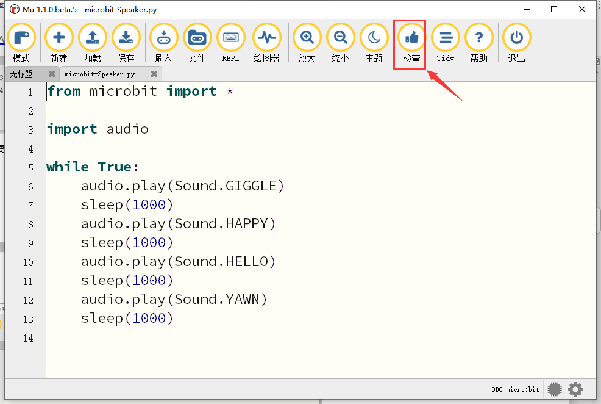

确定程序代码无误之后，你还需要确定micro USB线已连接到micro:bit和电脑，然后单击“刷入”按钮将代码下载到micro:bit。

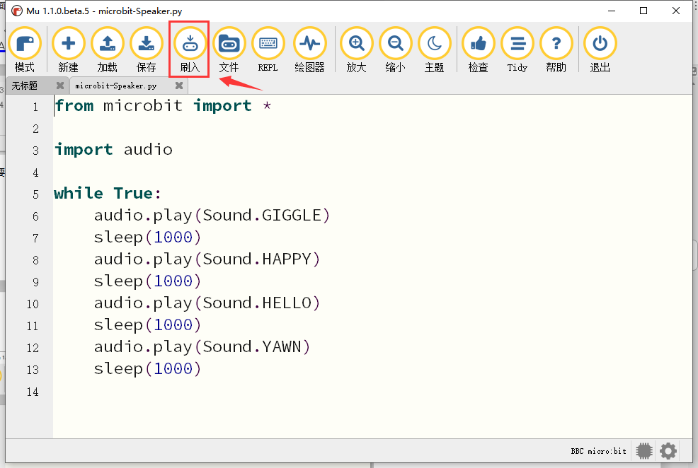

实验结果：

代码成功下载到micro：bit之后，micro USB数据线不要拔下来，利用micro USB数据线上电，micro:bit主板上的扬声器发出声音且LED点阵显示音乐标志图案。

代码说明：

|from microbit import*|导入micro：bit的库文件|
|-|-|
|import audio|audio库文件|
|while True:|这是一个永久循环，它使micro：bit永远执行这个循环中的代码。|
|audio.play(Sound.GIGGLE)|发出giggle的声音|
|sleep(1000)|延时1000毫秒|

#### 第十一课 麦克风

实验说明：

micro:bit
主板有一个内置麦克风，可以测量环境的声音程度。你可以使用它作为一个简单的输入---当你鼓掌时，micro:bit主板上前面内置麦克风LED指示灯会被打开。它还可以测量声音的强度，所以你可以制作一个噪音等级表或与音乐合拍的迪斯科灯光。麦克风是在micro:bit
主板的背面，而在前面，你会发现一个内置麦克风LED指示灯，还有紧挨着让声音进入麦克风的孔。当你micro:bit主板在测量声音级别时，它就会亮起来。

准备：

（1）通过micro USB线连接micro：bit和电脑。

（2）打开离线版本的Mu软件。

实验代码：

代码1：

用Mu软件打开“麦克风.py“文件

加载完成后，如下图所示。你也可以打开Mu软件，在编辑窗口输入代码。（注意！所有英文及符号均须以英文填写，最后一行必须有空格。）

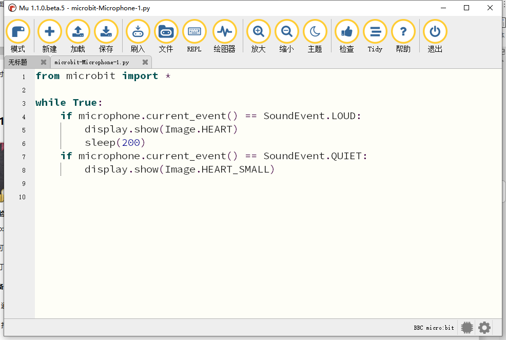

您需要单击“检查”按钮来检查代码是否有错误。如果一行出现光标或下划线，则表明该行的程序有错误。

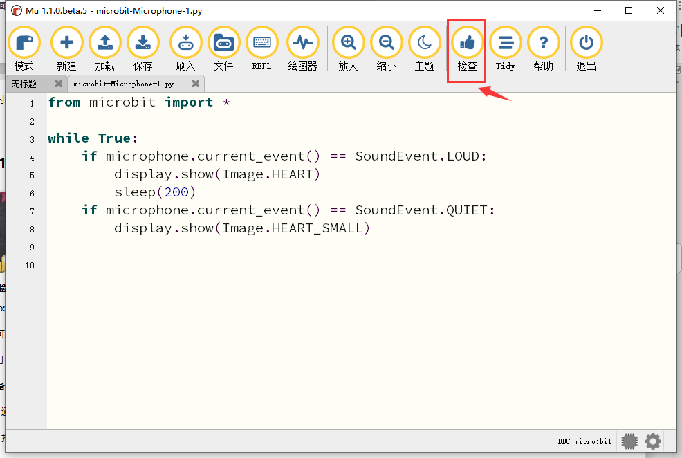

确定程序代码无误之后，你还需要确定micro USB线已连接到micro:bit和电脑，然后单击“刷入”按钮将代码下载到micro:bit。

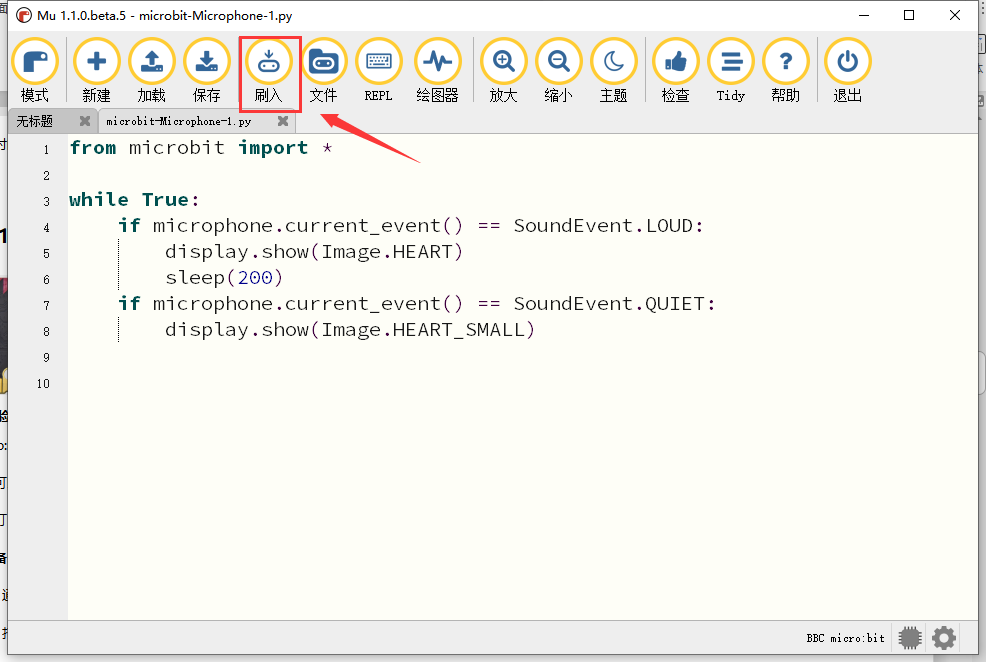

代码1成功下载到micro：bit之后，micro USB数据线不要拔下来，并且利用micro USB数据线上电。当你鼓掌时，micro:bit
主板上的LED点阵显示“❤”图案；当外界环境安静时，micro:bit
主板上的LED点阵显示“

”图案。

代码2：

用Mu软件打开“麦克风.py“文件

加载完成后，如下图所示。你也可以打开Mu软件，在编辑窗口输入代码。（注意！所有英文及符号均须以英文填写，最后一行必须有空格。）

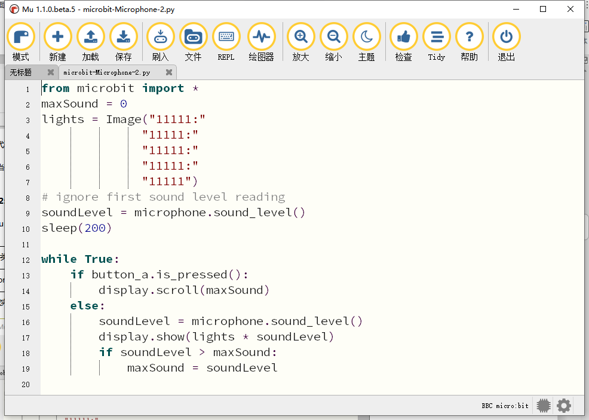

您需要单击“检查”按钮来检查代码是否有错误。如果一行出现光标或下划线，则表明该行的程序有错误。

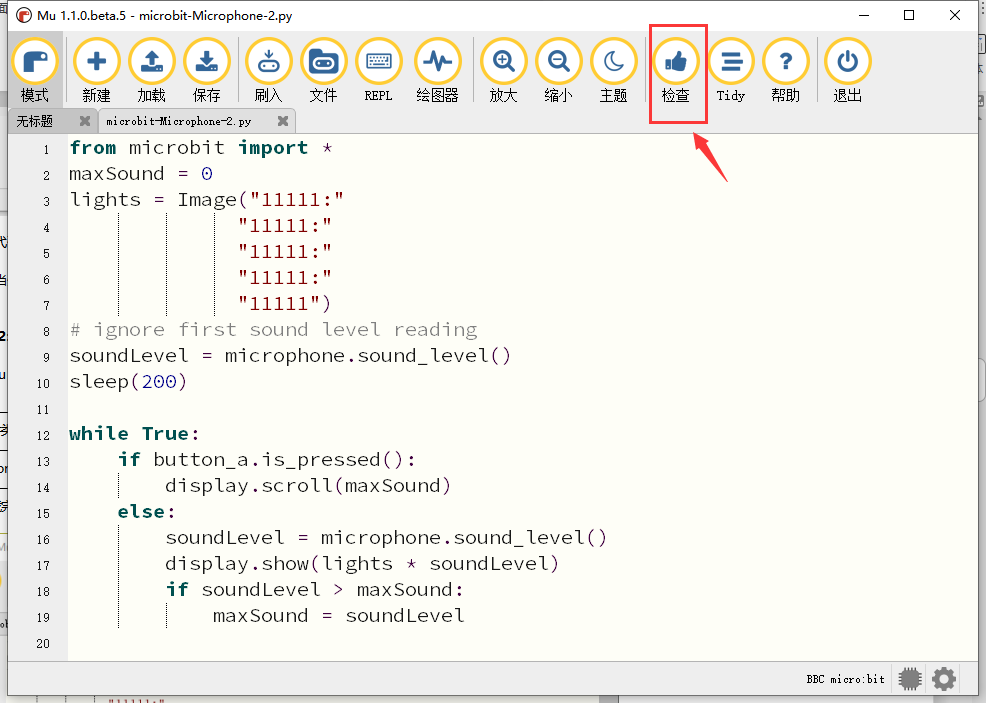

确定程序代码无误之后，你还需要确定micro USB线已连接到micro:bit和电脑，然后单击“刷入”按钮将代码下载到micro:bit。

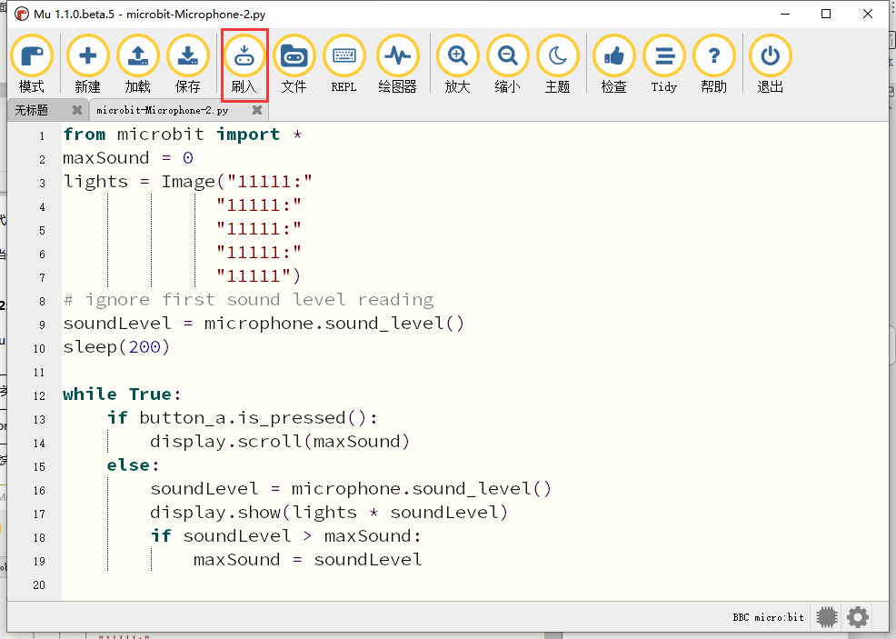

实验结果：

代码成功下载到micro：bit之后，micro USB数据线不要拔下来，利用micro USB数据线上电，并且，当你按下micro:bit主板上的A键时，micro:bit主板上的LED点阵显示检测到的此时环境中最大声音级别值（这里需要注意：通过按micro:bit背面的重置按钮重置最大值。）；当鼓掌时，测量的声音越大，LED点阵屏的25个LED就越亮。

#### 第12课 microbit的蓝牙无线通信

虽然micro:bit拥有一个低功耗蓝牙模块，可以进行蓝牙连接发送数据等，但它只有16k的RAM。BLE堆栈占用了12k RAM，这意味着没有足够的空间来运行microPython；也意味着在同一时刻，microPython和蓝牙服务只能运行一个。

在将来可能配备32k RAM的版本就可以支持蓝牙服务了，在此之前，microPython还无法支持蓝牙。

<https://microbit-micropython.readthedocs.io/en/latest/ble.html>
### Microbit 扩展课程

#### 第一课 外接LED闪烁

实验说明：

LED 闪烁实验是比较基础的实验之一，在使用方法中，我们可以控制micro:
bit自带的5 x 5点阵中的LED闪烁。但是，我们在这个实验中是外接一个LED，然后控制LED闪烁。

器件的介绍：

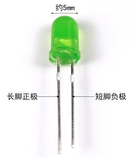

LED是一种二极管，二极管是用[半导体材料](https://baike.baidu.com/item/%E5%8D%8A%E5%AF%BC%E4%BD%93%E6%9D%90%E6%96%99/5078)(硅、硒、锗等)制成的一种电子器件。它具有单向导电性能，即给二极管阳极极（长脚）和阴极（短脚）加上正向电压，并且只有当其正极电压高于其负极电压时才能工作时，二极管导通（即LED点亮）。当给阳极和阴极加上反向电压时，二极管截止（即LED不亮）。
因此，二极管的导通和截止，则相当于开关的接通与断开，LED有不同的颜色、亮度和尺寸。发光二极管有一个阳极（+）和一个阴极（-），它们只能让电流从一个阳极流向阴极。LED不能直接连接电源，会损坏元件，在LED电路中必须串联一定电阻的电阻器。

电阻器：电阻器是电子电路中限制或调节电流流动的电子元件。左边是电阻器的外观，右边是电阻器在电路中表示的符号。电阻(R)的单位为欧姆(Ω)，1     mΩ= 1000 kΩ，1kΩ=
    1000Ω。电阻器是电子电路中限制或调节电流流动的电子元件。左边是电阻的外观。常见电阻阻值有：220Ω，1KΩ，10KΩ等。

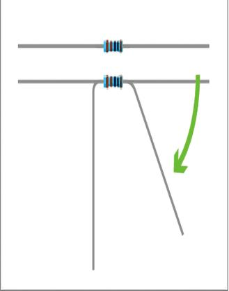

你可以使用它们来保护敏感组件，如LED。电阻的强度（以欧姆为单位）用小色环标记在电阻器的主体上。每种颜色代表一个数字，你可以用电阻对照卡查找。

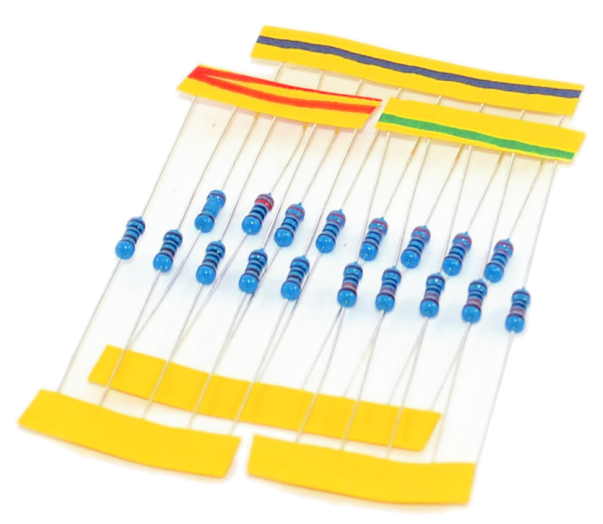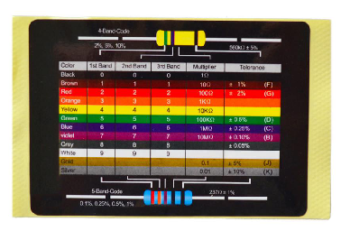

在相同的电压下，会有更小的电流和更大的电阻。电流、电压、电阻之间的联系可以用公式表示：I=U/R。在下图中，目前通过R1的电流:
I = U / R = 3 V / 10 KΩ= 0.000 3A= 0.3mA。

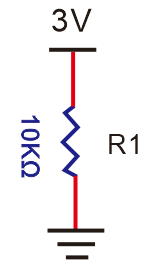

不要把电阻很低的电阻直接连接在电源两极，这样会使电流过高而损坏电子元件。电阻器是没有正负极之分。

面包板的结构和使用方法：

面包板是实验室中用于搭接电路的重要工具，熟练掌握面包板的使用方法是提高实验效率，减少实验故障出现几率的重要基础之一。下面就面包板的结构和使用方法做简单介绍。

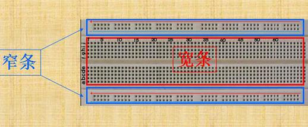

　　
面包板的外观和内部结构如上图所示，常见的最小单元面包板分上、中、下三部分，上面和下面部分一般是由一行或两行的插孔构成的窄条，中间部分是由中间一条隔离凹槽和上下各5
行的插孔构成的条。

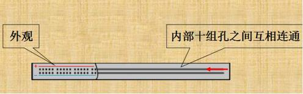

在面包板的两个窄条分别有两行插孔，两行之间是不连通的，一般是作为电源引入的通路。上方第一行标有“+”的一行有10组插孔，每组5个（内部5个孔连通），均为正极；上方第二行标有“-”的一行有10组插孔，每组5个（内部5个孔连通），均为接地。面包板下方的第一行与第二行结构同上。如需用到整个面包板，通常将“+”与“+”用导线连接起来，“-”与“-”用导线连接起来。

中间部分宽条是由中间一条隔离凹槽和上下各5行的插孔构成。在同一列中的5个插孔是互相连通的，列和列之间以及凹槽上下部分则是不连通的。外观及结构如下图：

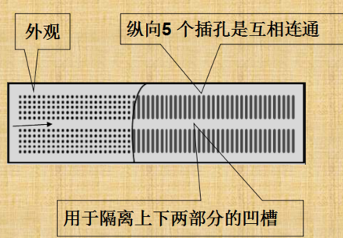

中间部分宽条的连接孔分为上下两部分，是面包板的主工作区，用来插接原件和跳线。在同一列中的5个插孔（即a-b-c-d-e，f-g-h-i-j）是互相连通的；列和列（即1-30）之间以及凹槽上下部分（即e-f）是不连通的。在做实验的时候，通常是使用两窄一宽组成的小单元，在宽条部分搭接电路的主体部分，上面的窄条取一行做电源，下面的窄条取一行做接地。中间宽条用于连接电路，由于凹槽上下是不连通的，所以集成块一般跨插在凹槽上。

Micro:bit扩展板的介绍

单独一块micro bit控制板在和其他传感器栏接线测试很不方便。为此我们特别设计了这个keyes micro bit传感器V2扩展板。

micro bit 传感器V2扩展板不仅将micro bit控制板上的PIO口全部引出并扩展成3PIN接口（GND VCC 信号端），方便micro bit控制板和传感器栏连接；同时扩展板还将micro bit控制板上的常用的串口通信接口、I2C通信接口、SPI通信接口用间距为2.54mm的排针或排母引出，
大大方便了micro bit控制板和其他通信设备连接通信。

扩展板给micro bit控制板供电时，我们可以选择利用黑色DC头输入DC 7-9V和利用micro USB接口输入DC 5V两种方法。扩展板给传感器供电时，我们可以通过V1 V2跳线帽连接选择供电电压，可选择3.3V和5V两种。

特点

两种电源输入方式：黑色DC头输入DC 7-9V

micro USB接口输入DC 5V

两种电压输出选择：V1 V2跳线帽连接选择电压输出

可选择3.3V和5V

自带1个电源指示灯

将所有micro bit控制板的PIO扩展成3PIN接口

引出1个串口通信接口

引出1个I2C通信接口

引出1个SPI通信接口

引脚说明

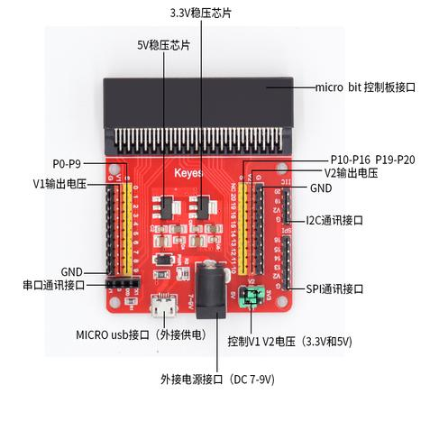

实验器材：

||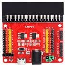||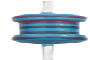|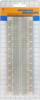|||
|-|-|-|-|-|-|-|
|micro：bit主板×1|keyes micro bit 传感器V2扩展板|红色LED×1|220Ω 电阻×1|面包板×1|公对母杜邦若干|micro USB数据线×1|

实验原理图

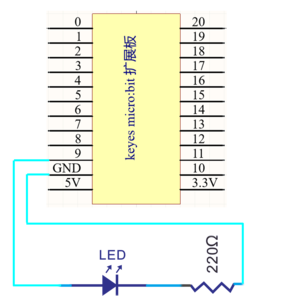

实验接线图：

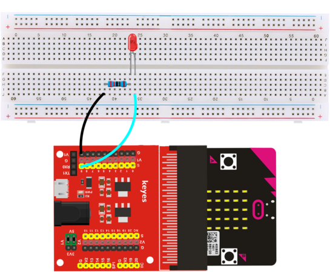

实验程序

程序说明

|from microbit import *|导入micro：bit的库文件|
|-|-|
|while True:|这是一个永久循环，它使micro：bit永远执行这个循环中的代码。|
|Pin9.write_digital(1)|控制引脚9输出高电平，点亮LED|
|sleep(1000)|延时1000毫秒|
|Pin9.write_digital(0)|控制引脚9输出低电平，熄灭LED|
|sleep(1000)|延时1000毫秒|

实验结果

按照接线图接好线，上传完程序，上电后，我们就可以看到外接LED灯不停闪烁，间隔大约为1秒。

拓展实验

让红色LED灯接在IO口P2，要求红色LED灯不停的闪烁，间隔大约为0.5秒。

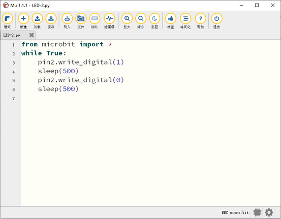

#### 交通灯

实验说明：

交通的发达，标志着城市的发达，相对交通的管理则显得越来越重要。交通灯是城市交通中的重要指挥系统，它与人们日常生活密切相关．随着人们生活水平的提高，对交通管制也提出了更高的要求，因此提供一个可靠、安全、便捷的多功能交通灯控制系统有着现实的必要性。 

对于复杂的城市交通系统，为了确保安全，保证正常的交通秩序，十字路口的信号控制必需按照一定的规律变化，以便于车辆行人能顺利地通过十字路口。

单片机自问世以来，性能不断提高和完善，其资源又能满足很多场合的应用，加之单片机具有集成度高、功能强、速度快、体积小、功耗低、使用方便、性能可靠、价格低廉，其易于产品化、抗干扰能力强、可在各种恶劣环境下可靠的工作等特点。

在我们学习micro：bit过程中，我们经常会用红绿黄3个LED外接电路来模拟路边交通灯的红绿黄灯闪烁。交通灯有两种，给机动车看的叫机动车灯，通常指由红、黄、绿（绿为蓝绿）三种颜色灯组成用来指挥交通通行的信号灯。

绿灯亮时，准许车辆通行，黄灯闪烁时，已越过停止线的车辆可以继续通行；没有通过的应该减速慢行到停车线前停止并等待，红灯亮时，禁止车辆通行。给行人看的叫人行横道灯，通常指由红、绿（绿为蓝绿）二种颜色灯组成用来指挥交通通行的信号灯，红灯停，绿灯行。

实验器材：

|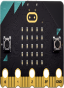|||||
|-|-|-|-|-|
|micro：bit主板×1|keyes micro bit 传感器V2扩展板|红色LED×1|黄色LED×1|绿色LED×1|
||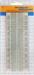||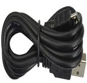||
|220Ω电阻×3|面包板×1|公对母杜邦若干|micro USB数据线×1||

实验原理图：

实验接线图：

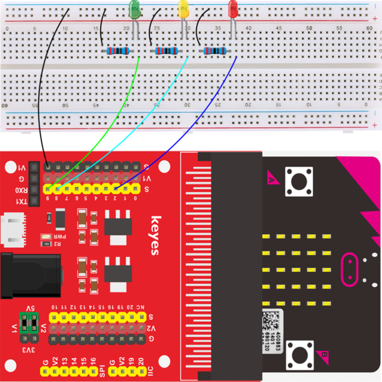

绿色LED接在P9、黄色LED接在P8、红色LED接在P2

实验程序

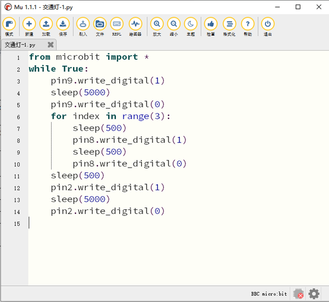

程序说明

|from microbit import *|导入micro：bit的库文件|
|-|-|
|while True:|这是一个永久循环，它使micro：bit永远执行这个循环中的代码。|
|pin9.write_digital(1)|控制引脚9输出高电平，点亮LED（绿）|
|sleep(5000)|延时5000毫秒|
|pin9.write_digital(0)|控制引脚9输出低电平，熄灭LED（绿）|
|for index in range(3):|循环3次|
|pin8.write_digital(1)|控制引脚8输出高电平，点亮LED（黄）|
|sleep(500)|延时500毫秒|
|pin8.write_digital(0)|控制引脚8输出低电平，熄灭LED（黄）|
|sleep(500)|延时500毫秒|
|pin2.write_digital(1)|控制引脚2输出高电平，点亮LED（红）|
|sleep(5000)|延时5000毫秒|
|pin2.write_digital(0)|控制引脚2输出低电平，熄灭LED（红）|

实验结果：

按照接线图接好线，上传完程序，上电后，我们就可以看到绿色LED亮5秒后熄灭，接着黄色LED闪烁三次，最后红色LED再亮5秒后熄灭，循环交替。

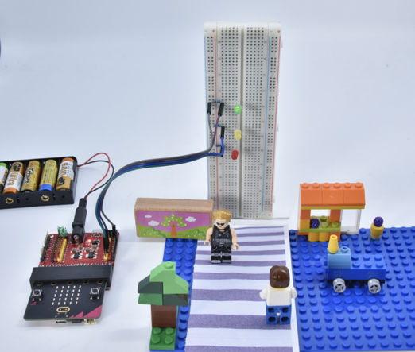

拓展实验：

模拟人行道红绿灯，绿灯先亮5秒，接着再闪烁3次，再亮红灯。

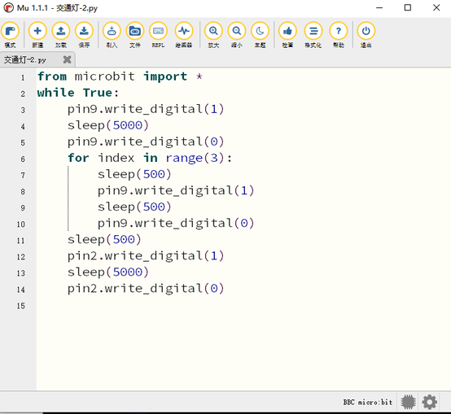

#### 第3课 流水灯

实验说明：

流水灯顾名思义就是发出的光像流水一样。流水灯也叫广告灯，我们在霓虹四射的晚上，经常都能看到这种像流水这样的LED灯在闪烁。说到这里是不是有点跃跃欲试了，不错，这次的课程就是在上一节的基础上再增加几个LED灯，然后通过控制它们亮灭的时间和顺序，来实现流水灯的现象。

实验器材：

|||||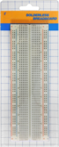||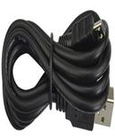|
|-|-|-|-|-|-|-|
|micro：bit主板×1|keyes micro bit 传感器V2扩展板|红色LED×6|220Ω 电阻×6|面包板×1|公对母杜邦若干|micro USB数据线×1|

实验原理图：

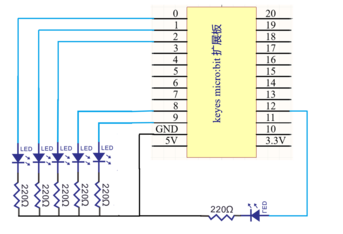

实验接线图：

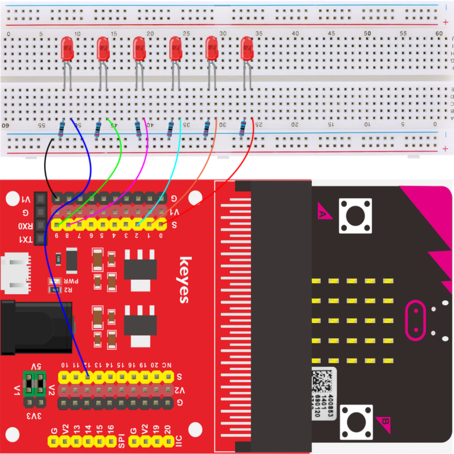

实验代码：

用Mu软件打开“流水灯.py“文件。

你也可以打开Mu软件，在编辑窗口输入代码。（注意！所有英文及符号均须以英文填写，最后一行必须有空格。）

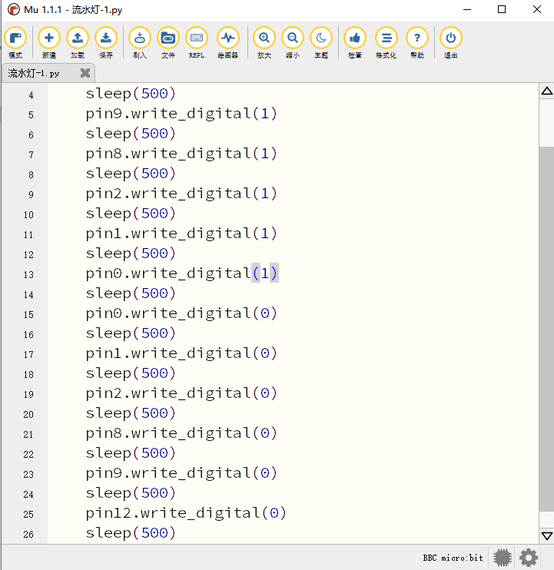

代码说明

代码跟前面的类似，只是我们改变了控制引脚的顺序，说明请参考前面的课程1和课程2；

实验结果

按照接线图接好线，上传完程序，上电后，我们就可以看到IO口外接LED灯先逐个变亮，然后逐个变暗，循环交替。

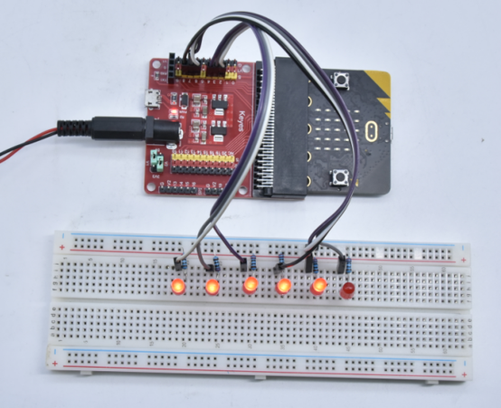

#### 第四课 呼吸灯

实验说明：

前面课程中，我们详细的介绍了通过代码控制LED灯的亮灭。在这个课程实验中我们将使用PWM来控制红色LED亮度不断地变化，模拟我们呼吸的效果。PWM是使用数字手段来控制模拟输出的一种手段。使用数字控制产生占空比不同的方波（一个不停在高电平与低电平之间切换的信号)来控制模拟输出。一般来说端口的输入电压只有两个0V与3V。如果想要1.5V的输出电压怎么办？有同学说串联电阻，对，这个方法是正确的。但是，如果想要0.5V，1V，2V等等之
间来回变动怎么办呢？不可能不停地切换电阻吧。这种情况下就需要使用PWM了，那它是怎么控制的呢，对micro：bit的数字端口电压输出只有LOW与HIGH两个，对应的就是0V与3V的电压输出，可以把LOW定义为0，HIGH定义为1，1秒内让micro：bit输出300个0或者1的信号。如果这300个全部为1，那就是完整的3V，如果全部为0，那就是0V。如果010101010101这样输出，刚好一半，输出端口就感觉是1.5V的电压输出了。这个和放映电影是一个道理，咱们所看的电影并不是完全连续的，它其实是每秒输出25张图片。在这种情况下，人的肉眼是分辨不出来的，看上去就是连续的了。PWM也是同样的道理，如果想要不同的电压，就控制0与1的输出比例控制就可以了。当然这和真实的连续输出还是有差别的，单位时间内输出的0,1信号越多，控制的就越精确。（输出电压=（开启时间/脉冲时间）\*最大电压值）  
在下图中，绿线之间代表一个周期，其值也是PWM频率的倒数。换句话说，如果micro：bit PWM的频率是500Hz，那么两绿线之间的周期就是2毫秒。 analogWrite()
命令中可以操控的范围为0-255， analogWrite(255)表示100%占空比（常开），
analogWrite(127)占空比大约为50%（一半的时间）。

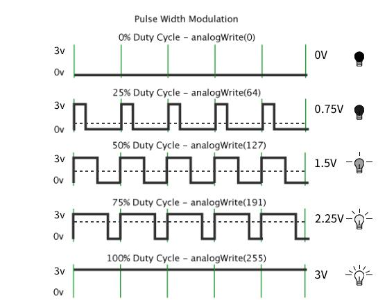

脉冲宽度调制（PWM）有多种应用：灯亮度调节、电机调速、发声等。
以下是PMW的三个基本参数：

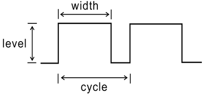

（1）脉冲宽度的振幅（最小/最大）

（2）脉冲周期（1秒内脉冲频率的倒数）

（3）电压水平（如：0V-3V）

（4）micro：bit上有6个PMW接口，即数字管脚P0、P1、P2、P3、P4和P10。

实验中，我们将红色LED接到了micro：bit主板的P0上，从micro:bit
引脚说明我们知道P0还可以当做模拟信号输入端口。我们通过P0端口控制外接LED亮度，先是逐渐变亮，然后是逐渐变暗，循环交替，模拟人体呼吸现象。

实验器材：

|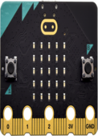|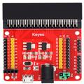|||||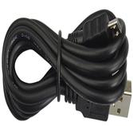|
|-|-|-|-|-|-|-|
|micro：bit主板×1|keyes micro bit 传感器V2扩展板|红色LED×1|220Ω电阻×1|面包板×1|公对母杜邦若干|micro USB数据线×1|

实验原理图：

实验接线图：

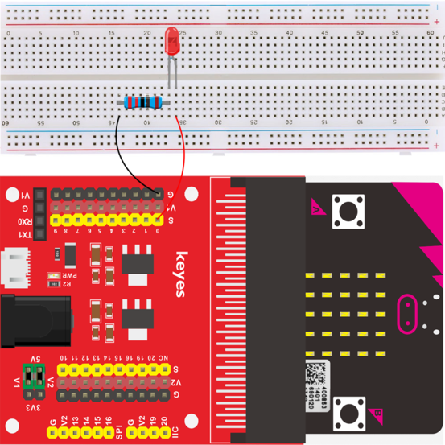

红色LED接在P0处

实验代码：

用Mu软件打开“呼吸灯-1.py“文件。

你也可以打开Mu软件，在编辑窗口输入代码。（注意！所有英文及符号均须以英文填写，最后一行必须有空格。）

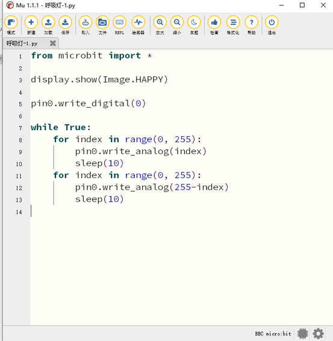

实验现象

接好线，上传好程序，microbit主板上的的LED点阵显示“笑脸”图案，可以看到LED灯会有个逐渐由亮到灭的一个缓慢过程，而不是直接的亮灭，如同呼吸一般，均匀变化。循环交替。

代码说明

|from microbit import *|导入micro：bit的库文件|
|-|-|
|display.show(Image.HAPPY)|microbit主板上的LED点阵显示“笑脸”图案|
|while True:|这是一个永久循环，它使micro：bit永远执行这个循环中的代码。|
|for index in range(0, 255):|range()是一个函数， for index in range(0, 255)就是将0~255赋值给index|
|Pin0.write_analog(index)|控制引脚P0模拟输出index|
|sleep(10)|延时10毫秒|

#### 第5课RGB

实验说明：

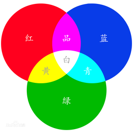RGB色彩模式是工业界的一种颜色标准，是通过对红(R)、绿(G)、蓝(B)三个颜色通道的变化以及它们相互之间的叠加来得到各式各样的颜色的，RGB即是代表红、绿、蓝三个通道的颜色，这个标准几乎包括了人类视力所能感知的所有颜色，是目前运用最广的颜色系统之一。

显示器大都是采用了RGB颜色标准，在显示器上，是通过电子枪打在屏幕的红、绿、蓝三色发光极上来产生色彩的，电脑一般都能显示32位颜色，有一千万种以上的颜色。电脑屏幕上的所有颜色，都由这红色绿色蓝色三种色光按照不同的比例混合而成的。一组红色绿色蓝色就是一个最小的显示单位。屏幕上的任何一个颜色都可以由一组RGB值来记录和表达。

RGB是从颜色发光的原理来设计定的，通俗点说它的颜色混合方式就好像有红、绿、蓝三盏灯，当它们的光相互叠合的时候，色彩相混，而亮度却等于三者亮度之总和，越混合亮度越高，即加法混合。红、绿、蓝三盏灯的叠加情况，中心三色最亮的叠加区为白色，加法混合的特点：越叠加越明亮，因此被通常被人们称为七彩LED。

红、绿、蓝三个颜色通道每种色各分为256阶亮度，在0时“灯”最弱——是关掉的，而在255时“灯”最亮。当三色灰度数值相同时，产生不同灰度值的灰色调，即三色灰度都为0时，是最暗的黑色调；三色灰度都为255时，是最亮的白色调。

RGB 颜色称为加成色，因为您通过将 R、G 和 B
添加在一起（即所有光线反射回眼睛）可产生白色。加成色用于照明光、电视和计算机显示器。例如，显示器通过红色、绿色和蓝色荧光粉发射光线产生颜色。绝大多数可视光谱都可表示为红、绿、蓝
(RGB)
三色光在不同比例和强度上的混合。这些颜色若发生重叠，则产生青、洋红和黄。

RGB灯分为共阳、共阴两种，下图展示的为共阴RGB灯。这个实验中我们用一个RGB灯，它是共阴极RGB模块。在这个实验中，我们把控制RGB红、绿、蓝三个颜色通道的信号端分别对应的接到了micro：bit主板的P4、
P3、
P2接口上，根据引脚说明，这3个引脚也是模拟输入信号端口。三个引脚分别为蓝、绿、红，这3个引脚可以只使用其中一个（只亮一种颜色），也可以同时使用（颜色组合）。在实验中，我们通过控制P4、
P3、
P2的模拟输入值，首先控制RGB灯显示红绿蓝三种颜色灯光，然后控制RGB灯快速变换颜色。通过控制R、G、B三个引脚的电压输入可以调节三种基色（红/蓝/绿）的强度，从而实现全彩的混色效果。

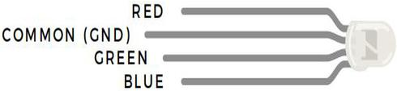

实验器材：

|||||
|-|-|-|-|
|micro：bit主板×1|keyes micro bit 传感器V2扩展板|RGB×1|micro USB数据线×1|
||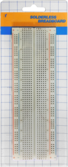|||
|220Ω 电阻×3|面包板×1|公对母杜邦若干||

实验原理图

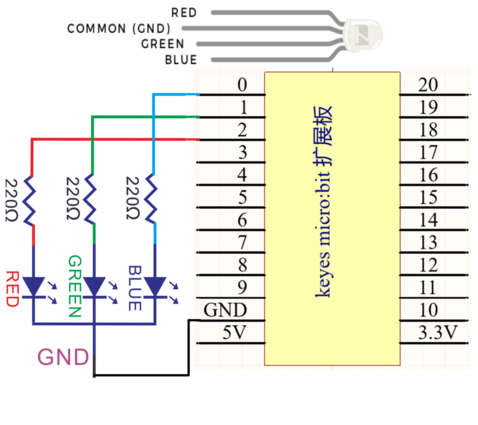

实验接线图

实验代码

根据上图的接线图接好线，由实验接线图可知，RGB的RED引脚接在P2、GREEN引脚接在P1、BLUE引脚接在P0，先用micro USB数据线将电脑和micro：bit主板连接好，再启动MU编程工具进行编写代码。

用Mu软件打开“RGB.py“文件。

你也可以打开Mu软件，在编辑窗口输入代码。（注意！所有英文及符号均须以英文填写，最后一行必须有空格。）

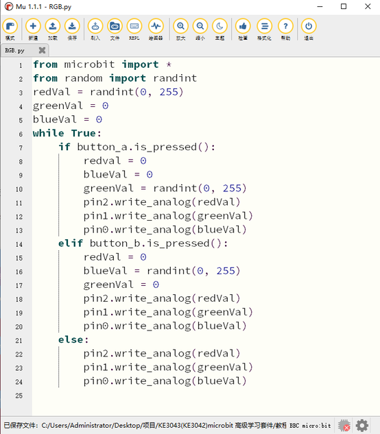

代码说明

|from random import randint|导入random库|
|-|-|
|redVal = randint(0, 255) greenVal = 0 blueVal = 0|初始化RGB显示红色值|
|if button_a.is_pressed():|当按键A按下时|
|redval = 0 blueVal = 0 greenVal = randint(0, 255) pin2.write_analog(redVal) pin1.write_analog(greenVal) pin0.write_analog(blueVal)|RGB显示绿色|
|elif button_b.is_pressed():|当按键B按下时|
|redVal = 0 blueVal = randint(0, 255) greenVal = 0 pin2.write_analog(redVal) pin1.write_analog(greenVal) pin0.write_analog(blueVal)|RGB显示蓝色|
|pin2.write_analog(redVal) pin1.write_analog(greenVal) pin0.write_analog(blueVal)|否则显示红色|

实验结果

点击检查，没有错误之后，刷入程序，RGB灯显示红色，当你按下micro:bit的A按钮，颜色会变成绿色，如果你按下B键，颜色就会变成蓝色。

想要深入了解random库可以参考链接：

https://microbit-micropython.readthedocs.io/en/latest/tutorials/random.html

#### 有源蜂鸣器

实验说明

我们可以用micro：bit制作许多互动作品，其中最常用的是声光显示。之前所有的实验都和LED有关。然而，这个实验中的电路可以产生声音。通常情况下，实验是用蜂鸣器或扬声器进行的，而蜂鸣器更简单、更容易使用。蜂鸣器的发声原理由振动装置和谐振装置组成，而蜂鸣器又可分为有源蜂鸣器和无源蜂鸣器两种。本课程中主要用到了有源蜂鸣器，有源蜂鸣器内部有一简单的振荡电路，能将恒定的直流电转化成一定频率的脉冲信号。实验中我们只需要给有源蜂鸣器输入一个高电平信号，蜂鸣器就响起。

三极管

三极管，全称应为[半导体三极管](https://baike.baidu.com/item/%E5%8D%8A%E5%AF%BC%E4%BD%93%E4%B8%89%E6%9E%81%E7%AE%A1/3517837)，也称[双极型晶体管](https://baike.baidu.com/item/%E5%8F%8C%E6%9E%81%E5%9E%8B%E6%99%B6%E4%BD%93%E7%AE%A1/5364185)、[晶体三极管](https://baike.baidu.com/item/%E6%99%B6%E4%BD%93%E4%B8%89%E6%9E%81%E7%AE%A1/9393790)，是一种控制电流的半导体器件。其作用是把微弱信号放大成幅度值较大的电信号，也用作无触点开关。

三极管是半导体基本元器件之一，具有电流放大作用，是电子电路的核心元件。三极管是在一块半导体基片上制作两个相距很近的PN结，两个PN结把整块半导体分成三部分，中间部分是基区，两侧部分是发射区和集电区，排列方式有PNP和NPN两种。

对于NPN三极管，它是由2块N型半导体中间夹着一块P型半导体所组成，发射区与基区之间形成的PN结称为发射结，而集电区与基区形成的PN结称为集电结，三条引线分别称为[发射极](https://baike.baidu.com/item/%E5%8F%91%E5%B0%84%E6%9E%81)E（Emitter）、[基极](https://baike.baidu.com/item/%E5%9F%BA%E6%9E%81)B (Base)和[集电极](https://baike.baidu.com/item/%E9%9B%86%E7%94%B5%E6%9E%81)C (Collector)。

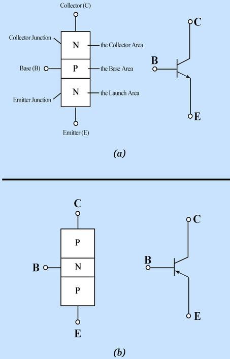

S8050三极管是一款小功率NPN型硅管，集电极-基极(Vcbo)电压最大可为40V，集电极电流为(Ic)0.5A。

S8050三极管字面朝向自己，[引脚](http://www.so.com/s?q=%E5%BC%95%E8%84%9A&ie=utf-8&src=internal_wenda_recommend_textn)朝下，[左边](http://www.so.com/s?q=%E5%B7%A6%E9%9D%A2&ie=utf-8&src=internal_wenda_recommend_textn)一脚是发射极（E极），[中间](http://www.so.com/s?q=%E4%B8%AD%E9%97%B4&ie=utf-8&src=internal_wenda_recommend_textn)一脚是基极（B极），[右边](http://www.so.com/s?q=%E5%8F%B3%E8%BE%B9&ie=utf-8&src=internal_wenda_recommend_textn)一脚是集电极（C极）

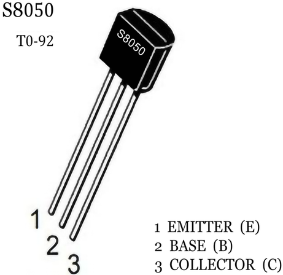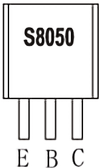

我们常用的三极管分为两大类型：PNP型三极管和NPN型三极管，S8550为PNP型三极管，S8050为NPN型三极管，在我们的学习套件中提供的是S8050。

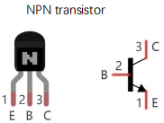
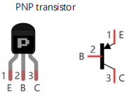

实验器材

|||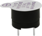||||
|-|-|-|-|-|-|
|micro：bit主板×1|keyes micro bit 传感器V2扩展板|有源蜂鸣器×1|2.4KΩ 电阻×1|公对母杜邦若干|面包板连接线若干|
|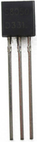|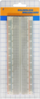|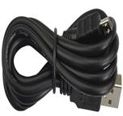||||
|S8050三极管×1|面包板×1|micro USB数据线×1|6节5号AA电池盒×1|5号AA电池×6||

实验原理图：

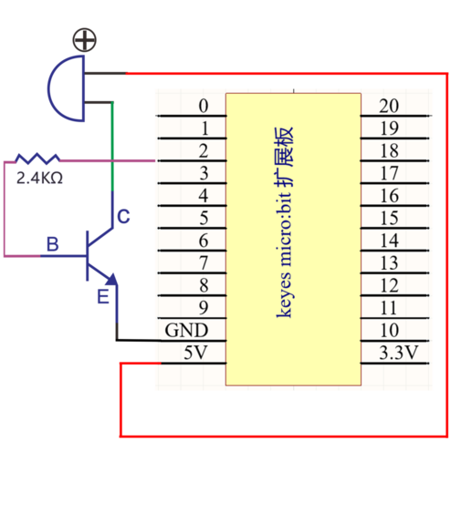

实验接线图：

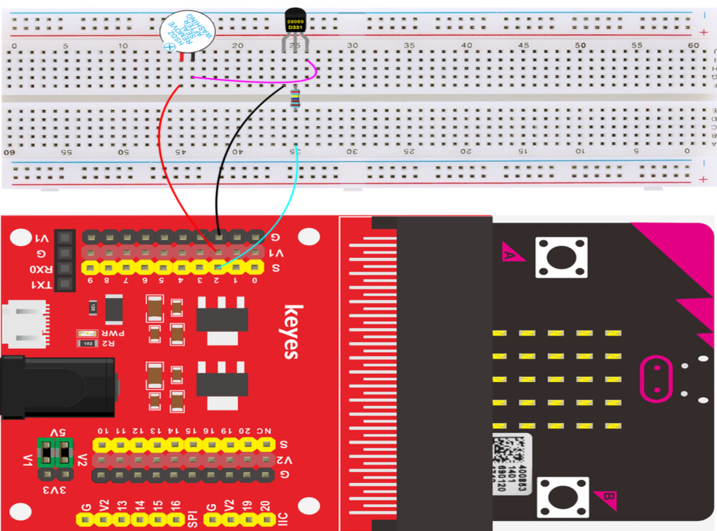

实验代码：

根据上图的接线图接好线，由实验接线图可知，有源蜂鸣器接到P2处，先用micro USB数据线将电脑和micro：bit主板连接好，再启动MU编程工具进行编写代码。

用Mu软件打开“有源蜂鸣器-1.py“文件。

你也可以打开Mu软件，在编辑窗口输入代码。（注意！所有英文及符号均须以英文填写，最后一行必须有空格。）

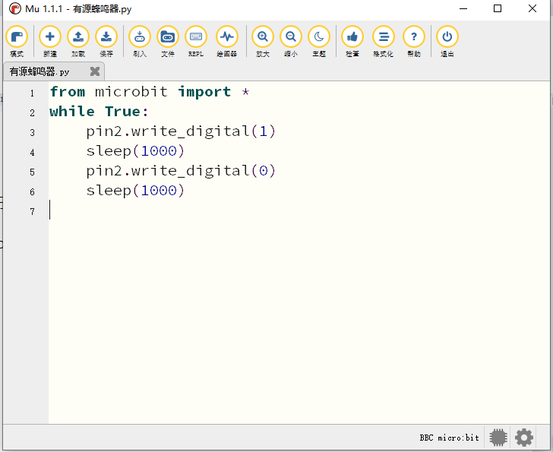

代码说明

|from microbit import *|导入micro：bit的库文件|
|-|-|
|while True:|这是一个永久循环，它使micro：bit永远执行这个循环中的代码。|
|Pin9.write_digital(1)|控制引脚2输出高电平，蜂鸣器发声|
|sleep(1000)|延时1000毫秒|
|Pin9.write_digital(0)|控制引脚2输出低电平，蜂鸣器不发声|
|sleep(1000)|延时1000毫秒|

实验结果：

按照接线图接好线，上传完程序，利用电池盒上电后，我们可以听到有源蜂鸣器响0.5秒，停止响起0.5秒，循环交替。（注意：扩展板使用DC 7~9V的电源供电，V2跳帽插在5V的位置，实验才能正常工作）

拓展实验：

更改声音的频率，有源蜂鸣器响0.2秒，停止响起0.2秒，循环交替。

用Mu软件打开“有源蜂鸣器-2.py“文件。

你也可以打开Mu软件，在编辑窗口输入代码。（注意！所有英文及符号均须以英文填写，最后一行必须有空格。）

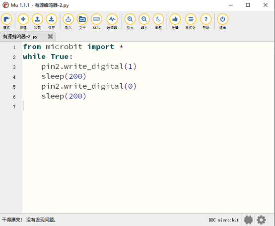

#### 第7课 无源蜂鸣器

实验说明：

我们可以用micro：bit制作许多互动作品，其中最常用的是声光显示。之前所有的实验都和LED有关。然而，这个实验中的电路可以产生声音。通常情况下，实验是用蜂鸣器或扬声器进行的，而蜂鸣器更简单、更容易使用。

我们这里介绍的蜂鸣器是无源蜂鸣器。它不能由自身驱动，而是由外部脉冲频率驱动。不同的频率产生不同的声音。我们可以使用micro：bit来编码歌曲的旋律，这实际上是非常有趣和简单的。

蜂鸣器可分为有源蜂鸣器和无源蜂鸣器两种。无源蜂鸣器利用电磁感应现象，为音圈接入交变电流后形成的电磁铁与永磁铁相吸或相斥而推动振膜发声，接入直流电只能持续推动振膜而无法产生声音，只能在接通或断开时产生声音。

无源蜂鸣器的工作原理与扬声器相同，在使用方波信号源驱动的应反向并联一个二极管，防止突然断电时产生的高压反向电动势击穿其他元件以及使用寿命缩短。  
　　有源蜂鸣器往往比无源蜂鸣器的贵，就是因为里面多个震荡电路，只需接入额定电压的直流电即可发出指定频率的声音，频率由内部振荡电路决定，无法改变。而无源蜂鸣器内部不带振荡源，直流信号无法令其鸣叫，须用方波驱动。

无源蜂鸣器的优点是：  
　　（1）制作成本低；  
　　（2）声音频率范围宽，可高分贝的发出某些频率的超声波以及可以做出“多来米发索拉西”的效果；  
　 （3）在一些特例中，可以和LED复用一个控制IO口。

无源蜂鸣器频率是由英文和数字组成的音名，选择不同的音名就能改变不同的频率啦。声音频率的高低叫做音调。在音乐课上，老师教过我们唱“1（Do）、2（Re）、3(Mi)、4(Fa) 、5(Sol) 、6(La) 、7(Si)”是音乐当中的唱名，就对应了音调中的C、D、E、F、G、A、B这些音名。

|1（Do）|2（Re）|3(Mi)|4(Fa)|5(Sol)|6(La)|7(Si)|
|-|-|-|-|-|-|-|
|C|D|E|F|G|A|B|

频率（音调）高低判断时先看后面的数字，数字越大，音调越高，数字相同时看前面的字母，从C到B频率（音调）越来越高；而节拍是音符延时时间，数值越大，延时时间越长。

节拍是指每个音符持续的时间。音谱中不带线的一个音符就是一拍，延时1000毫秒，而带一条下划线的音符节拍是不带线音符节拍的1/2，带两条下划线的音符节拍是不带线音符节拍的1/4（）

在本实验中，使无源蜂鸣器演奏”欢乐颂“歌曲，下面是《欢乐颂》歌曲的简谱。

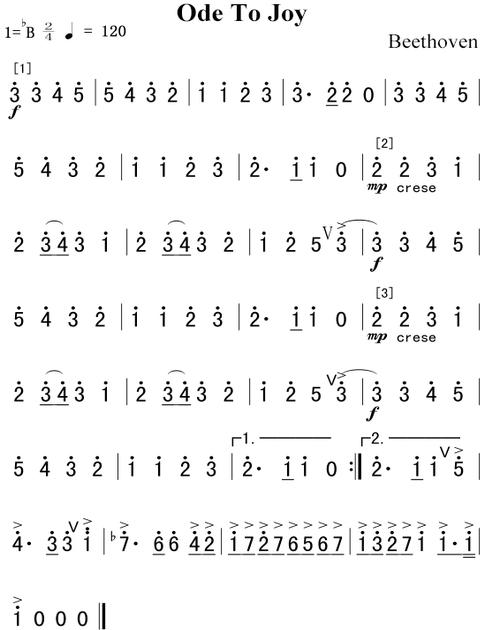

实验器材：

|||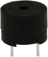||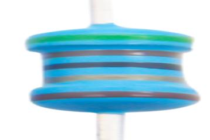||
|-|-|-|-|-|-|
|micro：bit主板×1|keyes micro bit 传感器V2扩展板|无源蜂鸣器×1|2.4KΩ电阻×1|51Ω电阻×1|面包板连接线若干|
|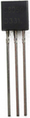|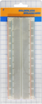||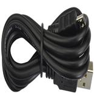||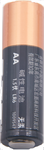|
|S8050三极管×1|面包板×1|公对母杜邦若干|micro USB数据线×1|6节5号AA电池盒×1|5号AA电池×6|

实验原理图：

（注意：在micro：bit主板中，无源蜂鸣器只能接在IO口P0处）

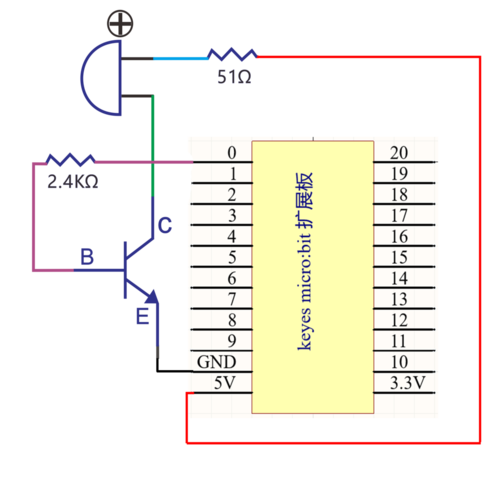

实验接线图

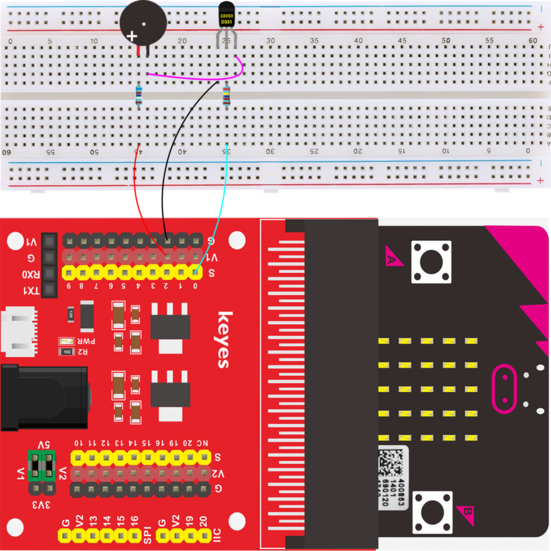

实验代码：

根据上图的接线图接好线，由实验接线图可知，无源蜂鸣器接到P0处，先用micro USB数据线将电脑和micro：bit主板连接好，再启动MU编程工具进行编写代码。

用Mu软件打开“无源蜂鸣器.py“文件。

你也可以打开Mu软件，在编辑窗口输入代码。（注意！所有英文及符号均须以英文填写，最后一行必须有空格。）

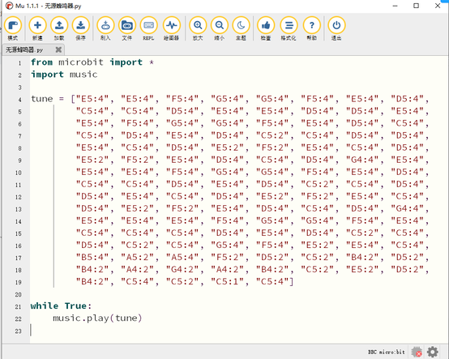

实验结果

代码检查没有错，成功下载到micro：bit之后，无源蜂鸣器一直循环播放《欢乐颂》歌曲。

#### 第8课 1位数码管显示

实验说明

数码管是一种半导体发光器件，其基本单元是发光二极管。数码管按段数分为七段数码管和八段数码管，八段数码管比七段数码管多一个发光二极管单元（多一个小数点显示）。本实验所使用的是八段数码管，这类数码管可以分为共阳极与共阴极两种，共阳数码管就是把所有LED的阳极连接到共同接点COM，共阳数码管在应用时应将公共极COM接到+3V，当某一字段发光二极管的阴极为低电平时，相应字段就点亮，当某一字段的阴极为高电平时，相应字段就不亮。而每个LED的阴极分别为a、b、c、d、e、f、g及dp（小数点）；共阴数码管是指将所有发光二极管的阴极接到一起形成公共阴极(COM)的数码管，共阴数码管在应用时应将公共极COM接到地线GND上，当某一字段发光二极管的阳极为高电平时，相应字段就点亮，当某一字段的阳极为低电平时，相应字段就不亮。而每个LED的阳极分别为a、b、c、d、e、f、g及dp（小数点）。数码管共有七段显示数字的段，还有一个显示小数点的段。当让数码管显示数字时，只要将相应的段点亮即可。

这个实验中我们用了一个共阴极八段数码管，当由micro：bit控制时，它必须与电阻器连接，因此阳极端的每个引脚都应连接到220Ω电阻器。1位数码管有8个发光二极管（LED）对应的8个引脚，如

下图所示，发光二极管a相对于引脚a，发光二极管b相对于引脚b，以此类推。把引脚a接到micro bit主板的P13，引脚b接到P14，引脚c接到P8，引脚d接到P9，引脚e接到P10，引脚f接到P12，引脚g接到P11，引脚dp接到P7，只要控制对应接口的高低电平，即可控制数码管的显示。实验中，我们让数码管逐渐显示0-9的10个数字。

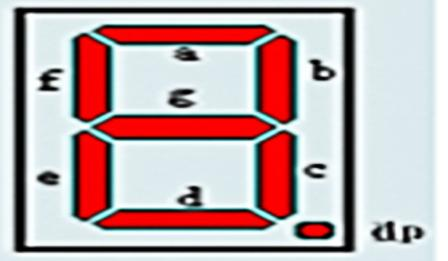
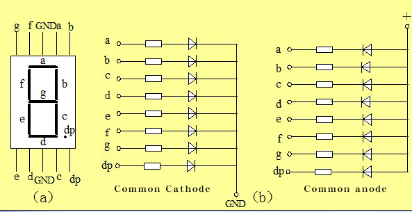

实验器材

|||||
|-|-|-|-|
|micro：bit主板×1|keyes micro bit 传感器V2扩展板|1位数码管×1|220Ω电阻×8|
|||||
|220Ω电阻×8|面包板×1|面包板连接线若干|公对母杜邦若干|

实验原理图：

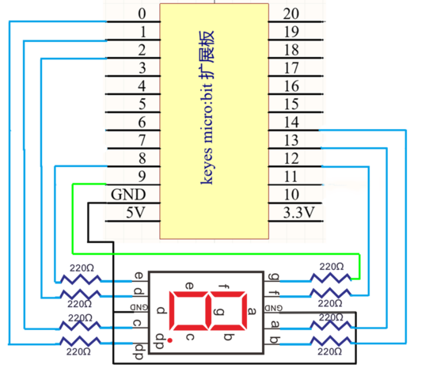

实验接线图：

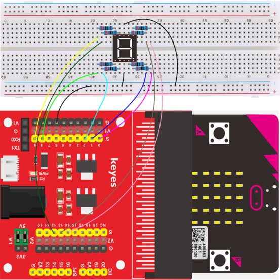

实验代码：

根据上图的接线图接好线，先用micro     USB数据线将电脑和micro：bit主板连接好，再启动MU在线编程工具进行编写代码。

用Mu软件打开“一位数码管.py“文件。

你也可以打开Mu软件，在编辑窗口输入代码。（注意！所有英文及符号均须以英文填写，最后一行必须有空格。）

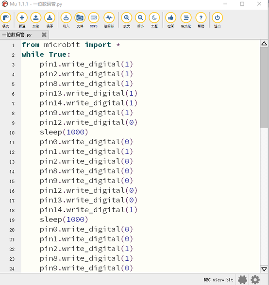

点击检查无报错再刷入

代码说明

|from microbit import *|导入micro：bit的库文件|
|-|-|
|while True:|这是一个永久循环，它使micro：bit永远执行这个循环中的代码。|
|pin1.write_digital(1) pin2.write_digital(1) pin8.write_digital(1) pin13.write_digital(1) pin14.write_digital(1) pin9.write_digital(1) pin12.write_digital(0)|一位数码管显示0|
|sleep(1000)|延时1000毫秒|
|pin0.write_digital(0) pin1.write_digital(1) pin2.write_digital(0) pin8.write_digital(0) pin9.write_digital(0) pin12.write_digital(0) pin13.write_digital(0) pin14.write_digital(1)|一位数码管显示1（其他的类似）|
|sleep(1000)|延时1000毫秒|

实验结果

按照接线图接好线，上传完程序，上电后，我们可以看到数码管循环显示0～6的7个数字。

#### 第9课 4位数码管模块显示

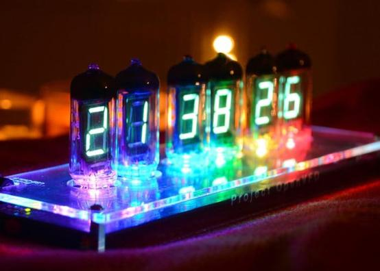

实验说明:

4位数码管模块是一个主要由12脚的带比分点的4位共阳数码管组成的显示模块，它的驱动芯片为TM1637，4位数码管模块是亮度可调带时钟点的。使用时，我们只需要2根信号线即可使单片机控制4位8数码管，大大节约了控制板IO口资源。该模块可以应用于时间显示、跑表显示及其他需要显示数字的设备上。模块的控制端接口为4pin
间距为2.54mm的排针，我们可以通过该排针将模块连接到对应的控制单片机上。

为了方面将模块固定在其他设备上，模块自带2个直径为3mm的定位孔。

在本实验中，我们将keyes 4位数码管模块通过面包板连接到keyes micro bit
扩展板上，通过micro：bit主板和编写程序来控制 4位数码管模块显示数字。

实验器材：

|||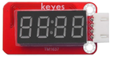|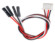||
|-|-|-|-|-|
|micro：bit主板×1|keyes micro bit T型扩展板×1|keyes 4位数码管模块×1|4P 转杜邦线母单|micro USB数据线×1|

接线图

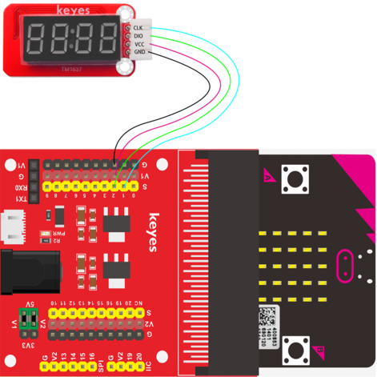

实验程序

用Mu软件打开“四位数码管-1.py“文件。

你也可以打开Mu软件，在编辑窗口输入代码。（注意！所有英文及符号均须以英文填写，最后一行必须有空格。）

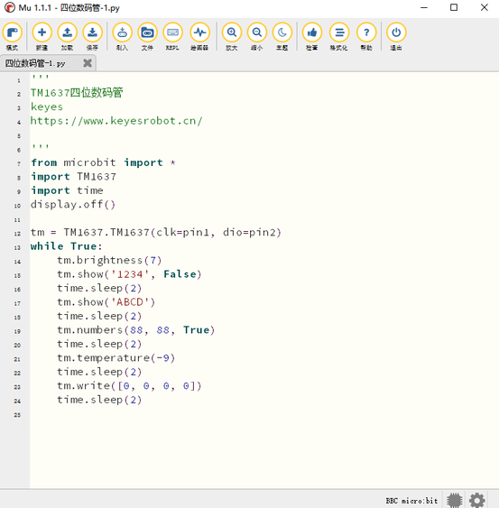

您需要单击“检查”按钮来检查代码是否有错误。如果一行出现光标或下划线，则表明该行的程序有错误。

添加TM1637库文件

不要点击“刷入”，因为你还需要做一些额外的工作：导入“TM1637.py“库文件到micro:bit中。这个库文件包含了四位数码管的控制方法，我们将这些方法集成到一个“TM1637.py”库文件中，这使得您更容易通过Python代码来使用。这就像MakeCode代码中的扩展库文件一样。

操作

把库文件TM1637复制到MU软件的“Mu_code”目录下；

例如，在windows系统中，假设您的系统安装在电脑C驱动器上，则用户名为“Administrator”，那么“mu_code”目录的路径是“C:\Users\Administrator\mu\_
code”。在Linux系统上，“mu_code”目录的路径是“~/home/mu_code”

进入“mu_code”文件夹。

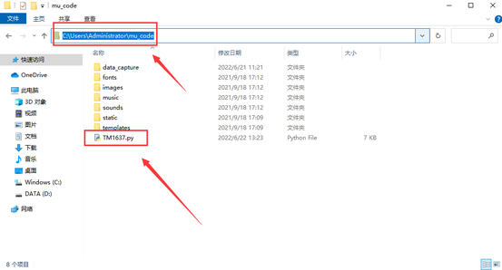

（2）先打开Mu软件并连接micro:bit到电脑，接着点击“文件”按钮，再拖着“TM1637.py“库文件到micro:bit中。(若点击“文件”，没有看到库文件，需要先刷入个程序再打开点击“文件”)

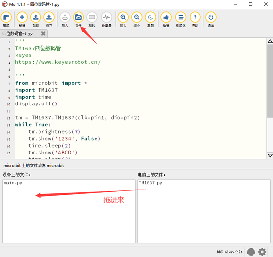

几秒钟后，导入完成。导入成功后，您将在左侧方框中可以看到它。

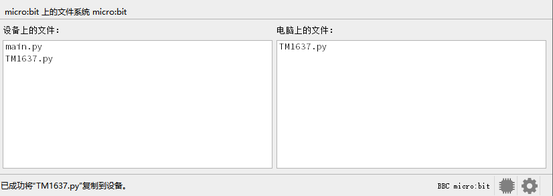

点击检查无报错再刷入

代码说明

|tm.brightness(7)|调数码管的亮度|
|-|-|
|tm.show('1234', False)|数码管显示1234并点亮两点|
|time.sleep(2)|延时两秒|
|tm.show('ABCD')|数码管显示ABCD|
|tm.numbers(88, 88, True)|数码管显示“8888”并不点亮两点|
|tm.temperature(-9)|数码管显示-9度|
|tm.write([0, 0, 0, 0])|数码管显示不显示|

实验现象

上传程序，上电后，我们可以看到4位数码管模块间隔2S显示字符串“1234”，“ABCD”,”-9℃”，如此循环往复。

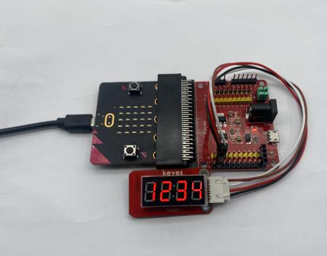

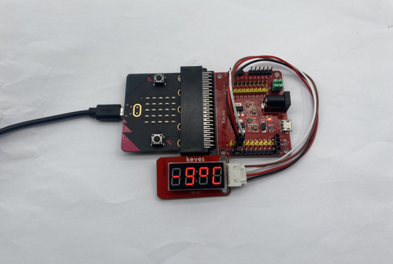

#### 第10课 8\*8点阵显示

实验说明：

点阵在我们生活中很常见，很多都有用到他，比如LED广告显示屏，电梯显示楼层，公交车报站等等。

8\*8点阵共由64个发光二极管组成，且每个发光二极管是放置在行线和列线的交叉点上，当对应的某一行置高电平，某一列置低电平，则相应的二极管就亮；如要将第一个点点亮，则7脚接高电平A脚接低电平，则第一个点就亮了；如果要将第一行点亮，则第7脚要接高电平，而A、B、C、D、E、F、G、H这些引脚接低电平，那么第一行就会点亮；如要将第一列点亮，则第A脚接低电平，而0、1、2、3、4、5、6、7接高电平，那么第一列就会点亮。

在本课程中，我们只是让点阵输出一个数字“11”。

8\*8点阵原理图：

8\*8点阵实物图：

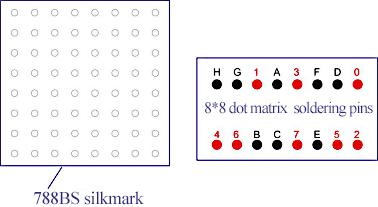

实验器材：

|||||
|-|-|-|-|
|micro：bit主板×1|keyes micro bit 传感器V2扩展板|8*8点阵屏×1|公对母杜邦若干|
||||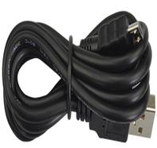|
|220Ω电阻×8|面包板×1|面包板连接线若干|micro USB数据线×1|

实验原理图

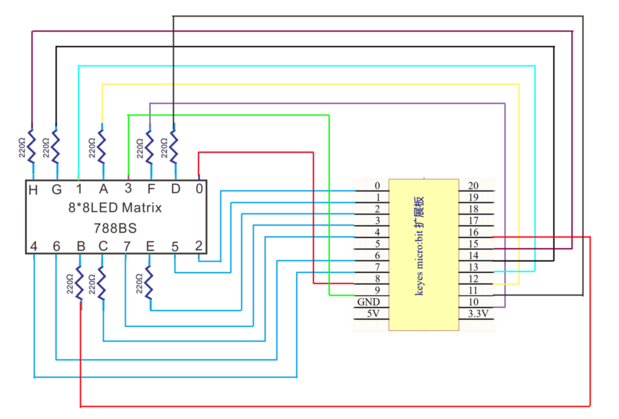

实验接线图：

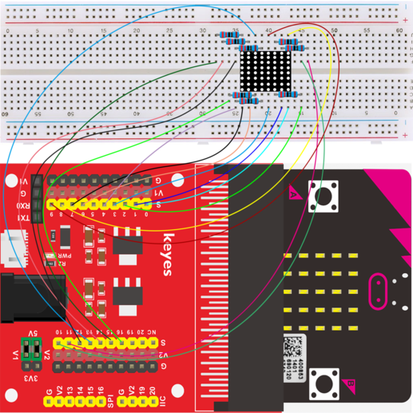

实验代码：

用Mu软件打开目录下“程序.py“文件。

你也可以打开Mu软件，在编辑窗口输入代码。（注意！所有英文及符号均须以英文填写，最后一行必须有空格。）

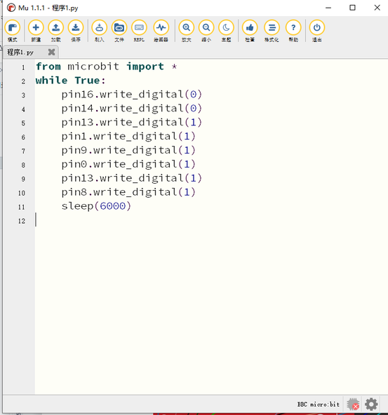

代码说明

|from microbit import *|导入micro：bit的库文件|
|-|-|
|while True:|这是一个永久循环，它使micro：bit永远执行这个循环中的代码。|
|pin16.write_digital(0) pin14.write_digital(0) pin13.write_digital(1) pin1.write_digital(1) pin9.write_digital(1) pin0.write_digital(1) pin13.write_digital(1) pin8.write_digital(1)|点阵显示11|
|sleep(6000)|延时6000毫秒|

实验结果：

按照接线图接好线，上传完程序，使用电池盒上电后，我们可以看到8\*8点阵屏显示数字“11”。

#### 第十一课 自制小台灯

实验说明

在设计电路时，按键开关是最常用的一种元件。在上面实验四中，我们已经讲解了有关按键开关的工作原理。尽管micro：bit主板上自带了三个按键，其中2个可编程按键和1个复位按键，但是有时设计电路还是需要用到外接按键。在本实验中，我们只是利用一个外接按键控制一个外接的LED的亮和灭。

实验器材：

|||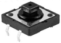|||
|-|-|-|-|-|
|micro：bit主板×1|keyes micro bit 传感器V2扩展板|按键×1|红色LED×1|10KΩ电阻×1|
|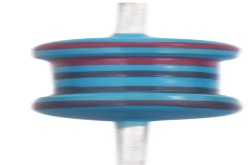|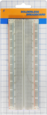||||
|220Ω电阻×1|面包板×1|公对母杜邦若干|micro USB数据线1|按键帽×1|

实验原理图：

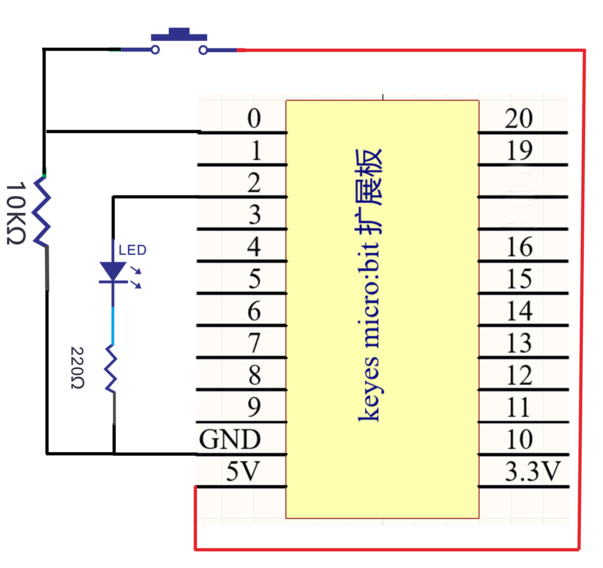

实验接线图：

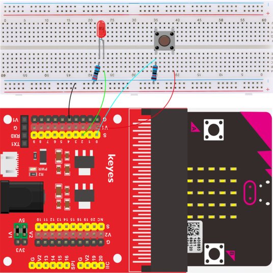

实验程序：

用Mu软件打开“小台灯-1.py“文件。

你也可以打开Mu软件，在编辑窗口输入代码。（注意！所有英文及符号均须以英文填写，最后一行必须有空格。）

程序1：

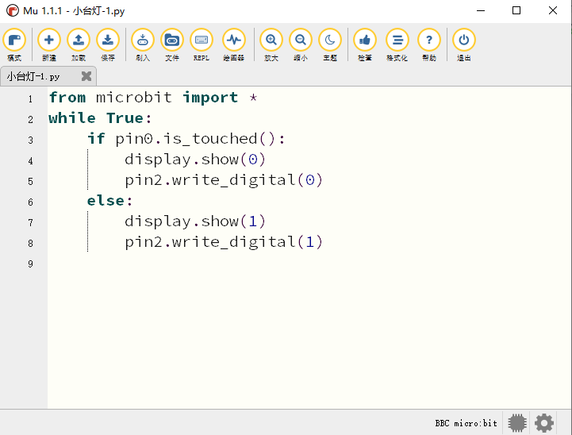

点击检查无报错再刷入

程序2：

用Mu软件打开“小台灯-2.py“文件。

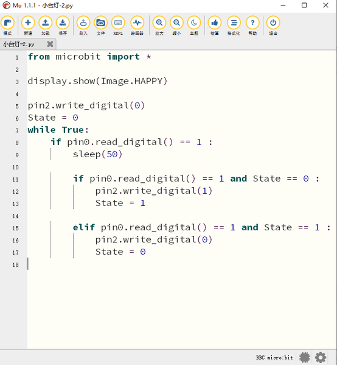

点击检查无报错再刷入

程序说明

|from microbit import *|导入micro：bit的库文件|
|-|-|
|Pin.write_digital(0)|将引脚设置为低电平，关闭LED|
|while True:|这是一个永久循环，它使micro：bit永远执行这个循环中的代码。|
|State = 0|声明state等于0|
|if pin0.read_digital() == 1 : sleep(50) if pin0.read_digital() == 1 and State == 0 : pin2.write_digital(1) State = 1 elif pin0.read_digital() == 1 and State == 1 : pin2.write_digital(0) State = 0|判断按键是否按下 延时50ms消抖 再检测按键是否按下与state=0: 是：点亮LED灯 赋值state等于1 再检测按键是否按下与state=1 是：熄灭LED灯 赋值state等于0|

实验现象

程序1：按照接线图接好线，上传完程序，上电后，按下外接按键，外接LED亮起，micro:bit点阵显示1，否则外接LED熄灭，micro:bit点阵显示0；如此循环。

程序2：按照接线图接好线，上传完程序，上电后，按下外接按键，外接LED亮起，再按下外接按键，外接LED熄灭。如此循环。

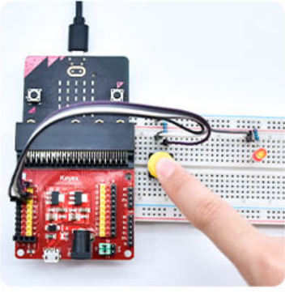

#### 第12课 自制人体红外报警器

实验说明：

我们在影视剧中看过这样的镜头，有人去偷袭一个目标时，还没有靠近目标，就直接被发现，而警报响起。有些特种兵去偷袭目标时，会再全身涂满湿润的泥巴，这样就不会给对方发现了，那这是为什么呢？

原来普通人体会发射10um左右的特定波长红外线，被偷袭的目标附近都安装了相关传感器能够感应到人体发射的红外线，然后报警，涂满泥巴后，传感器就感应不到人体发射的红外线了。

在这里，我们用keyes
人体红外传感器来检测附近是否有人运动，假如附近有人运动时，传感器信号端输出高电平1，否则输出低电平0。特别注意，这个传感器只能检测在运动中的人体，静止中的人体检测不到，检测距离最远为4米。

实验中，我们将keyes 人体红外传感器通过面包板连接到keyes micro bit
传感器V2扩展板上，观察信号变化，然后keyes人体红外传感器控制有源蜂鸣器。

实验器材：

|||||
|-|-|-|-|
|micro：bit主板×1|keyes micro bit 传感器V2扩展板|有源蜂鸣器×1|2.4KΩ电阻×1|
|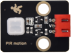||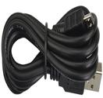||
|keyes人体红外传感器模块×1|面包板连接线若干|micro USB数据线×1|面包板×1|
|||||
|3Pin+杜邦母单线|6节5号AA电池盒×1|S8050三极管×1|面包板连接线若干|

实验原理图：

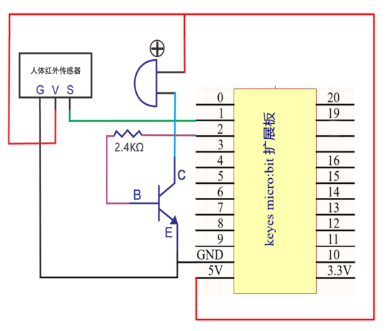

实验接线图：

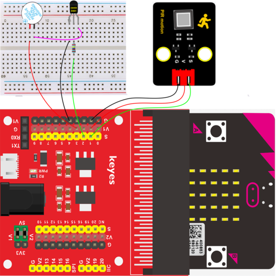

实验一

用Mu软件打开“人体红外-1.py“文件。

加载完成后，如下图所示。你也可以打开Mu软件，在编辑窗口输入代码。（注意！所有英文及符号均须以英文填写，最后一行必须有空格。）

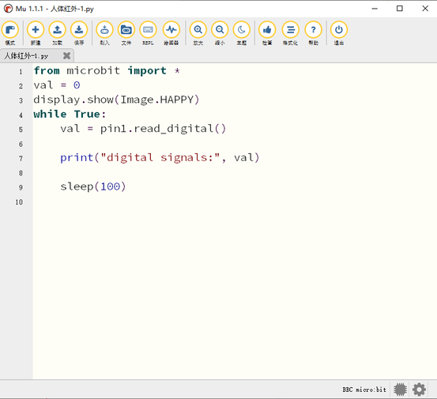

点击检查无报错再刷入

实验一结果

利用micro USB数据线连接主板，代码成功下载到micro：bit主板之后。先点击“REPL”按钮，再按一下micro:bit主板后面的复位按钮，当人体红外热释电传感器检测到附近有人运动时，串口输出数字信号1（高电平）；否则，当人体红外热释电传感器未检测到附近有人运动时，串口输出数字信号0（低电平）。

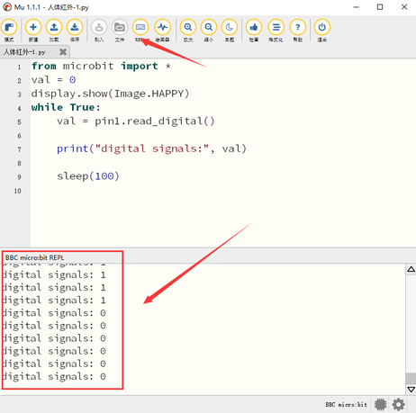

实验二

用Mu软件打开“人体红外-2.py“文件。

加载完成后，如下图所示。你也可以打开Mu软件，在编辑窗口输入代码。（注意！所有英文及符号均须以英文填写，最后一行必须有空格。）

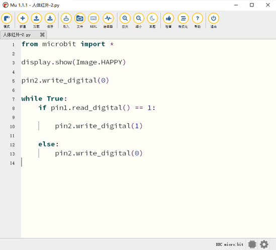

点击检查无报错再刷入

实验二结果

将程序下载到micro:bit主板，并且外接电源供电。当人体红外热释电传感器检测到附近有人运动时，蜂鸣器发出声音；否则，当人体红外热释电传感器未检测到附近有人运动时，蜂鸣器停止发声。

程序说明

|from microbit import *|导入micro：bit的库文件|
|-|-|
|Pin2.write_digital(0)|将引脚2设置为低电平，蜂鸣器不发声|
|while True:|这是一个永久循环，它使micro：bit永远执行这个循环中的代码。|
|If pin1.read_digital() == 1： Pin2.write_digital(1) else： Pin2.write_digital(0)|如果接在引脚1的人体红外传感器检测到附近有人运动时： 引脚2设置为高电平，蜂鸣器发声 否则： 引脚2设置为低电平，蜂鸣器停止发声|

#### 第13课 自制火焰报警

实验说明：

在生活中，我们发现有很多地方出现火灾，没有及时救火，导致火势愈演愈烈，最终造成重大损失。那么有没有办法避免这种情况呢？有，就是在容易着火的地方安装火焰传感器和喇叭，当火焰传感器检测到附近着火时，喇叭及时发出声音报警，提醒人们及时救火；甚至还可以直接和灭火器连接，在提醒人们救火的同时，自动控制灭火器灭火。

火焰传感器是机器人专门用来搜寻火源的传感器，本传感器对火焰特别灵敏。火焰传感器利用红外线对火焰非常敏感的特点，使用特制的红外线接收管来检测火焰，然后把火焰的亮度转化为高低变化的电平信号。

实验中，在这里我们用一个火焰传感器和有源蜂鸣器模拟自动报警系统。当火焰传感器检测到火焰时，火焰的亮度转化为高低变化的电平信号输入到micro bit主板中，然后控制无源蜂鸣器响起报警。

注意：火焰传感器可以检测火焰或者波长在760纳米～1100纳米范围内的光源，它的探测角度为60度左右。

实验器材：

|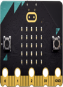||||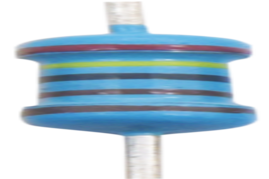||
|-|-|-|-|-|-|
|micro：bit主板×1|keyes micro bit 传感器V2扩展板|无源蜂鸣器×1|火焰传感器|2.4KΩ电阻×1|51Ω电阻×1|
|||||||
|面包板连接线若干|面包板×1|S8050三极管×1|红色LED×1|220Ω电阻×1|10KΩ电阻×1|
|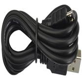||||||
|micro USB数据线×1||||||

实验原理图：

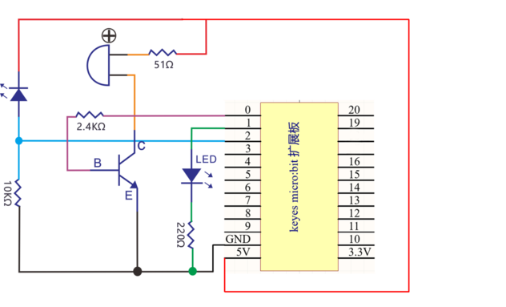

实验接线图：

火焰传感器的短引脚端为负极，长引脚端为正极。按照下图将负极插到面包板的正极（+）插口中，然后将正极与10K电阻相连，电阻的另一端插到面包板的负极（-）插口中，最后从火焰传感器的正极端所在列插入一根跳线，跳线的另一端插在数字口中。如图：

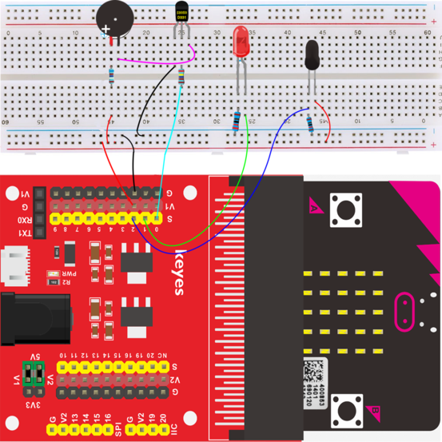

实验一

用Mu软件打开“火焰报警-1.py“文件。

加载完成后，如下图所示。你也可以打开Mu软件，在编辑窗口输入代码。（注意！所有英文及符号均须以英文填写，最后一行必须有空格。）

点击检查无报错再刷入

实验一结果

如图接好线，利用micro USB数据线连接主板，代码成功下载到micro：bit主板之后。先点击“REPL”按钮，再按一下micro:bit主板后面的复位按钮，当火焰传感器检测到附近有火焰时，串口输出数字信号1（高电平）；否则，火焰传感器检测到附近没有火焰时，串口输出数字信号0（低电平）。

（注意：扩展板使用DC 7~9V的电源供电，V2跳帽插在5V的位置，实验才能正常工作）

实验二

用Mu软件打开“火焰报警-2.py“文件。

加载完成后，如下图所示。你也可以打开Mu软件，在编辑窗口输入代码。（注意！所有英文及符号均须以英文填写，最后一行必须有空格。）

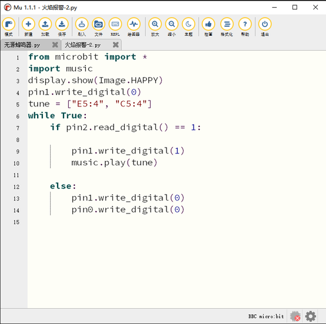

点击检查无报错再刷入

实验二结果

将程序下载到micro:bit主板，并且外接电源供电。当火焰传感器检测到附近有火焰时，蜂鸣器发出声音，LED灯亮；否则，火焰传感器检测到附近没有火焰时，蜂鸣器停止发声，LED灭。

（注意：扩展板使用DC 7~9V的电源供电，V2跳帽插在5V的位置，实验才能正常工作）

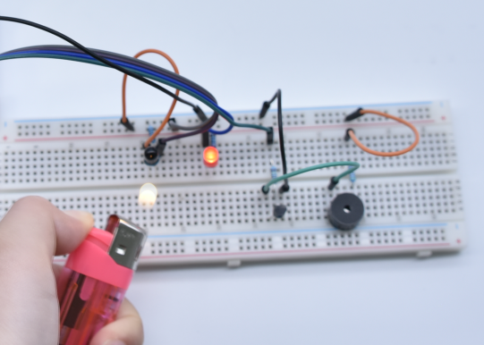

代码说明

|from microbit import *|导入micro：bit的库文件|
|-|-|
|import music|导入音乐库文件，该库文件包含控制声音和发出声音的功能|
|Pin1.write_digital(0)|将引脚1设置为低电平，LED灭|
|tune = ["E5:4", "C5:4"]|定义tune=["E5:4", "C5:4"]|
|while True:|这是一个永久循环，它使micro：bit永远执行这个循环中的代码。|
|if pin2.read_digital() == 1: pin1.write_digital(1) music.play(tune) else: pin1.write_digital(0) pin0.write_digital(0)|如果火焰传感器检测到附近有火焰时： 引脚1设置为高电平，LED点亮，蜂鸣器发声 否则： 引脚1设置为低电平，LED熄灭，蜂鸣器停止发声|

#### 第15课 倾斜感应开关实验

实验说明：

在这个套件中，有2个倾斜开关，它主要采用SW-200D
振动开关元件。

SW-200D
振动开关元件是滚珠型倾斜感应单方向性触发开关。该振动开关两端一端有两根金属脚，一端镀银；两根金属脚端为触发端，镀银端为导电端。当倾斜开关向触发端（两根金属脚）倾斜时，开关元件为闭路ON状态，倾斜开关输出高电平；
当倾斜开关在水平位置或向导电端（镀银）倾斜时，开关元件为开路OFF状态，倾斜开关输出低电平。

实验中，我们把倾斜开关通过面包板连接到keyes micro bit扩展板上，通过读取倾斜开关高低电平，判断倾斜开关的方向，并且我们在串口监视器上显示实验结果的同时观察两个LED亮的情况。

在你做电路设计时，有时候你需要测试一个物体是否左右倾斜，这样你就可以用到倾斜开关。它主要是利用滚珠在开关内随不同倾斜角度的发化，达到触发电路的目的。

在这个实验中，左右倾斜倾斜开关，从而通过micro：bit主板控制两个LED亮的情况。

实验器材：

|||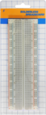|||
|-|-|-|-|-|
|micro：bit主板×1|keyes micro bit 传感器V2扩展板|面包板×1|红色LED×2|倾斜开关×2|
|||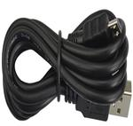|||
|面包板连接线若干|220Ω电阻×2|micro USB数据线×1|10KΩ电阻×2|面包板连接线若干|

实验原理图：

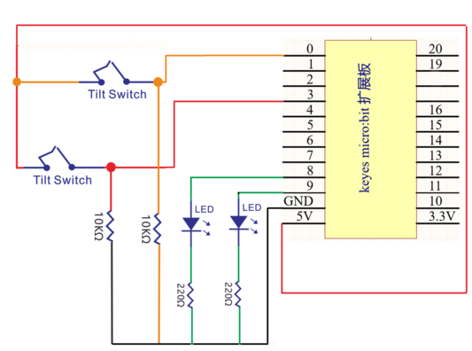

实验接线图：

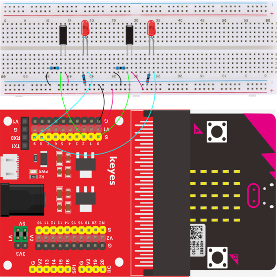

实验一

用Mu软件打开“倾斜传感器-1.py“文件。

加载完成后，如下图所示。你也可以打开Mu软件，在编辑窗口输入代码。（注意！所有英文及符号均须以英文填写，最后一行必须有空格。）

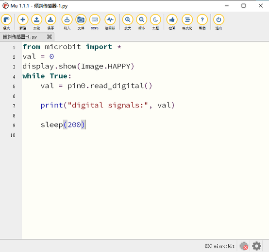

点击检查无报错再刷入

实验一结果

如图接好线，利用micro USB数据线连接主板，代码成功下载到micro：bit主板之后。先点击“REPL”按钮，再按一下micro:bit主板后面的复位按钮，当倾斜开关向触发端（两根金属脚）倾斜时，串口监视器显示数字信号1；当倾斜开关在水平位置或向导电端（镀银）倾斜时，串口监视器显示数字信号0;

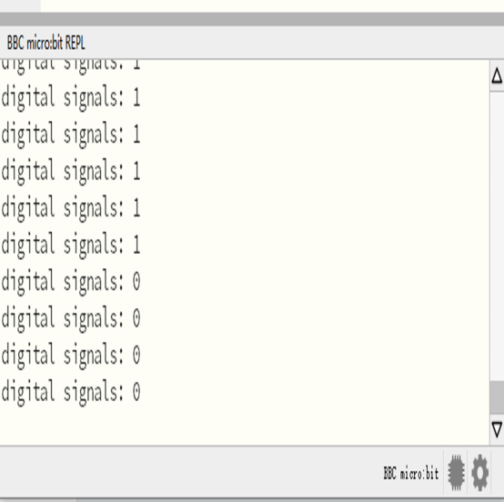

实验二

用Mu软件打开“倾斜传感器-2.py“文件。

加载完成后，如下图所示。你也可以打开Mu软件，在编辑窗口输入代码。（注意！所有英文及符号均须以英文填写，最后一行必须有空格。）

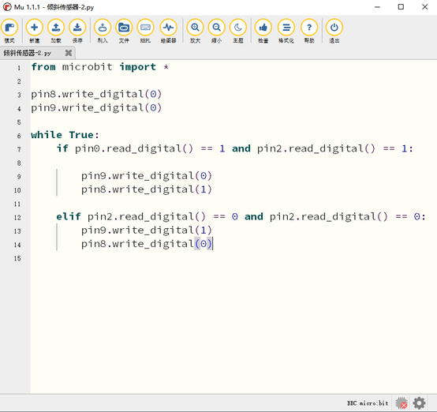

点击检查无报错再刷入

实验二结果

如上接好线，上传好程序；两个倾斜开关同时控制2个LED灯的亮灭，当两个倾斜开关都不倾斜时，
一个LED变亮，同时另一个LED不亮，当两个倾斜开关都倾斜时，亮的LED灯熄灭，不亮的LED灯点亮。

#### 第15课 自制小夜灯

实验说明：

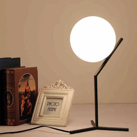在生活中我们发现，很多公共场所的照明灯，一到晚上它就自动亮起来，一到白天它就自动熄灭，
难道这些灯都是有人去控制吗？实际上不是，实际上很多照明灯都是安装了一个感光元件，可以测量外界光的亮度，当到晚上时，亮度低了，就自动控制路灯亮起；当到白天时，亮度高了，就自动控制路灯熄灭。

这个感光元件实际上就是光敏电阻器，是利用半导体的光电效应制成的一种电阻值随光照的强弱而改变的电阻器，光敏电阻对环境光线是非常敏感的，在不同的光照强度下，光敏电阻的阻值是不一样的。我们利用光敏电阻器该特性，设计电路，生成光敏电阻传感器模块。光敏电阻器单片机的模拟口，当光照强度增强时，电阻减小，模拟口电压增大，即单片机的模拟值也变大；反之，光照强度减弱时，电阻增大，模拟口电压减小，即单片机的模拟值变小。这样，我们就可以利用光敏电阻器读取对应模拟值，感应环境中光照强度了。

光敏电阻器一般用于光的测量、光的控制和光电转换（将光的变化转换为电的变化）。光敏电阻器可广泛应用于各种光控电路，如对灯光的控制、调节等场合，也可用于光控开关。

在这里，我们将光敏电阻器接到装有keyes micro bit
扩展板的面包板上来测试外界光的亮度。我们需要用到micro：bit主板的模拟输入功能，只有几个特定的IO口才有该功能，具体的可以参考micro:bit
引脚说明。实验中光敏电阻器信号端接的是P2端，将所测结果在micro：bit主板上LED点阵或串口监视器上显示。

实验器材： 

|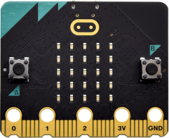|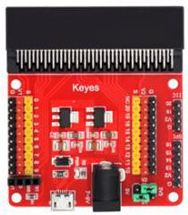|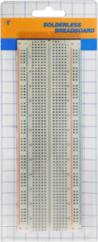||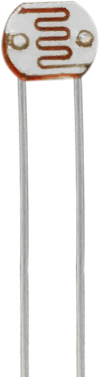|
|-|-|-|-|-|
|micro：bit主板1|面包板×1|红色LED×1|220Ω电阻×1|光敏电阻×1|
|||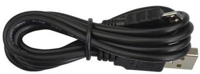|||
|面包板连接线若干|10KΩ电阻×1|micro USB数据线×1|面包板连接线若干|红色LED×2|

实验原理图：

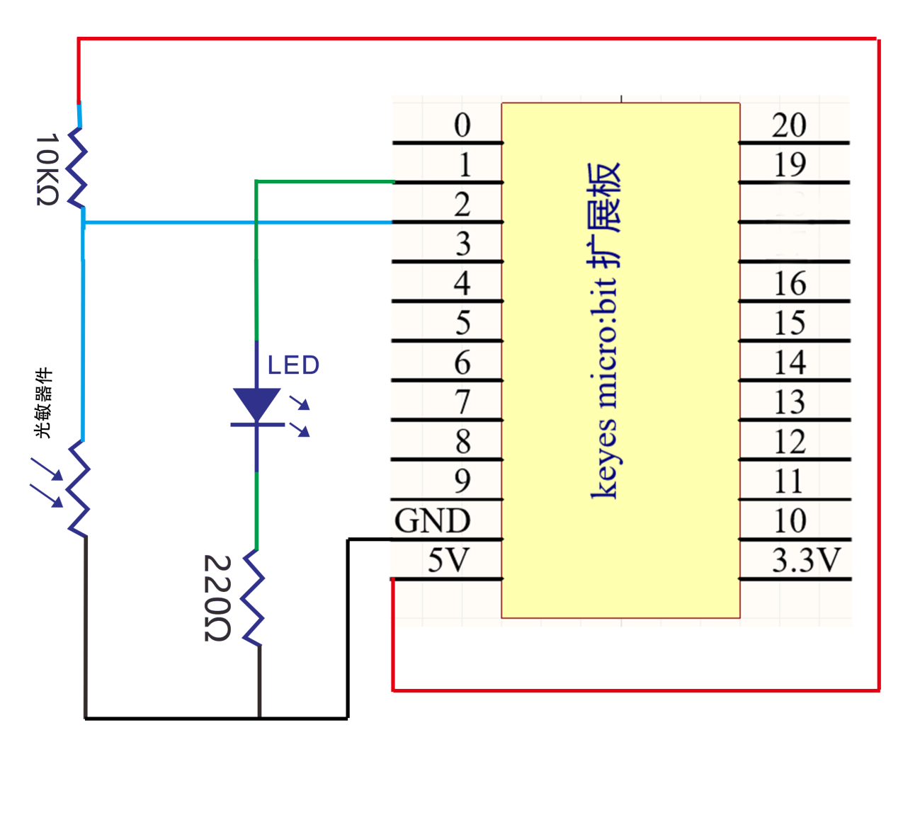

实验接线图：

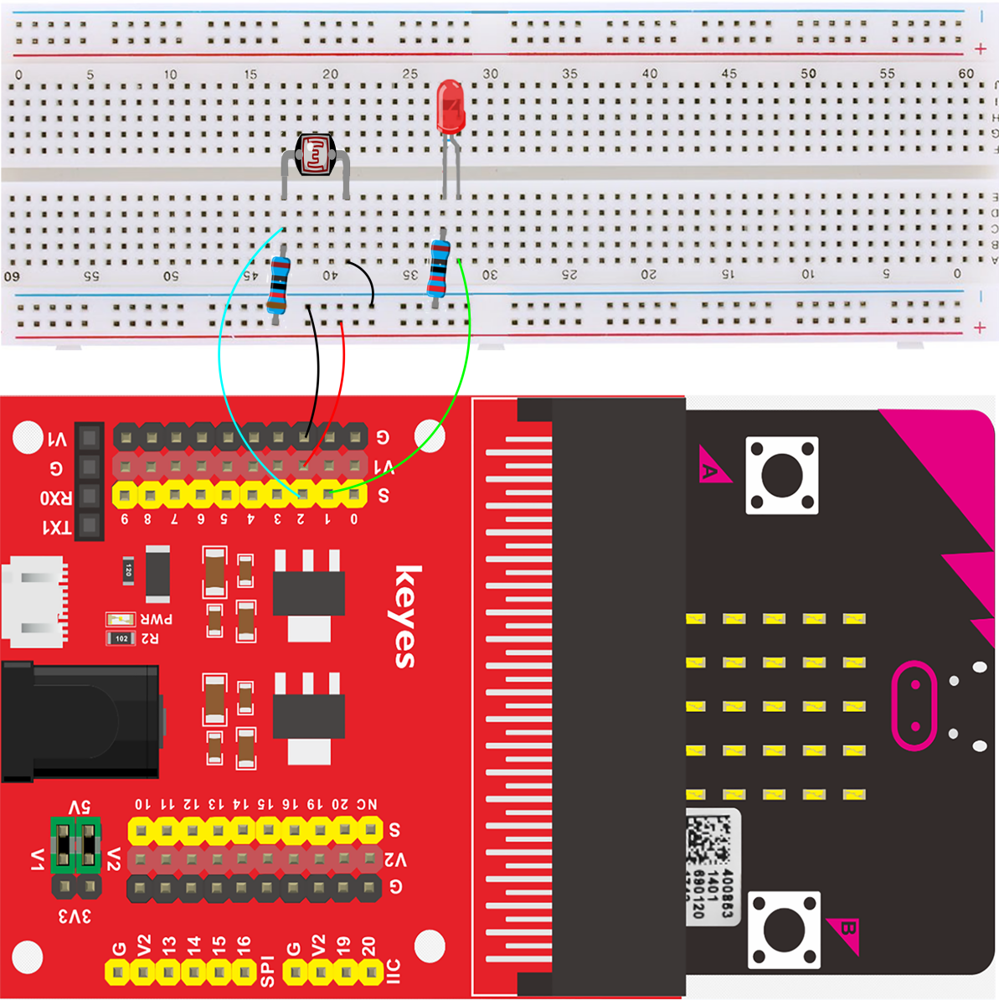

实验一

加载完成后，如下图所示。你也可以打开Mu软件，在编辑窗口输入代码。（注意！所有英文及符号均须以英文填写，最后一行必须有空格。）

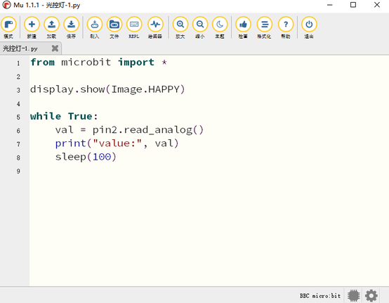

点击检查无报错再刷入

实验一结果

如图接好线，利用USB线连接micro:bit主板，代码成功下载到micro：bit主板之后。先点击“REPL”按钮，再按一下micro:bit主板后面的复位按钮，监视串口显示当前光照强度模拟值（关照强度越大数值越小）如下图：

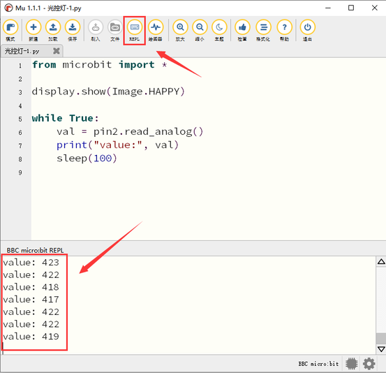

实验二

加载完成后，如下图所示。你也可以打开Mu软件，在编辑窗口输入代码。（注意！所有英文及符号均须以英文填写，最后一行必须有空格。）

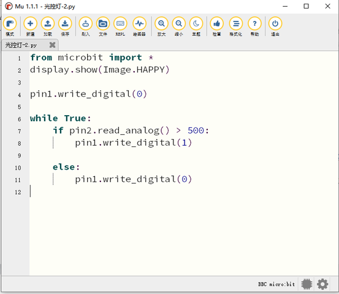

点击检查无报错再刷入

实验二结果

按照接线图接好线，上传完程序，利用micro USB线上电后，当光敏电阻器感应到外界光照强度在减弱，其输入的模拟值大于等于400时，
LED灯点亮；反之，LED灯熄灭。

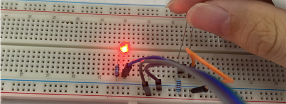

代码说明

|from microbit import *|导入micro：bit的库文件|
|-|-|
|Pin1.write_digital(0)|引脚1设置为低电平，LED熄灭|
|while True:|这是一个永久循环，它使micro：bit永远执行这个循环中的代码。|
|if pin2.read_analog() > 500: pin1.write_digital(1) else: pin1.write_digital(0)|当环境的光照强度>500时 点亮LED灯 否则 熄灭LED灯|

#### 第16课 DIY声控灯

实验说明：

在生活中，当我们晚上经过楼道时，如果脚步很轻，黑漆漆一片，而当我们加重脚步，或者大叫一声，楼

道里的照明灯就会陆续亮起。实际上楼道里的照明电路里安装有声音传感器，当检测到外界声音时，控制开启照明灯，否则关闭照明灯。

声音传感器主要采用一个高感度麦克风元件和LM386芯片。高感度麦克风元件用于检测外界的声音。利用LM386芯片搭建合适的电路，对高感度麦克风检测到的声音进行放大，最大倍数为200倍。使用时我们可以通过旋转传感器上电位器，调节声音的放大倍数。调节时，顺时针调节电位器到尽头，放大倍数最大。可以用来实现根据声音大小进行互动的效果制作声控机器人、声控开关、声控报警等。

在这实验中，我们将
声音传感器的信号端接到micro：bit主板的P0，通过读取P0端的模拟值，来检测外界的声音大小。检测时，外界声音越大，模拟值越大；外界声音越小，模拟值越小。并且，我们将所测的模拟值串口监视器上显示。同时，声音传感器控制LED的亮灭。

实验器材：

|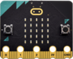|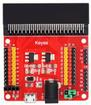|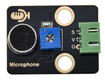||||
|-|-|-|-|-|-|
|micro：bit主板1|扩展板×1|声音传感器模块×1|红色LED×1|220Ω电阻×1|5号AA电池×6|
|||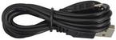|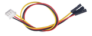|||
|面包板×1|面包板连接线若干|micro USB数据线×1|3P连接线×1|6节5号AA电池盒×1||

实验原理图：

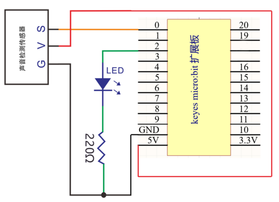

实验接线图：

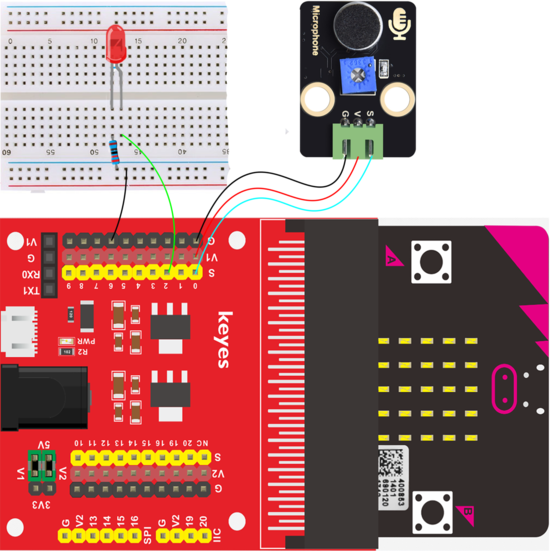

实验一

用Mu软件打开“声控灯-1.py“文件。

加载完成后，如下图所示。你也可以打开Mu软件，在编辑窗口输入代码。（注意！所有英文及符号均须以英文填写，最后一行必须有空格。）

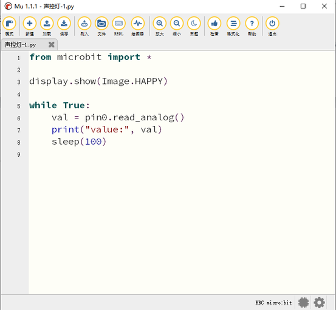

点击检查无报错再刷入

实验一结果

如图接好线，利用USB线连接micro:bit主板，代码成功下载到micro：bit主板之后。先点击“REPL”按钮，再按一下micro:bit主板后面的复位按钮，监视串口显示当前环境声音模拟值（声音越大数值越越大）如下图：

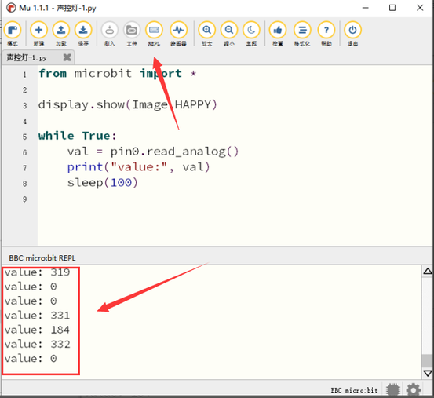

实验二

用Mu软件打开“声控灯-2.py“文件。

加载完成后，如下图所示。你也可以打开Mu软件，在编辑窗口输入代码。（注意！所有英文及符号均须以英文填写，最后一行必须有空格。）

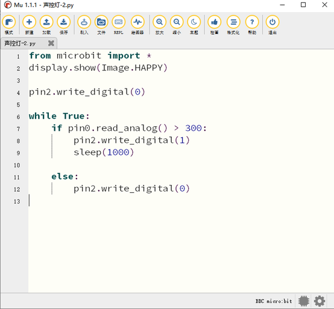

点击检查无报错再刷入

实验二结果

按照接线图接好线，上传完程序，利用micro USB线上电后，当声音传感器检测到环境的声音模拟值大于300时，
LED灯点亮；反之，LED灯熄灭。

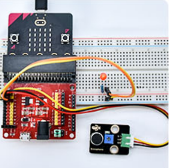

代码说明

|from microbit import *|导入micro：bit的库文件|
|-|-|
|Pin2.write_digital(0)|引脚2设置为低电平，LED熄灭|
|while True:|这是一个永久循环，它使micro：bit永远执行这个循环中的代码。|
|if pin0.read_analog() > 300: pin2.write_digital(1) sleep(1000) else: pin2.write_digital(0)|当环境的光照强度>300时 点亮LED灯 延时1秒 否则 熄灭LED灯|

#### 第17课 自制调光灯

实验说明：

当我们在做DIY实验时，我们经常要用到可调电位器，它也是一个10K可调电阻，当我们在旋转电位器时，实际上就是改变可调电位器的电阻。我们设置对应电路，将电阻阻值的变化，转换成电压的变化。然后将电压变化通过模块信号端输入到micro：bit主板的模拟输入口检测。所以在在这实验中，我们将可调电位器的信号端接到micro：bit主板的P0，通过读取P0端的模拟值，旋转电位器，模拟值数据改变，我们将所测的模拟值在CoolTerm串口监视器上显示出来。

接下来把可调电位器与LED相组合，通过学习利用可调电位器读取模拟值的方法和在前面课程中我们利用代码调节LED亮度的方法相组合，我们利用电位器读取到的模拟值控制LED的亮度。设计代码时，模拟值的范围是0-1023，LED的亮度是由PWM值控制，范围为0-255。在这里，我们就需要用到映射功能，将0-1023数值映射到0-255。设置成功后，我们就可以通过旋转电位器，控制LED的亮度。

实验器材：

|||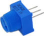||
|-|-|-|-|
|micro：bit主板1|扩展板×1|可调电位器×1|红色LED×1|
||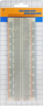||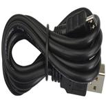|
|220Ω电阻×1|面包板×1|面包板连接线若干|micro USB数据线×1|

实验原理图：

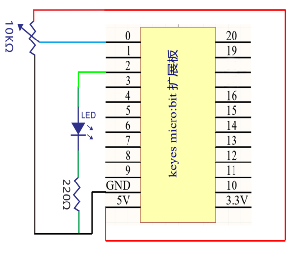

实验接线图：

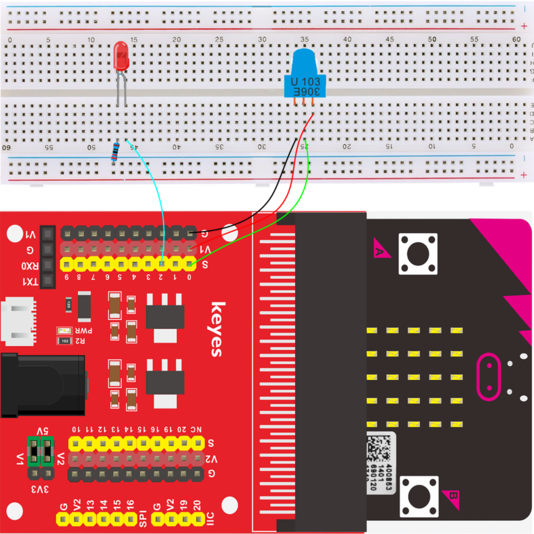

实验一

用Mu软件打开“调光灯-1.py“文件。

加载完成后，如下图所示。你也可以打开Mu软件，在编辑窗口输入代码。（注意！所有英文及符号均须以英文填写，最后一行必须有空格。）

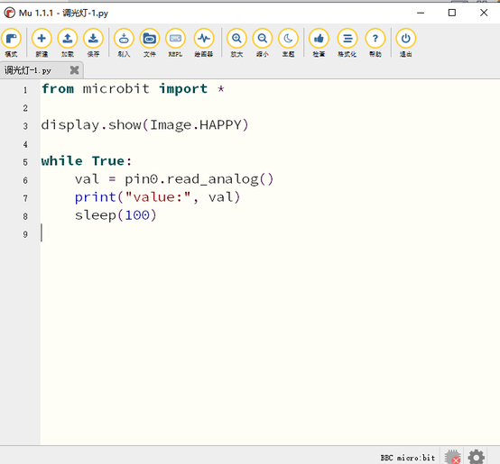

点击检查无报错再刷入

实验一结果

如图接好线，利用USB线连接micro:bit主板，代码成功下载到micro：bit主板之后。先点击“REPL”按钮，再按一下micro:bit主板后面的复位按钮，当我们顺时针或逆时针旋转电位器时，监视串口上数值随之变大或变小，如下图：

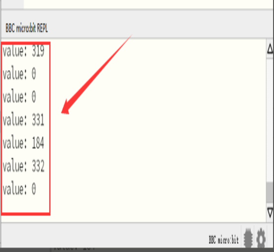

实验二

加载完成后，如下图所示。你也可以打开Mu软件，在编辑窗口输入代码。（注意！所有英文及符号均须以英文填写，最后一行必须有空格。）

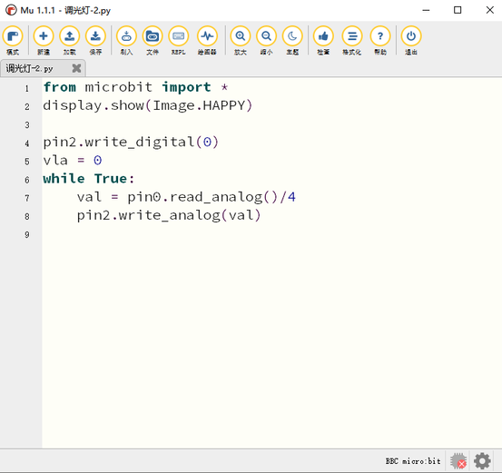

点击检查无报错再刷入

实验二结果

按照接线图接好线，上传完程序，利用micro USB线上电后，当我们顺时针或逆时针旋转电位器时，LED灯慢慢变亮或慢慢变暗。

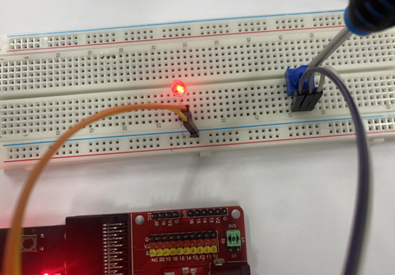

代码说明

|from microbit import *|导入micro：bit的库文件|
|-|-|
|display.show(Image.HAPPY)|microbit主板上的LED点阵显示“笑脸”图案|
|pin2.write_digital(0)|初始化LED灯|
|vla = 0|声明val=0|
|while True:|这是一个永久循环，它使micro：bit永远执行这个循环中的代码。|
|val = pin0.read_analog()/4|读取电位器的模拟值并除以4并赋值给val|
|pin2.write_analog(val)|Val的值赋给LED灯|

#### 第19课 煤气警报器

实验说明：

煤气报警器是为了预防气体中毒的一种家用的自动报警器，也是一种高灵敏度的气体探测器，应用高灵敏度的气敏元件作为气电转换元件，并配以电路和声光报警部分组成。当泄漏的气体达到危险极限值时报警器就会发生鸣响和声光报警。

这里使用的气敏元件是MQ-2气体传感器，MQ-2气体传感器可用于家庭用气体泄漏报警器、工业用可燃气体报警器以及便携式气体检测仪器，适宜于液化气、煤气、氢气、烟雾等的探测，被广泛运用到各种[消防报警系统](https://baike.so.com/doc/5909700-6122605.html)中。故因此，MQ-2气体传感器可以准确来说是一个多种气体探测器，同时还具有灵敏度高、响应快、稳定性好、寿命长、驱动电路简单等优点。

MQ-2气体传感器检测可燃气体与烟雾的浓度范围是100~10000ppm，对天然气、液化石油气、煤气等烟雾有很高的灵敏度，尤其对烷类烟雾更为敏感。在使用之前必须加热一段时间，这样输出的电阻和电压较准确。但是加热电压不宜过高，否则会导致内部的信号线熔断。

MQ-2气体传感器属于二氧化锡半导体气敏材料，属于表面离子式N型半导体。处于一定温度时，二氧化锡吸附空气中的氧，形成氧的负离子吸附，使半导体中的电子密度减少，从而使其电阻值增加。利用这一点就可以获得烟雾或可燃气体存在的信息，空气中烟雾或可燃气体的浓度越大，导电率越大，输出电阻越低，则输出的模拟信号就越大。传感器自带1个定位孔，方便你将传感器固定在其他设备。此外，通过旋转电位器可以调整灵敏度。

MQ-2气体传感器有两个信号端，模拟口A0和数字口D0。当检测到可燃气体浓度越高，A0数值越大；当检测到可燃气体浓度到达一定时，A0也到达一定数值。

在这实验中，MQ-2气体传感器的信号端A0接到micro：bit主板的P0，先通过读取P0端的模拟值，检测空气中可燃气体并将所测的模拟值在CoolTerm串口监视器上显示；再通过MQ-2气体传感器控有源蜂鸣器和LED。

实验器材：

||||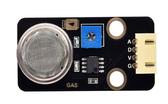|||
|-|-|-|-|-|-|
|micro：bit主板1|扩展板×1|有源蜂鸣器×1|MQ-2气体传感器模块×1|2.4KΩ电阻×1|公对母杜邦线若干|
|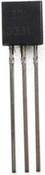|||||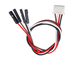|
|S8050三极管×1|面包板×1|面包板连接线若干|红色LED×1|220Ω电阻×1|4P连接线×1|

实验原理图

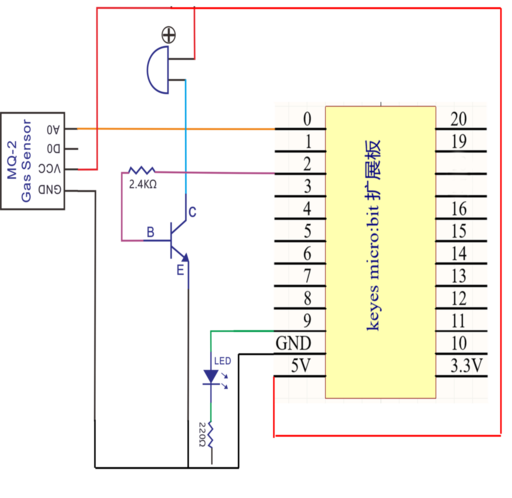

实验接线图：

实验一

加载完成后，如下图所示。你也可以打开Mu软件，在编辑窗口输入代码。（注意！所有英文及符号均须以英文填写，最后一行必须有空格。）

点击检查无报错再刷入

实验一结果

如图接好线，利用USB线连接micro:bit主板，代码成功下载到micro：bit主板之后。先点击“REPL”按钮，再按一下micro:bit主板上背面的复位按键，用打火机气体对着MQ-2气体传感器，串口显示的模拟值逐渐变大。（注意：传感器需要预热几分钟数据才会稳定，V1跳帽插在3.3V的位置）

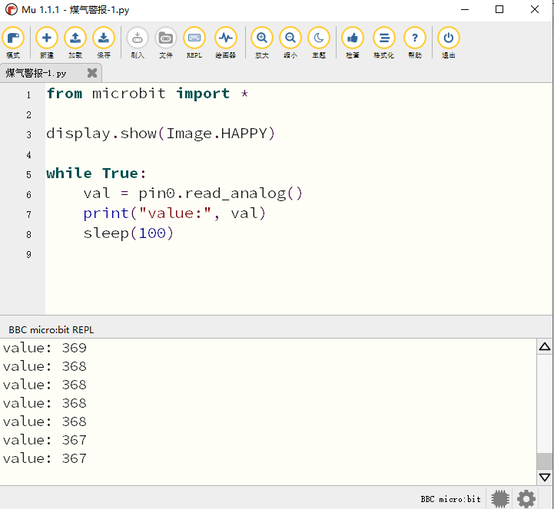

实验二

加载完成后，如下图所示。你也可以打开Mu软件，在编辑窗口输入代码。（注意！所有英文及符号均须以英文填写，最后一行必须有空格。）

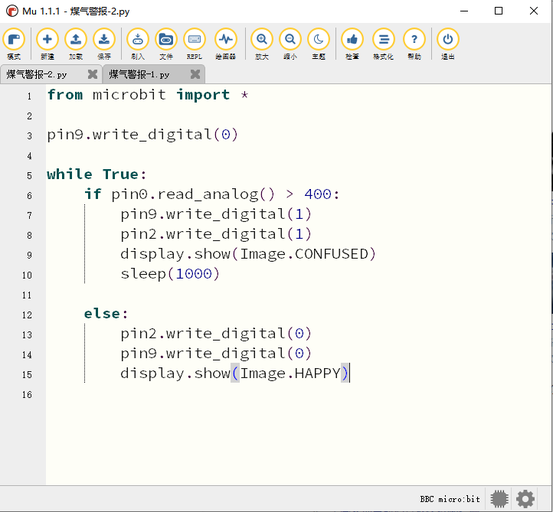

点击检查无报错再刷入

实验二结果

如图接好线，代码成功下载到micro：bit主板，上电之后。用打火机气体对着MQ-2气体传感器，当模拟值大于400时，有源蜂鸣器响起且LED点亮，micro:bit主板上的点阵显示哭脸；否则有源蜂鸣器不响且LED熄灭，同时micro:bit主板上的点阵显示笑脸。（注意：传感器需要预热几分钟数据才会稳定，V1跳帽插在3.3V的位置）

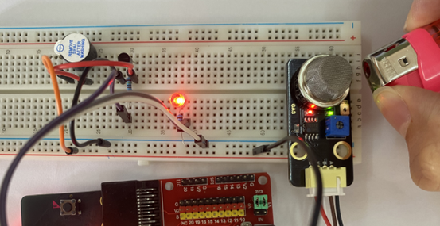

代码说明

|from microbit import *|导入micro：bit的库文件|
|-|-|
|pin2.write_digital(0) pin9.write_digital(0)|初始化2和9引脚|
|while True:|这是一个永久循环，它使micro：bit永远执行这个循环中的代码。|
|if pin0.read_analog() > 400: pin9.write_digital(1) pin2.write_digital(1) display.show(Image.CONFUSED) sleep(1000) else: pin2.write_digital(0) pin9.write_digital(0) display.show(Image.HAPPY)|当气体传感器检测到的数值大于400时： LED点亮 蜂鸣器发声 Micro:bit显示哭脸 延时1S 否则 蜂鸣器发声 LED灯点亮 Micro:bit显示笑脸|

#### 第19课 水位监测警报器

实验说明

在生活中，一遇到大雨或暴雨，河流或者水库中的水位暴涨，到达一定水位时，需要开闸泄洪，解决安全隐患。然而怎么检测河流或者水库中的水位呢？这就需要用到水位传感器。

水位传感器是一个模拟输入模块，它是一款简单易用、小巧轻便、性价比较高的水位/水滴识别检测传感器，其是通过具有一系列的暴露的平行导线线迹测量其水滴/水量大小从而判断水位，轻松完成水量到模拟信号的转换，输出的模拟值可以直接被程序中函数所应用，达到水位报警的功效。低功耗，灵敏度是其又一大特点。

在这个实验中，我们用水位传感器来模拟检测水杯中的水位，并作出相应报警。我们将水位传感器的信号端接到micro：bit主板的P0，通过读取P0端的模拟值，检测水位高低，水位越高，模拟值越大。我们将所测的模拟值在CoolTerm串口监视器上显示，并且控制当水位到达一定高度时，外接LED闪烁。

实验器材

|||||||
|-|-|-|-|-|-|
|micro：bit主板1|扩展板×1|红色LED×1|黄色LED×1|绿色LED×1|220Ω电阻×3|
||||||||
|keyes水位传感器模块×1|面包板×1|公对母杜邦线若干|micro USB数据线×1|3P连接线×1|||

实验原理图

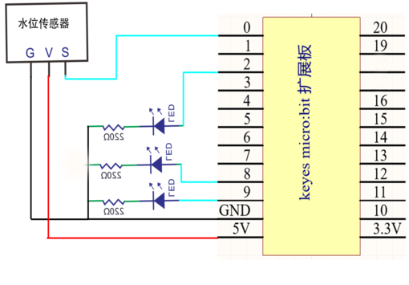

实验接线图

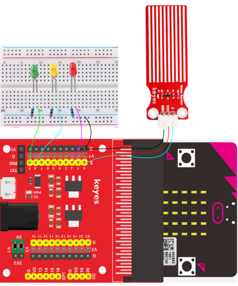

实验一

用Mu软件打开“水位传感器-1.py“文件。

加载完成后，如下图所示。你也可以打开Mu软件，在编辑窗口输入代码。（注意！所有英文及符号均须以英文填写，最后一行必须有空格。）

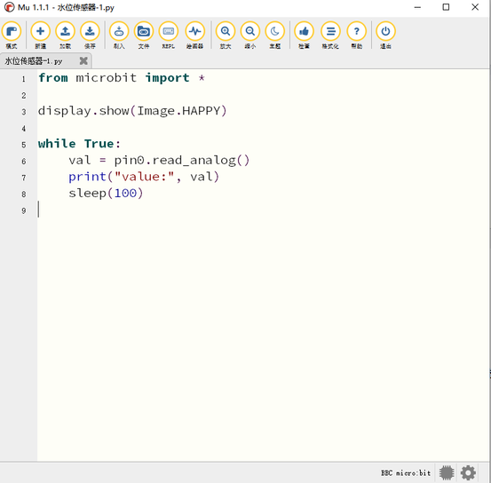

点击检查无报错再刷入

实验一结果

如图接好线，利用USB线连接micro:bit主板，代码成功下载到micro：bit主板之后。先点击“REPL”按钮，再按一下micro:bit主板上背面的复位按键，当用手触摸水位传感器，串口显示的数值逐渐变大。

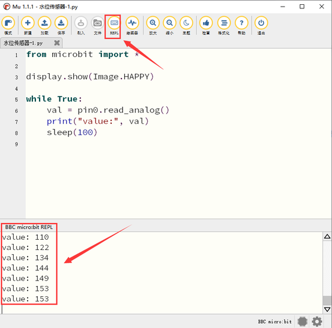

实验二

加载完成后，如下图所示。你也可以打开Mu软件，在编辑窗口输入代码。（注意！所有英文及符号均须以英文填写，最后一行必须有空格。）

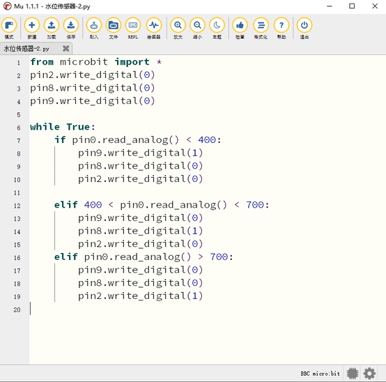

点击检查无报错再刷入

实验一结果

按照接线图接好线，上传完程序，上电后，把水位传感器插入装有水的杯子中（这里用手模拟），当模拟值小于400时，绿LED灯亮；当模拟值大于400且小于700时，黄LED灯亮；当模拟值大于700时，红色LED灯亮。

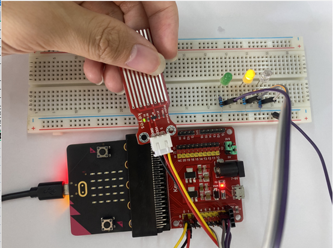

代码说明

|from microbit import *|导入micro：bit的库文件|
|-|-|
|pin2.write_digital(0) pin8.write_digital(0) pin9.write_digital(0)|初始化2，8，9引脚 ，熄灭LED灯|
|while True:|这是一个永久循环，它使micro：bit永远执行这个循环中的代码。|
|if pin0.read_analog() < 400: pin9.write_digital(1) pin8.write_digital(0) pin2.write_digital(0) elif 400 < pin0.read_analog() < 700: pin9.write_digital(0) pin8.write_digital(1) pin2.write_digital(0) elif pin0.read_analog() > 700: pin9.write_digital(0) pin8.write_digital(0) pin2.write_digital(1)|当水位传感器检测的数值小于400时： 绿LED点亮 黄LED熄灭 红LED熄灭 当水位传感器检测的数值小于700且大于400时： 绿LED熄灭 黄LED点亮 红LED熄灭 当水位传感器检测的数值大于700时： 绿LED熄灭 黄LED熄灭 红LED点亮|

#### 第20课 花盆湿度检测装置

实验说明：

在生活中，我们养一些花花草草，总要不定时的给他们浇水，防止它们渴死，但是又不能多浇，这些都需要经验。那我们可不可以做一个系统，让机器自动在土壤干燥的时候浇水呢？

可以的，我们首先在装有micro：bit主板和keyes micro bit
扩展板的面包板上连接一个土壤湿度传感器，它是用来检测土壤中的干湿度。当土壤缺水，传感器输出的模拟值将减少；否则，模拟值将增大。如果你用这个传感器制作一个自动浇水装置，它可以检测你的植物是否渴，以防止你外出时它枯萎。将传感器与micro:bit控制器配合使用，使您的植物更舒适，花园更智能。土壤湿度传感器模块并不像你想象的那么复杂，如果你需要在你的项目中检测土壤，它将是你最好的选择。

传感器设置有两个探头插入土壤中，当电流通过土壤时，传感器通过读取两个探头之间的电流变化得到电阻值，并将电阻值转换成含水量。水分越高（电阻越小），土壤的电导率越高。传感器表面做了金属化处理，可以延长它的使用寿命。将其插入土壤中，然后使用AD转换器读取。借助这个传感器，植物可以提醒你：我需要水。传感器自带2个定位孔，方便你将传感器固定在其他设备。

在这实验中，我们只是将土壤湿度传感器的信号端接到micro：bit主板的P0，通过读取P0端的模拟值，检测土壤干湿度，湿度越大，模拟值越大。我们将所测的模拟值串口监视器上显示。

实验器材：

|||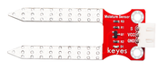||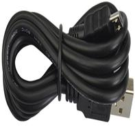|
|-|-|-|-|-|
|micro：bit主板1|扩展板×1|土壤湿度传感器模块×1|3P连接线×1|micro USB数据线×1|

实验接线图：

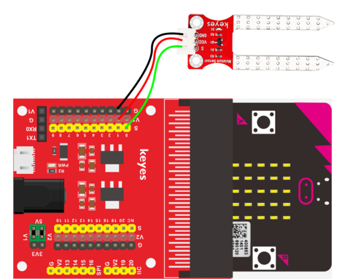

实验代码

用Mu软件打开“土壤检测.py“文件。

加载完成后，如下图所示。你也可以打开Mu软件，在编辑窗口输入代码。（注意！所有英文及符号均须以英文填写，最后一行必须有空格。）

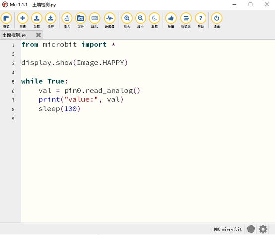

点击检查无报错再刷入

实验一结果

如图接好线，利用USB线连接micro:bit主板，代码成功下载到micro：bit主板之后。先点击“REPL”按钮，再按一下micro:bit主板上背面的复位按键，将土壤湿度传感器插入花盆中，串口上显示土壤湿度模拟值。

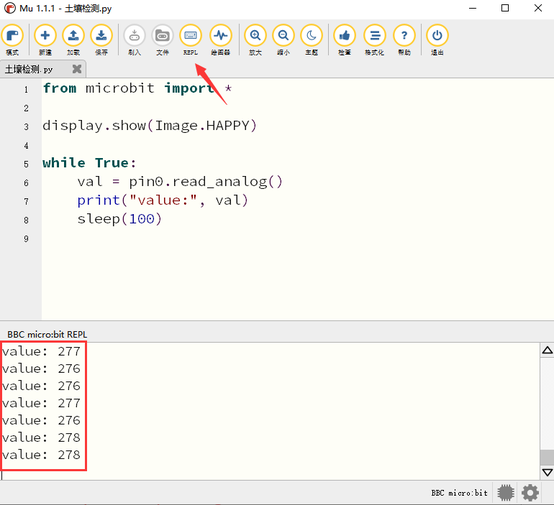

代码说明

|from microbit import *|导入micro：bit的库文件|
|-|-|
|display.show(Image.HAPPY)|micro：bit主板显示笑脸|
|while True:|这是一个永久循环，它使micro：bit永远执行这个循环中的代码。|
|val = pin0.read_analog() print("value:", val) sleep(100)|读取土壤湿度模拟数值 串口打印土壤湿度模拟数值 延时100ms|

#### LCD1602屏的使用

概述

这是一个可以显示2行，每行16个字符的液晶屏模块。液晶屏显示蓝底白字，自带I2C通信模块，使用时只需连接单片机I2C通信接口，大大节约了单片机资源。I2C通信模块上带有1个电位器，可用于调节显示屏背光，通信地址默认为0x27。

规格参数

工作电压：DC 5V

接口：间距为2.54mm 4pin防反接口

定位孔大小：直径为3mm

通讯方式：I2C通讯

I2C通信地址: 0x27

显示屏颜色：蓝底白字

尺寸：80\*37\*18mm

重量：34.7g

实验器材

|||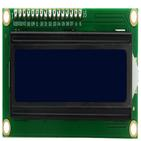||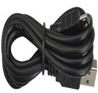|
|-|-|-|-|-|
|micro：bit主板1|扩展板×1|1602 LCD显示屏模块×1|4P 转杜邦线母|micro USB数据线×1|
||||||
|6节5号AA电池盒×1|5号AA电池×6||||

接线图

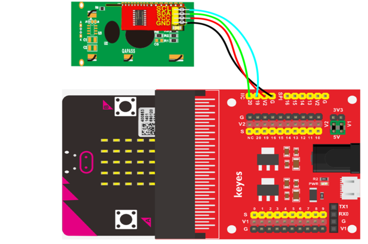

实验程序

根据上图的接线图接好线，由实验接线图可知，1602 LCD液晶显示屏模块的SDA引脚是接在P20处，SCL引脚是接在P19处，先用micro USB数据线将电脑和micro：bit主板连接好，再启动Mu编写代码.

用Mu软件打开“LCD1602.py“文件。

加载完成后，如下图所示。你也可以打开Mu软件，在编辑窗口输入代码。（注意！所有英文及符号均须以英文填写，最后一行必须有空格。）

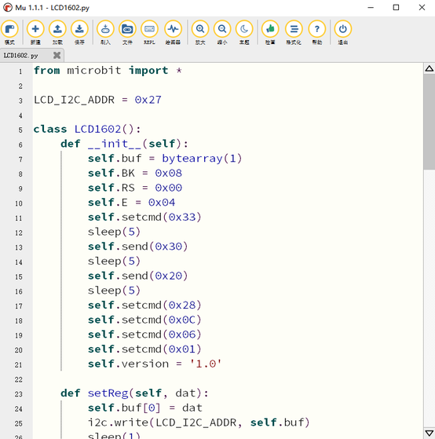

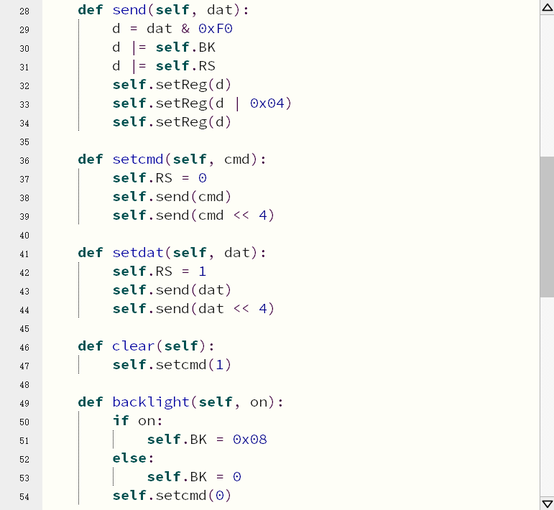

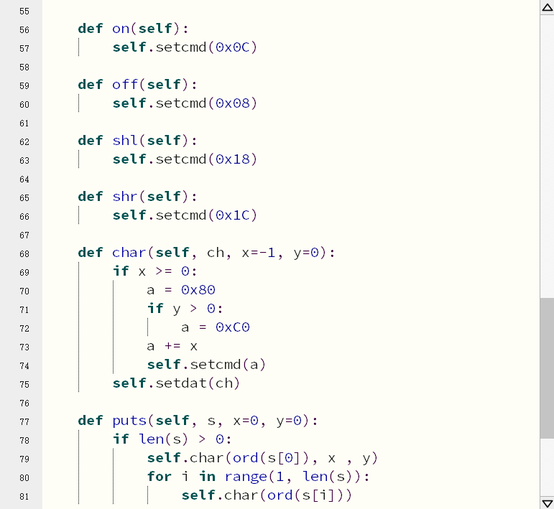

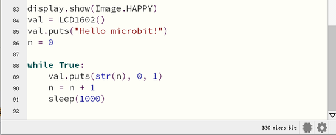

点击检查无报错再刷入

实验结果

按照之前的方式将示例代码下载到micro:bit主板，电池盒供电。microbit主板上LED点阵屏显示“笑脸”图案，1602 LCD液晶显示屏模块的显示屏上第一行显示“Hello microbit!”字符，第二行显示数字，每过0.5s，数字加1。

注意：扩展板使用DC 7~9V的电源供电，V2跳帽插在5V的位置实验才能正常工作，上传代码成功，上电后，显示屏没有字符显示时，可以调节1602 I2C模块反面上的电位器，调节背光，使Keyes 1602 I2C模块上的LCD屏幕显示对应字符串。

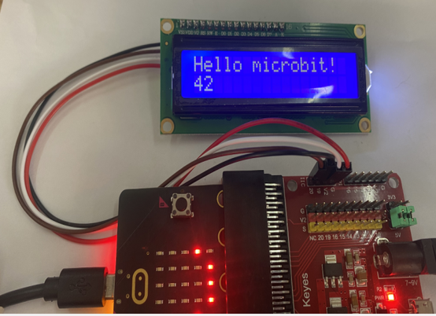

代码说明

|LCD_I2C_ADDR = 0x27|LCD1602的通信地址是0x27|
|-|-|
|display.show(Image.HAPPY)|Micro:bit显示笑脸|
|val.puts("Hello microbit!")|LCD1602第一行显示Hello microbit!|
|val.puts(str(n), 0, 1)|LCD1602第二行显示从0开始计数 （n=n+1）|

L293D驱动电机

实验说明：

L293D是一种直流电动驱动IC，在一些机器人项目中可用来驱动直流电机或步进电机。它共有16个引脚，可以同时驱动两路直流电机。输入电压范围：4.5 V ~ 36 V，每通道输出电流：MAX 600mA，可以驱动感性负载，特别是其输入端可以与单片机直接相连，从而很方便地受单片机控制。当驱动小型直流电机时，可以直接控制两路电机，并且可以实现电机正转与反转，实现此功能只需改变输入端的高低电平。市面上有许多采用L293D芯片的电机驱动板，当然我们也可以自己通过简单连接来使用它。

L293D引脚图：

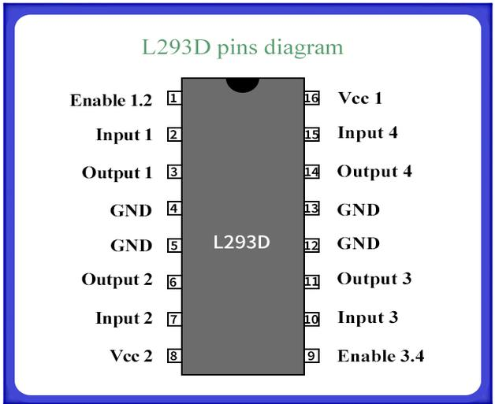

|引脚号|引脚名称|描述|
|-|-|-|
|1|Enable1,2|该引脚使能输入引脚Input 1(2)和Input 2(7)|
|2|Input1|直接控制输出1引脚，由数字电路控制。|
|3|Output1|连接到电机1的一端|
|4|GND|接地引脚连接到电路的接地(0V)|
|5|GND|接地引脚连接到电路的接地(0V)|
|6|Output2|连接到电机1的另一端|
|7|Input2|直接控制输出2引脚。由数字电路控制|
|8|Vcc2(Vss)|连接到运行电机的电压引脚(4.5V至36V)|
|9|Enable3,4|该引脚使能输入引脚输入3(10)和输入4(15)|
|10|Input3|直接控制输出3引脚。由数字电路控制|
|11|Output3|连接到电机2的一端|
|12|GND|接地引脚连接到电路的接地(0V)|
|13|GND|接地引脚连接到电路的接地(0V)|
|14|Output4|连接到电机2的另一端|
|15|Input4|直接控制输出4引脚。由数字电路控制|
|16|Vcc1(Vss)|连接到+ 5V以启用IC功能|

实验器材：

|||||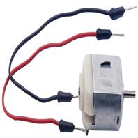|
|-|-|-|-|-|
|micro：bit主板1|扩展板×1|L293D驱动芯片×1|小风扇×1|直流电机（焊有2根杜邦线）×1|
||||||
|6节5号AA电池盒×1|micro USB数据线×1|面包板连接线若干|公对母杜邦线若干|面包板×1|

实验原理图：

实验接线图：

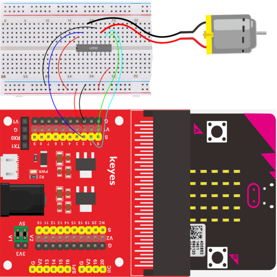

实验代码：

根据上图的接线图接好线，由实验接线图可知，L293D驱动芯片的Enable3,4端是接在P0处，Input3端是接在P1处，Input4端是接在P2处，电机的红线是接在L293D驱动芯片的Onput3端，黑线是接在L293D驱动芯片的Onput4端。先用micro USB数据线将电脑和micro：bit主板连接好，再启动MU编程工具进行编写代码：

加载完成后，如下图所示。你也可以打开Mu软件，在编辑窗口输入代码。（注意！所有英文及符号均须以英文填写，最后一行必须有空格。）

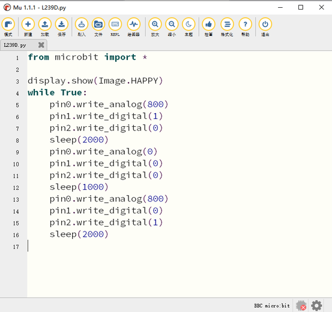

点击检查无报错再刷入

实验结果

按照接线图接好线，上传完程序，上电后，电机顺时针转2s，停1S,逆时针转1s，循环重复。（注意：扩展板使用DC 7~9V的电源供电，V2跳帽插在5V的位置，实验才能正常工作）

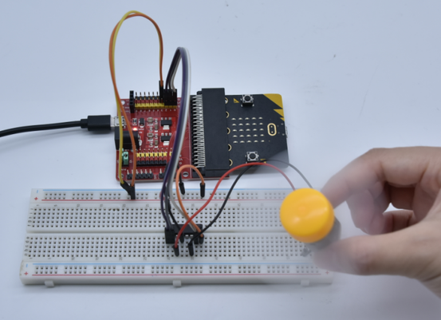

#### 第23课 自动浇花系统

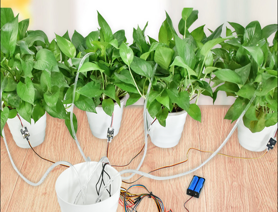

实验说明：

以上实验已经分别学过了土壤湿度传感器、LCD1602显示屏模块、L293D驱动和电机(水泵)的工作原理，在本次实验中，我们采用micro：bit主板和micro:bit扩展板外接土壤湿度传感器、LCD1602显示屏模块、L293D驱动和水泵组成自动浇花系统。在micro bit主板的控制下，土壤湿度传感器检测土壤湿度，将检测值传送回来，经micro bit主板判断该值是否在正常湿度范围内，若低于湿度的最小值，发出浇水最多的指令，让水泵自动快速的出水；若湿度在最小值与最大值之间，发出浇水较少的指令，让水泵自动慢速的出水；若高于等于最大值时，发出终止浇水的指令，让水泵停止出水。

实验器材：

|||||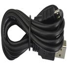|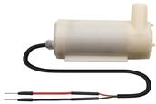||
|-|-|-|-|-|-|-|
|micro：bit主板1|扩展板×1|1602 LCD显示屏模块×1|4P和3P 转杜邦线母|micro USB数据线×1|水泵×1|5号AA电池×6|
|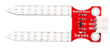|||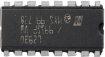||||
|土壤湿度传感器模块×1|面包板连接线若干|水泵出水管×1|L293D驱动芯片×1|公对母杜邦线若干|面包板×1|6节5号AA电池盒×1|

实验原理图：

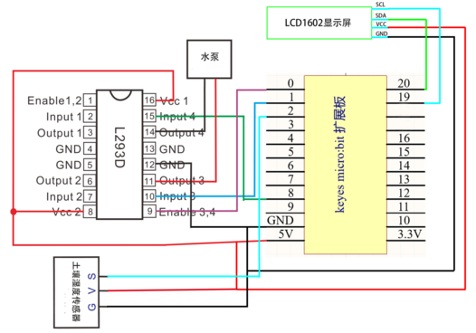

实验接线图：

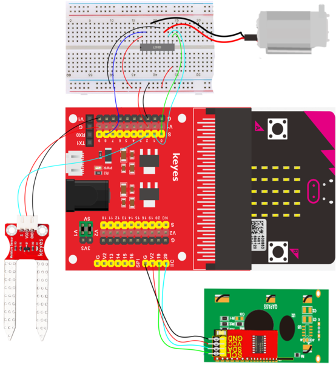

土壤湿度传感器模块的信号端S是接在P2处；LCD1602模块的SDA引脚是接在P20，SCL引脚是接在P19；L293D驱动芯片的Enable3,4端是接在P0处，Input3端是接在P1处，Input4端是接在P8处，水泵的红线是接在L293D驱动芯片的Onput3端，黑线是接在L293D驱动芯片的Onput4端。

实验代码

用Mu软件打开“浇花.py“文件。

加载完成后，如下图所示。你也可以打开Mu软件，在编辑窗口输入代码。（注意！所有英文及符号均须以英文填写，最后一行必须有空格。）

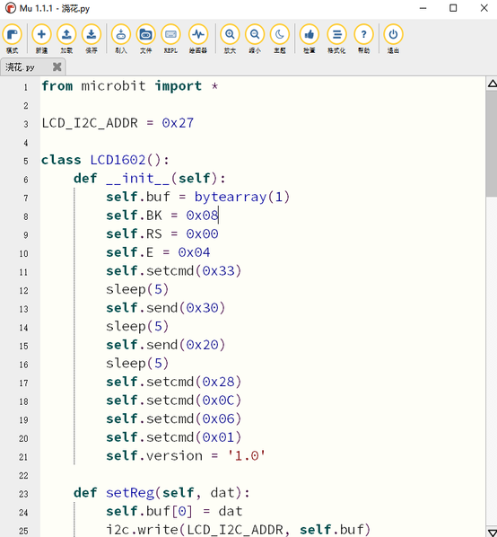

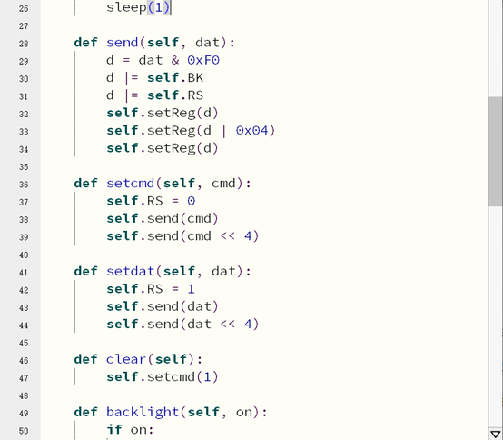

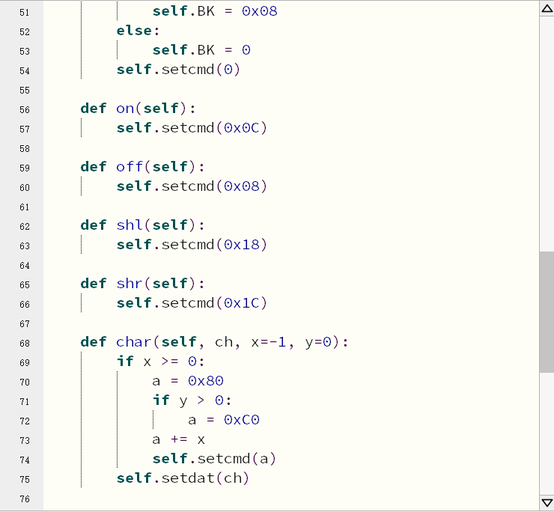

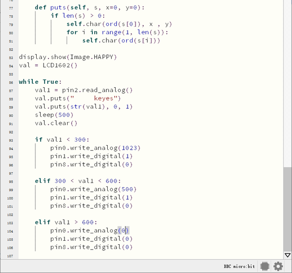

点击检查无报错再刷入

实验结果：

按照接线图接好线，上传完程序，上电后，将土壤湿度传感器插入花盆中，LCD显示屏第一行显示“Keyes”,第二行显示出土壤湿度传感器检测到的土壤湿度值，当土壤湿度的模拟值小于300时，水泵以最快的速度抽水；当土壤湿度的模拟值大于300且小于600时，水泵抽水速度减慢；若土壤湿度的模拟值大于600时，水泵停止抽水。（注意：扩展板使用DC 7~9V的电源供电，V2跳帽插在5V的位置，实验才能正常工作）

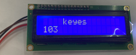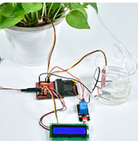

#### 第24课 舵机控制

实验说明：

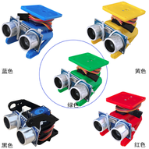
当我们在做DIY自己小车时，我们会经常让小车实现个自动避障的功能。在DIY过程中我们需要一个舵机控制超声波模块左右转动，然后检测小车与左右两方障碍物的距离，方便控制小车避障。在这课程中我们着重介绍下舵机的原理和使用方法。

舵机是一种位置伺服的驱动器，主要是由外壳、电路板、无核心马达、齿轮与位置检测器所构成。其工作原理是由接收机或者单片机发出信号给舵机，其内部有一个基准电路，产生周期为20ms，宽度为1.5ms
的基准信号，将获得的直流偏置电压与电位器的电压比较，获得电压差输出。经由电路板上的IC
判断转动方向，再驱动无核心马达开始转动，透过减速齿轮将动力传至摆臂，同时由位置检测器送回信号，判断是否已经到达定位。适用于那些需要角度不断变化并可以保持的控制系统。当电机转速一定时，通过级联减速齿轮带动电位器旋转，使得电压差为0，电机停止转动。一般舵机旋转的角度范围是0
度到180 度。

舵机有很多规格，但所有的舵机都有外接三根线，分别用棕、红、橙三种颜色进行区分，由于舵机品牌不同，颜色也会有所差异，棕色为接地线，红色为电源正极线，橙色为信号线。

舵机的转动的角度是通过调节PWM（脉冲宽度调制）信号的占空比来实现的，标准PWM（脉冲宽度调制）信号的周期固定为20ms（50Hz），理论上脉宽分布应在1ms到2ms
之间，但是，事实上脉宽可由0.5ms 到2.5ms
之间，脉宽和舵机的转角0°～180°相对应。对于同一信号，不同牌子的舵机旋转的角度也会有所不同。

用micro：bit主板控制舵机的方法有两种，一种是通过micro.bit
的普通数字传感器接口产生占空比不同的方波，模拟产生PWM
信号进行舵机定位，第二种是直接利用micro.bit自带的Servo
函数进行舵机的控制，micro.bit的驱动能力有限，所以当需要控制1个及以上的舵机时需要外接电源。

软件上，我们不仅可以直接在米思齐软件上设置对应引脚的输出高低电平，从而控制舵机的角度；而且我们还特别设置了智能家居库文件，只需一条代码即可控制舵机的角度，简单方便。

这里要注意，不要使用电脑USB数据线供电，因为如果电流需求大于500mA，会有烧毁USB数据线的可能，推荐使用电池外置供电。

实验器材：

|||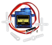||||
|-|-|-|-|-|-|
|micro：bit主板1|扩展板×1|舵机×1|micro USB数据线×1|5号电池×6|6节5号AA电池盒×1|

实验接线图

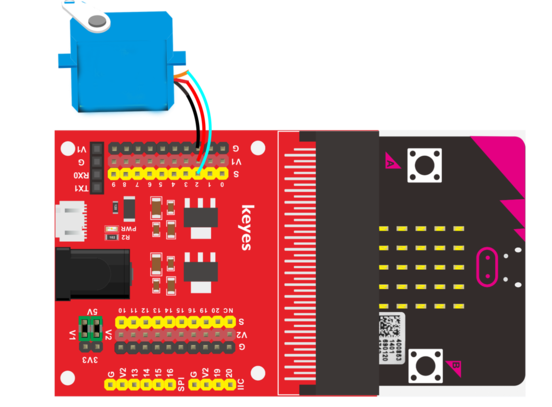

舵机的黄线端是接在P2处

实验代码：

用Mu软件打开“舵机.py“文件。

加载完成后，如下图所示。你也可以打开Mu软件，在编辑窗口输入代码。（注意！所有英文及符号均须以英文填写，最后一行必须有空格。）

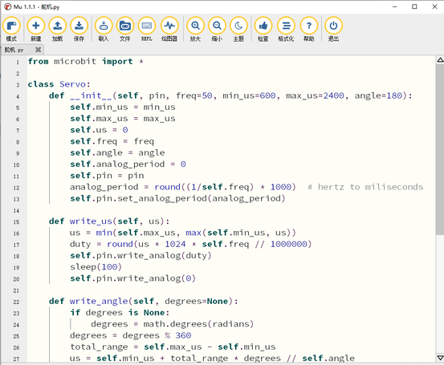

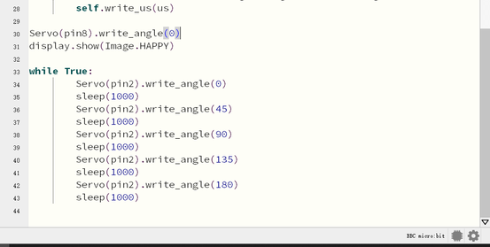

您需要单击“检查”按钮来检查代码是否有错误。如果一行出现光标或下划线，则表明该行的程序有错误。（图中红色框出来的部分可以忽略不管，这是因为MU软件没有识别到存在MicroPython里面集成的函数，实际它是可以正常执行的）

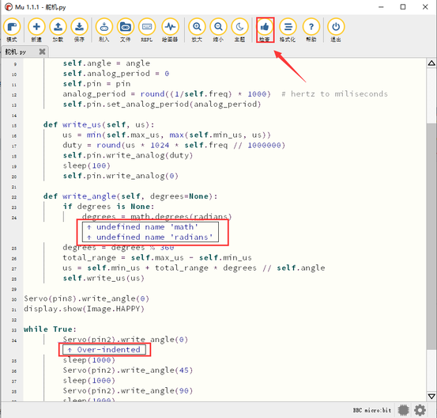

实验结果：

将示例代码上传到micro:bit主板，上传成功后，microbit主板上的LED点阵显示“笑脸”图案，再将船型开关上的“1”端按下，舵机从0°~45°~90°~135°~180°~0°，循环进行。

（注意：扩展板使用DC 7~9V的电源供电，V2跳帽插在5V的位置，实验才能正常工作）

#### 第26课 控制步进电机

实验说明：

步进电机是将电[脉冲](https://baike.so.com/doc/5327352-5562524.html)信号转变为[角位移](https://baike.so.com/doc/2803889-2959433.html)或线位移的开环控制元件。在非超载的情况下，电机的转速、停止的位置只取决于脉冲信号的频率和脉冲数，而不受负载变化的影响，当步进驱动器接收到一个脉冲信号，它就驱动步进电机按设定的方向转动一个固定的角度，称为"步距角"，它的旋转是以固定的角度一步一步运行的。可以通过控制脉冲个数来控制角位移量，从而达到准确定位的目的；同时可以通过控制脉冲频率来控制电机转动的速度和加速度，从而达到调速的目的。

步进电机是一种[感应电机](https://baike.so.com/doc/6284999-6498474.html)，它的工作原理是利用电子电路，将直流电变成分时供电的，多相时序控制电流，用这种电流为步进电机供电，步进电机才能正常工作，驱动器就是为步进电机分时供电的，多相时序控制器。

虽然步进电机已被广泛地应用，但步进电机并不能像普通的直流电机和交流电机一样在常规下就能使用。它必须由双环形脉冲信号、功率驱动电路等组成控制系统方可使用。因此用好步进电机却非易事，它涉及到机械、电机、电子及计算机等许多专业知识。步进电机作为[执行元件](https://baike.so.com/doc/6281461-6494919.html)，是机电一体化的关键产品之一，广泛应用在各种自动化控制系统中。

特征：（1）步进电机的旋转角度与输入脉冲成比例；

（2）步进电机在静止时具有全扭矩（如果绕组通电）；

（3）精确的定位和运动的重复性，因为良好的步进电机的精度为一步的-5%，并且从一步到下一步的误差是不累积的；

（4）对启动/停止/反转有极好的响应；

（5）非常可靠，因为步进电机中没有接触刷。因此，步进电机的寿命仅取决轴承的寿命；

（6）步进电机对数字输入脉冲的响应提供开环控制，使步进电机更简单，控制成本更低；

（7）可以通过直接连接到轴上的负载实现非常低速的同步旋转；

（8）由于转速与输入脉冲的频率成正比，因此可以实现大范围的转速。

实验器材：

|||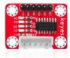|||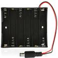|
|-|-|-|-|-|-|
|micro：bit主板1|扩展板×1|Keye ULN200步进电机驱动板×1|母对母面包板连接线若干|5号电池×6|6节5号AA电池盒×1|
|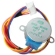||||||
|Keyes 5线步进电机×1|面包板×1|||||

实验接线图：

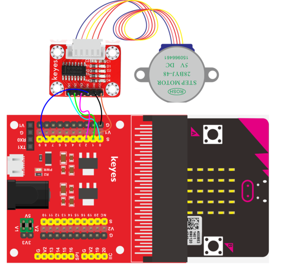

步进电机驱动模块的IN1对应的是接到P0处，IN2对应的是接到P1处，IN3对应的是接到P2处，IN4对应的是接到P8，接线用公对母的杜邦线接到面包板上转接

实验代码：

用Mu软件打开“步进电机控制.py“文件。

你也可以打开Mu软件，在编辑窗口输入代码。（注意！所有英文及符号均须以英文填写，最后一行必须有空格。）

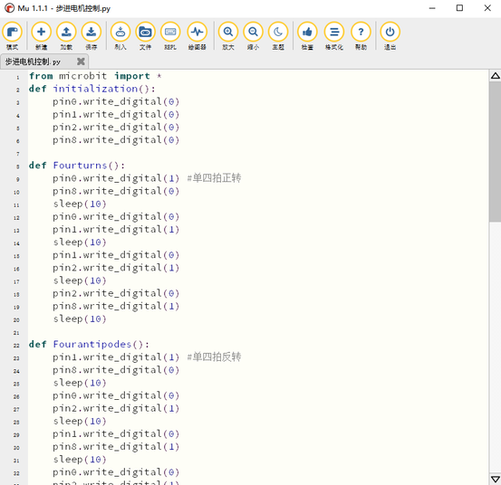

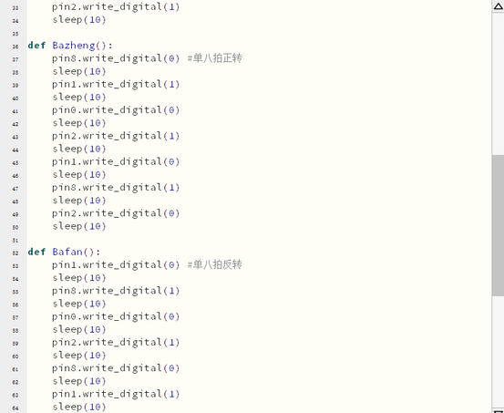

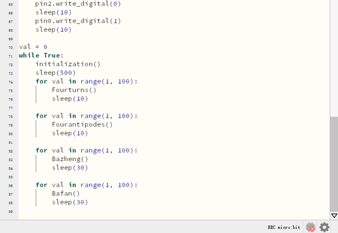

点击检查无报错再刷入

实验结果：

按照接线图接好线，上传完程序，上电后，步进电机以最慢的速度逆时针和逆时针100步，再以最快的速度逆时针和逆时针转100步，如此循环。

（注意：扩展板使用DC 7~9V的电源供电，V2跳帽插在5V的位置，实验才能正常工作）

代码说明

|initialization()|步进电机初始化|
|-|-|
|for val in range(1, 100):|循环100次|
|Fourturns()|步进电机以单四拍速度正转|
|Fourantipodes()|步进电机以单四拍速度反转|
|Bazheng()|步进电机以单八拍速度正转|
|Bafan()|步进电机以单八拍速度反转|

#### 第26课 继电器的使用

实验说明：

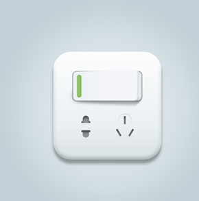在生活中，我们一般用220V的交流电来驱动电器设备。有时候我们需要用到开关来控制电器，假如直接

把开关接到220V的交流电电路中，一旦漏电，那么就会危及人身安全，这样不好。于是我们就设计了一个继电器模块。这个继电器模块常开（NO）和常闭（NC）接口，它是高电平有效。

继电器模块具有[控制系统](https://baike.baidu.com/item/%E6%8E%A7%E5%88%B6%E7%B3%BB%E7%BB%9F/1051898)（又称[输入](https://baike.baidu.com/item/%E8%BE%93%E5%85%A5/32696)[回路](https://baike.baidu.com/item/%E5%9B%9E%E8%B7%AF/35792)）和被[控制系统](https://baike.baidu.com/item/%E6%8E%A7%E5%88%B6%E7%B3%BB%E7%BB%9F/1051898)（又称[输出](https://baike.baidu.com/item/%E8%BE%93%E5%87%BA/11056752)[回路](https://baike.baidu.com/item/%E5%9B%9E%E8%B7%AF/35792)），通常应用于[自动控制](https://baike.baidu.com/item/%E8%87%AA%E5%8A%A8%E6%8E%A7%E5%88%B6/5337539)[电路](https://baike.baidu.com/item/%E7%94%B5%E8%B7%AF/33197)中，它实际上是用较小的[电流](https://baike.baidu.com/item/%E7%94%B5%E6%B5%81/268192)、较低的[电压](https://baike.baidu.com/item/%E7%94%B5%E5%8E%8B/269108)去控制较大[电流](https://baike.baidu.com/item/%E7%94%B5%E6%B5%81/268192)、较高的[电压](https://baike.baidu.com/item/%E7%94%B5%E5%8E%8B/269108)的一种“[自动开关](https://baike.baidu.com/item/%E8%87%AA%E5%8A%A8%E5%BC%80%E5%85%B3/3967423)”。故在[电路](https://baike.baidu.com/item/%E7%94%B5%E8%B7%AF/33197)中起着[自动调节](https://baike.baidu.com/item/%E8%87%AA%E5%8A%A8%E8%B0%83%E8%8A%82/4094137)、[安全](https://baike.baidu.com/item/%E5%AE%89%E5%85%A8/32778)[保护](https://baike.baidu.com/item/%E4%BF%9D%E6%8A%A4/5807080)、[转换](https://baike.baidu.com/item/%E8%BD%AC%E6%8D%A2/197560)[电路](https://baike.baidu.com/item/%E7%94%B5%E8%B7%AF/33197)等[作用](https://baike.baidu.com/item/%E4%BD%9C%E7%94%A8/33062)。它可以让micro：bit主板驱动3A以下负载，如LED灯带、直流马达、微型水泵、电磁阀可插拔式接口设计，方便使用。电磁继电器的内部主要部件是电磁铁A、衔铁B、弹簧C、动触点D、静触点（常开触点）E、和静触点（常闭触点）F，(如图所示)。只要在线圈两端加上一定的[电压](https://baike.baidu.com/item/%E7%94%B5%E5%8E%8B)，线圈中就会流过一定的电流，从而产生电磁效应，衔铁就会在电[磁力](https://baike.baidu.com/item/%E7%A3%81%E5%8A%9B)吸引的作用下克服返回弹簧的拉力吸向铁芯，从而带动衔铁的[动触点](https://baike.baidu.com/item/%E5%8A%A8%E8%A7%A6%E7%82%B9)与[静触点](https://baike.baidu.com/item/%E9%9D%99%E8%A7%A6%E7%82%B9)（常开触点）吸合。当线圈断电后，电磁的吸力也随之消失，衔铁就会在弹簧的[反作用力](https://baike.baidu.com/item/%E5%8F%8D%E4%BD%9C%E7%94%A8%E5%8A%9B)返回原来的[位置](https://baike.baidu.com/item/%E4%BD%8D%E7%BD%AE)，使动触点与原来的静触点（常闭触点）释放。这样吸合、释放，从而达到了在电路中的导通、切断的目的。对于继电器的“常开、常闭”触点，可以这样来区分：[继电器线圈](https://baike.baidu.com/item/%E7%BB%A7%E7%94%B5%E5%99%A8%E7%BA%BF%E5%9C%88)未通电时处于断开状态的静触点，称为“常开触点”；处于接通状态的静触点称为“常闭触点”。

使用时，我们在G（-）、V（+）供电5V，S接信号端，当给S高电压时，驱动继电器，即常开（NO）连通、常闭（NC）断开；当给S低电压时，关闭继电器，即常开（NO）断开、常闭（NC）连通。这样我们把220V的交流电电路接到常开（NO）或常闭（NC）接口，通过3V电压控制，安全方便。

在这里，我们将模拟继电器控制外接电路，我们用继电器模块控制一个LED（为方便接线，电路中没有加220V电压，还是3V，原理是一样）的亮灭。

实验器材：

||||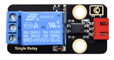||
|-|-|-|-|-|
|micro：bit主板1|扩展板×1|红色LED×1|单路继电器模块×1|公对母杜邦线若干|
||||||
|面包板×1|220Ω电阻×1|5号AA电池×6|6节5号AA电池盒×1|3P连接线×1|

实验接线图：

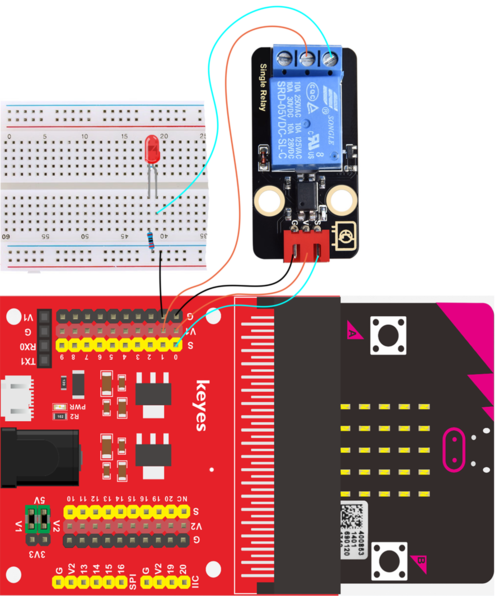

继电器的信号端S是接在P0处

实验代码：

用Mu软件打开“继电器-1.py“文件。

加载完成后，如下图所示。你也可以打开Mu软件，在编辑窗口输入代码。（注意！所有英文及符号均须以英文填写，最后一行必须有空格。）

点击检查无报错再刷入

代码说明

|from microbit import *|导入micro：bit的库文件|
|-|-|
|while True:|这是一个永久循环，它使micro：bit永远执行这个循环中的代码。|
|Pin0.write_digital(1)|控制引脚0输出高电平，打开继电器|
|sleep(2000)|延时2000毫秒|
|Pin0.write_digital(0)|控制引脚0输出低电平，打开继电器|
|sleep(2000)|延时2000毫秒|

实验结果：

按照接线图接好线，上传完程序，上电后，将看到继电器接通（NO接通，NC断开）2秒钟，然后断开2秒钟（NC闭合，NO断开），重复循环。当继电器接通时，红色LED亮起；接着继电器关闭，则红色LED熄灭，循环进行。

#### 第27课 红外智能遥控

实验说明：

在生活中，我们可以经常看到人们利用红外遥控控制各种家电，如冰箱、音响、录影机等。红外遥控是由红外发射和红外接收系统组成的，也就是一个红外遥控器和红外接收器和一个能解码的单片机组成的，我们看图示。

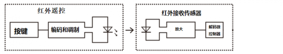

红外发射的遥控器发射的38K红外载波信号是由遥控器里的编码芯片对其进行编码。它是以一段引导码，用户码，数据码，数据反码组成，利用脉冲的时间间隔来区别是0还是1信号(高电平低电平之比约为1:1时被认为是信号0，1，而编码就是由这些0
、1信号组成。同一个遥控器的用户码是不变的，用数据吗不同来分辨遥控器按的键不同。当按下遥控器按键时，遥控器发送出红外载波信号，红外接收器接收到信号时程序对载波信号进行解码，通过数据码的不同来判断按下的是哪个键。单片机由接收到的01信号进行解码，由此判断遥控器按下的是什么键。

在这实验中，我将红外接收器连接在micro：bit主板的P16上，上传对应实验代码。上电后，按下对准红外接收器按下红外遥控按键，然后我们可以在串口监视器中看到对应的按键键值。我们可以根据这些按键键值控制其他外接传感器模块。在本实验中，我们是再外接一个RGB元件，利用红外遥控按键控制RGB元件显示对应颜色灯光。

实验器材：

|||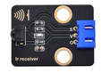|||
|-|-|-|-|-|
|micro：bit主板1|扩展板×1|红外接收模块|3P 转杜邦线母|RGB×1|
||||||
|220Ω电阻×3|面包板×1|面包板连接线若干|Keyes 遥控器||

实验接线图：

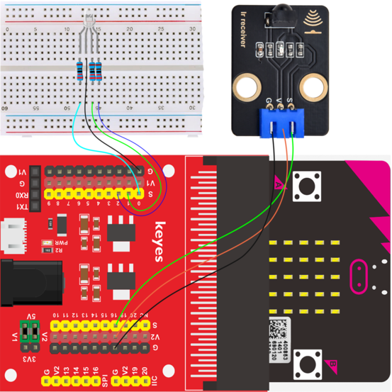

实验一

用Mu软件打开“红外接收-1.py“文件。

你也可以打开Mu软件，在编辑窗口输入代码。（注意！所有英文及符号均须以英文填写，最后一行必须有空格。）

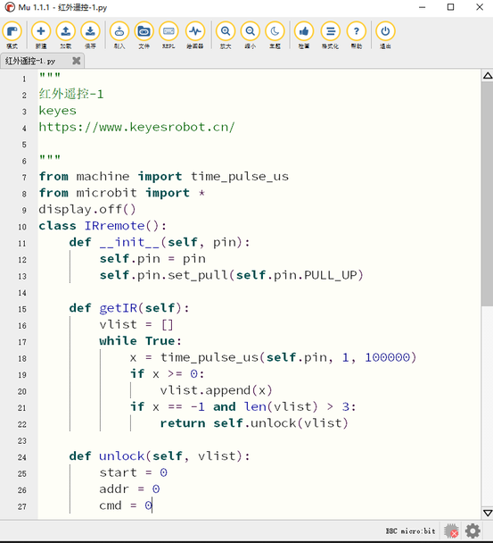

点击检查无报错再刷入

实验一结果

如图接好线，利用USB线连接micro:bit主板，代码成功下载到micro：bit主板之后。先点击“REPL”按钮，再按一下micro:bit主板上背面的复位按键，当用遥控器对着红外接收按下时，窗口上显示相应按键的十六进制数值，如下图所示：

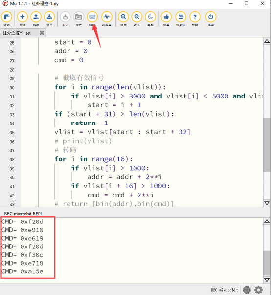

注意：

测试红外遥控是OK的方法，有一个小诀窍测试红外遥控是否OK。

打开手机摄像头拍照，红外遥控多准手机摄像头按下按键。如果在手机上看到有紫光闪烁，就代表红外遥控是OK的。

实验二

用Mu软件打开“红外接收-2.py“文件。

你也可以打开Mu软件，在编辑窗口输入代码。（注意！所有英文及符号均须以英文填写，最后一行必须有空格。）

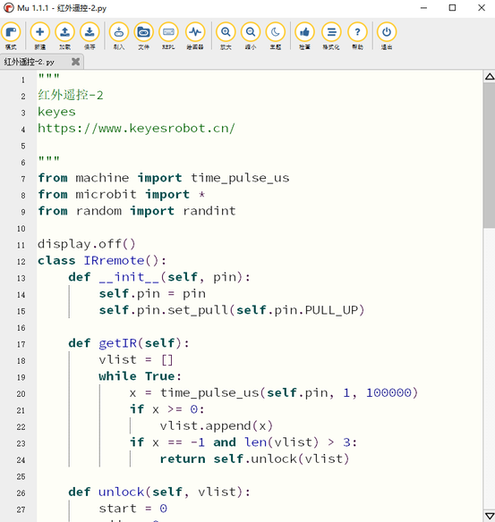

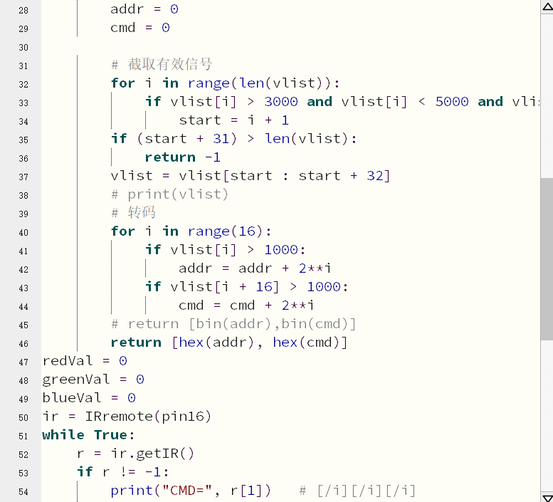

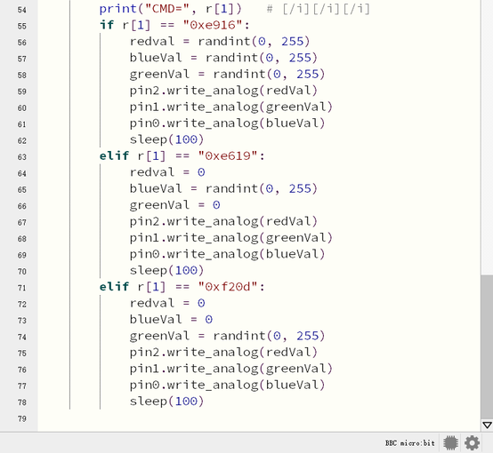

点击检查无报错再刷入

实验二结果

红外遥控器对准扩展板上的红外接收器，按下对应按键。当按下按键时，模块上RGB LED显示淡蓝色色；按下按键时，模块上RGB LED显示蓝色；按下按键时，模块上RGB LED显示绿色；

#### 第28课 自制电子时钟

实验说明：

DS1302是Maxim/Dallas公司生产的一款低成本、超高精度的涓流充电实时时钟芯片，DS1302涓流充电计时芯片包含一个实时时钟/日历和31字节的静态RAM。它通过简单的串行接口与单片机通信，使用同步串行通信简化了DS1302与单片机的接口。

DS1302实时时钟产生秒、分、时、星期、日期、月和年计时，并提供有效期到2100年的闰年补偿。当遇到少于31天的月份，将自动调整月末日期，包括闰年补偿。时钟的工作格式可以是24小时或带-AM/PM指示的12小时格式。DS1302是DS1202的继承者，除了DS1202的基本计时功能外，DS1302还具有用于主电源和备用电源的双电源功能。DS1302提供2个可编程日历闹钟和1路可编程方波输出。通过精密的、经过温度补偿的电压基准和比较器来监视VCC状态，检测电源故障，提供复位输出，并在必要时自动切换到备用电源。另外，DS1302时钟模块带可充电电池，保证系统断电后，时钟任然正常走动。

DS1302与单片机之间能简单地采用同步串行的方式进行通信，仅需用到三个口线：（1）RST
复位（2）DAT
数据线（3）CLK串行时钟。时钟/RAM的读/写数据以1个字节或多达31
个字节的字符组方式通信。DS1302
工作时功耗很低保持数据和时钟信息时功率小于1mW。模块自带1个定位孔，方便你将模块固定在其他设备。

DS1302是一个时钟模块，其实就是像一个电子时钟，它自身带有电池，当设置好时间后，DS3231就会自动走时。

实验器材：

|||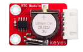|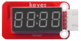|
|-|-|-|-|
|micro：bit主板1|扩展板×1|keyes 1302时钟传感器|keyes 4位数码管模块|
|||||
|4P 转杜邦线母|5P 转杜邦线母|5号AA电池×6|6节5号AA电池盒×1|

实验接线图：

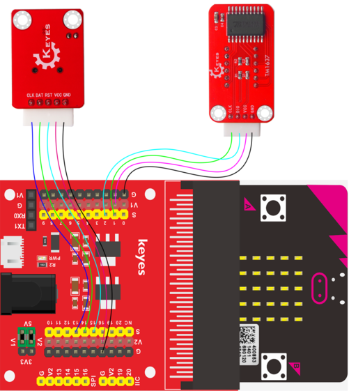

实验1

用Mu软件打开“电子时钟-1.py“文件。

你也可以打开Mu软件，在编辑窗口输入代码。（注意！所有英文及符号均须以英文填写，最后一行必须有空格。）

添加库文件

不要点击“刷入”，因为你还需要做一些额外的工作：导入“TM1637.py“和“DS1302”库文件到micro:bit中。这个库文件包含了四位数码管和时钟的控制方法，我们将这些方法集成到一个库文件中，这使得您更容易通过Python代码来使用。这就像MakeCode代码中的扩展库文件一样。

操作

把库文件复制到MU软件的“Mu_code”目录下；

例如，在windows系统中，假设您的系统安装在电脑C驱动器上，则用户名为“Administrator”，那么“mu_code”目录的路径是“C:\Users\Administrator\mu\_
code”。在Linux系统上，“mu_code”目录的路径是“~/home/mu_code”

进入“mu_code”文件夹。

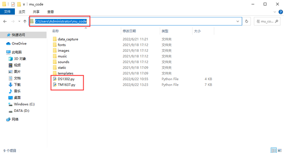

（2）先打开Mu软件并连接micro:bit到电脑，接着点击“文件”按钮，再拖着“TM1637.py“和“DS1302”库文件到micro:bit中。(若点击“文件”，没有看到库文件，需要先刷入个程序再打开点击“文件”)

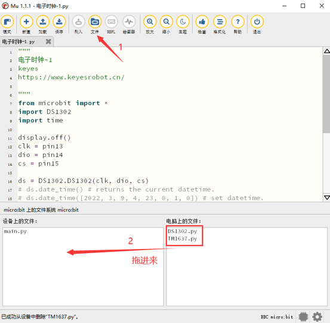

几秒钟后，导入完成。导入成功后，您将在左侧方框中可以看到它。

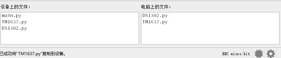

点击检查无报错再刷入

实验1现象

如图接好线，利用USB线连接micro:bit主板，代码成功下载到micro：bit主板之后。先点击“REPL”按钮，再按一下micro:bit主板后面的复位按钮，串口上显示”年-月-日-时分-秒-周；如下图“

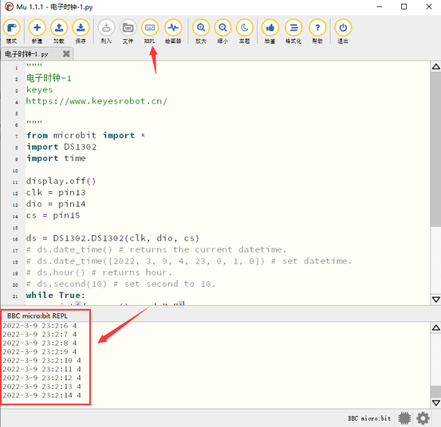

实验2

用Mu软件打开“电子时钟-2.py“文件。

你也可以打开Mu软件，在编辑窗口输入代码。（注意！所有英文及符号均须以英文填写，最后一行必须有空格。）

点击检查无报错再刷入

实验2现象

按照接线图接好线，上传程序，上电后。我们可以看到4位数码管模块显示出时间。

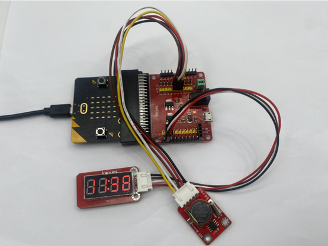

代码说明

|tm.brightness(7)|调节数码的亮度|
|-|-|
|tm.numbers(ds.hour(), ds.minute(), True)|数码第1、2位显示时，3、4位显示分|
|time.sleep(0.5)|延时0.5S|

#### 第29课 micro：bit体感实验

实验说明： 

micro：bit主板中集成了3 轴磁力计（电子罗盘），3 轴加速度计，可以测量microbit的3轴转动角度，也可以检测加速度的大小，也可以检测micro：bit常见的状态，摇晃倾斜自由落体等等。

3轴加速度计是I2C接口与外部通信的，10位ADC精度，可设置量程为±2g，±4g，±8g，数据最大更新速率为800Hz。当micro:bit主板处于静止或匀速运动状态时，加速计仅检测到重力加速度；将micro:bit轻微甩动，加速计检测到甩动的加速度远小于重力加速度，可忽略不计，因此，在使用micro:bit过程中，主要是检测当姿态变化时，重力加速度在x、y、z轴上的变化。

3轴磁力计也是I2C接口与外部通信的，量程为±1000µT，最大数据更新速率为80Hz，地磁传感器除了检测地磁场强度外,还能当作电子罗盘确定方向，同时也是航姿参考系统(AHRS)的重要组成部分。与三轴加速速计结合使用可在任意姿态下计算方位。

实验器材：

|||||
|-|-|-|-|
|micro：bit主板×1|keyes micro bit 传感器V2扩展板|RGB×1|micro USB数据线×1|
|||||
|220Ω 电阻×3|面包板×1|公对母杜邦若干||

实验原理图：

实验接线图：

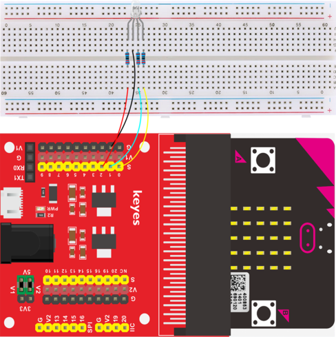

RGB的RED引脚接在P0、GREEN引脚接在P1、BLUE引脚接在P2

实验代码

用Mu软件打开“体感.py“文件。

你也可以打开Mu软件，在编辑窗口输入代码。（注意！所有英文及符号均须以英文填写，最后一行必须有空格。）

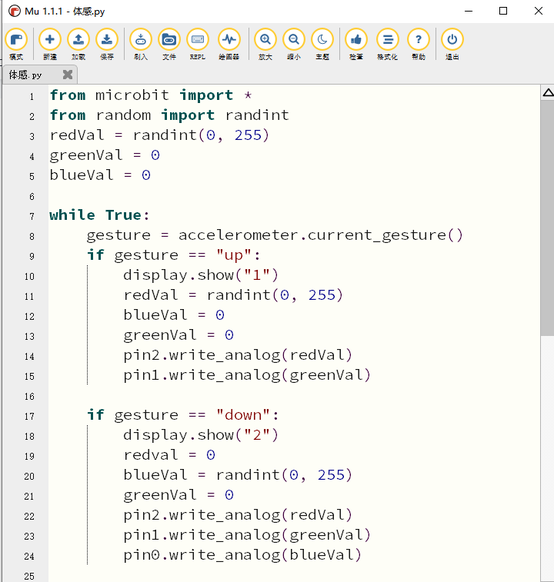

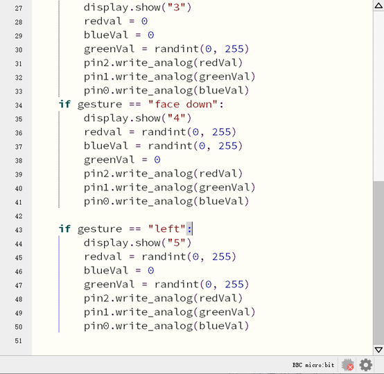

点击检查无报错再刷入

实验结果

按照接线图接好线，上传程序，上电后。micro：bit主板的徽标朝上时，RGB亮红色灯；徽标朝下时，RGB亮绿色灯；屏幕朝上时，RGB亮蓝色灯；屏幕朝下时，RGB亮黄色灯；向左倾斜，RGB亮青色灯；

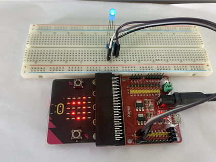

#### 第30课 摇杆控制

实验说明

当我们在做DIY自己物品时，经常需要用到摇杆模块，如游戏手柄。那摇杆模块模块是怎么样工作的呢？

摇杆模块主要是采用PS2
手柄摇杆元件，实际上摇杆模块有3个信号端接口，模拟3维空间，其中信号端X、Y模拟空间的X轴和Y轴，控制时，我们需要将模块的X、Y信号端端口连接单片机模拟口，通过控制2个模拟输入值，控制物体在空间X、Y轴的坐标。Z信号端B模拟空间Z轴，它一般接数字口，做按键使用。

V接单片机电源输出端（3.3-5V），G接单片机GND，原始状态下读出电压为2.5V左右，对于X轴方向，当随箭头方向按下，读出电压值随着增加，最大到5V，随箭头相反方向按下，读出电压值减少，最小为0V；对于Y轴方向，当沿着模块上的箭头方向按下，读出电压值减少，最小为0V，随箭头相反方向按下，读出电压值随着增加，最大到5V；对于Z轴方向，信号端B接数字口，原始状态下输出0，按下输出1。我们可以读取两个模拟值和一个数字口的高低电平情况，判断模块上摇杆的工作状态。

在这实验中，我们将摇杆模块的X、Y信号端分别接到micro：bit主板的P0、P1，B信号端接到micro：bit主板的P2。我们将所测的数值在串口监视器上显示。

实验器材：

||||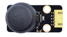||
|-|-|-|-|-|
|micro：bit主板×1|keyes micro bit 传感器V2扩展板|micro USB数据线×1|Keye摇杆模块|5P 转杜邦母单|

实验接线图

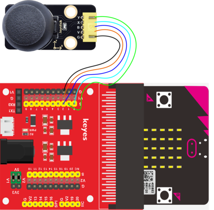

V1跳帽接到3.3V

实验程序：

用Mu软件打开“摇杆控制.py“文件。

你也可以打开Mu软件，在编辑窗口输入代码。（注意！所有英文及符号均须以英文填写，最后一行必须有空格。）

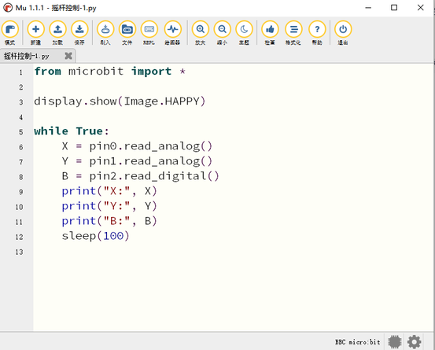

点击检查无报错再刷入

实验现象

控制摇杆模块，我们就可以在串口监视器上看到显示B/Y/Z的数据结果，显示如下图。

（注意：扩展板使用DC 7~9V的电源供电，V1跳帽接到3.3V的位置，实验才能正常工作）

#### 第31课 模拟小车运动

实验说明

前一实验我们已经学过了摇杆模块的控制原理，摇杆模块通过摇杆可以很多传感器/模块来设计很多好玩的DIY，本实验我们来学习摇杆模块的应用，我们将摇杆模块的X、Y信号端分别接到micro：bit主板的P0、P1，B信号端接到micro：bit主板的P2，利用摇杆模块控制电机的正反转来模拟小车运动。

实验器材：

||||||||
|-|-|-|-|-|-|-|
|micro：bit主板×1|keyes micro bit 传感器V2扩展板|L293D驱动芯片×1|小风扇×1|直流电机×1|Keye摇杆模块|5P 转杜邦母单|
||||||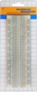||
|公对母杜邦若干|面包板连接线若干|5号电池×6|6节5号AA电池盒×1|micro USB数据线×1|面包板×1||

实验接线图

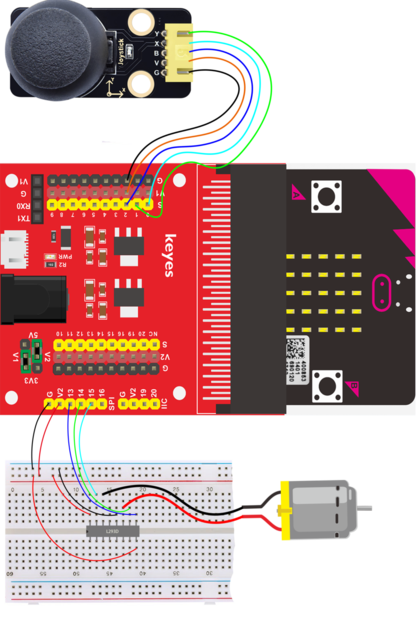

注意：V1跳帽接到3.3V,V2跳帽插在5V的位置

实验程序

用Mu软件打开目录下的“程序.py“文件。

你也可以打开Mu软件，在编辑窗口输入代码。（注意！所有英文及符号均须以英文填写，最后一行必须有空格。）

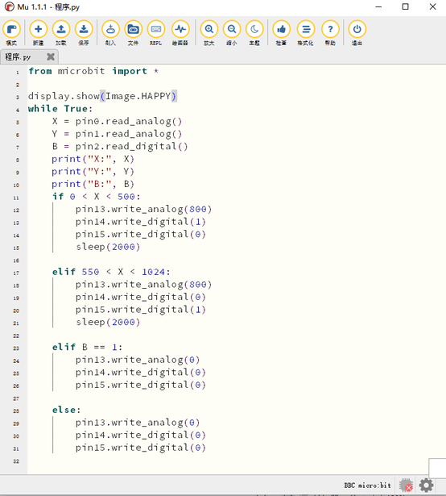

点击检查无报错再刷入

实验结果

按照接线图接好线，上传程序，上电后，当摇杆往左移时，电机逆时针转动；当摇杆往右移时，电机顺时针转动；当按下摇杆时，电机停止转动。

（注意：V1跳帽接到3.3V,V2跳帽插在5V的位置，实验才能正常工作）

#### 第32课 自制超声波测距仪

实验说明

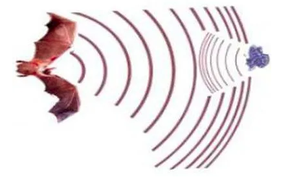自然界有一种叫蝙蝠的动物，蝙蝠在夜间飞行不是靠眼睛看的，而是靠耳朵和发音器官飞行的。蝙蝠在飞行时，会发出一种尖叫声，这是一种超声波信号，是人类无法听到的，因为它的音频很高。这些超声波的信号若在飞行路线上碰到其他物体，就会立刻反射回来，在接收到返回的信息之后，蝙蝠于振翅之间就完成了听、看、计算与绕开障碍物的全部过程。

超声波测距的原理跟上面的原理是一样的，超声波测距模块一触发信号后发射超声波，当超声波投射到物体而反射回来时，模块输出一回响信号，以触发信号和回响信号间的时间差，来判定物体的距离。

在这里，我们将 HC-SR04 超声波传感器先接到keyes micro:bit扩展板上，用于测试超声波传感器和前方障碍物的距离，并在CoolTerm串口监视器显示出来。然后再接LCD显示屏模块，使超声波传感器测试到的前方障碍物的距离在LCD显示屏模块显示出来。

实验器材：

|||||
|-|-|-|-|
|micro：bit主板1|扩展板×1|1602 LCD显示屏模块×1|4P 转杜邦线母×|
|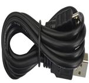|||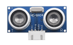|
|micro USB数据线×1|6节5号AA电池盒×1|5号AA电池×6|keyes HC-SR04超声波传感器|

实验接线图：

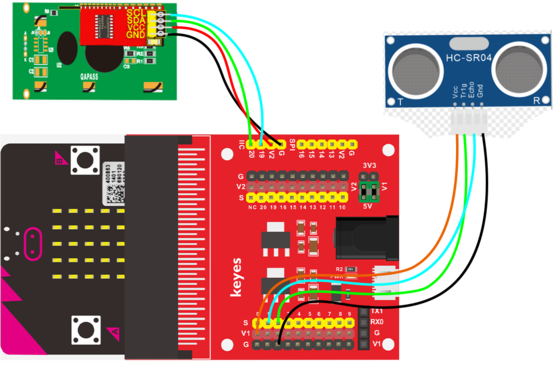

实验一

用Mu软件打开“超声波测距-1.py“文件。

你也可以打开Mu软件，在编辑窗口输入代码。（注意！所有英文及符号均须以英文填写，最后一行必须有空格。）

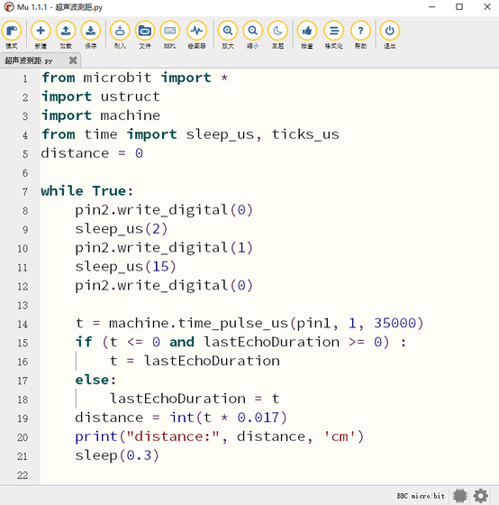

您需要单击“检查”按钮来检查代码是否有错误。如果一行出现光标或下划线，则表明该行的程序有错误。（图中红色框出来的部分可以忽略不管，这是因为MU软件没有识别到存在MicroPython里面集成的函数，实际它是可以正常执行的）

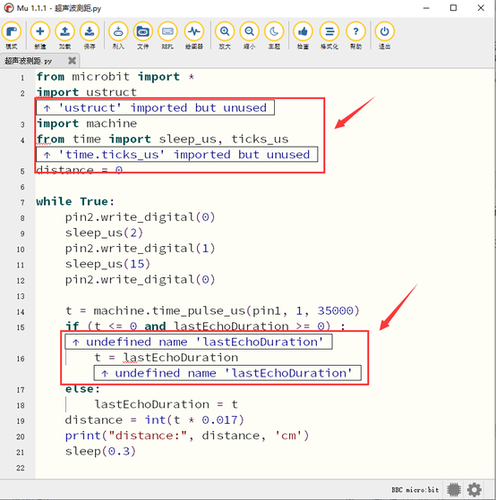

实验一结果

如图接好线，利用USB线连接micro:bit主板，代码成功下载到micro：bit主板之后。先点击“REPL”按钮，再按一下micro:bit主板上背面的复位按键，超声波检测到的距离在串口上显示，如下所示：

（注意：扩展板使用DC 7~9V的电源供电，V1/V2跳帽插在5V的位置，实验才能正常工作）

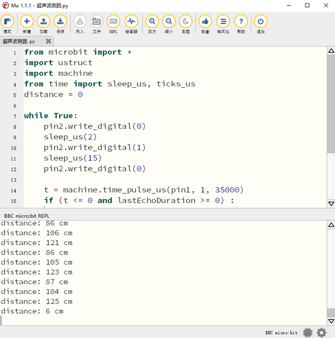

实验二

用Mu软件打开“超声波测距-2.py“文件。

你也可以打开Mu软件，在编辑窗口输入代码。（注意！所有英文及符号均须以英文填写，最后一行必须有空格。）

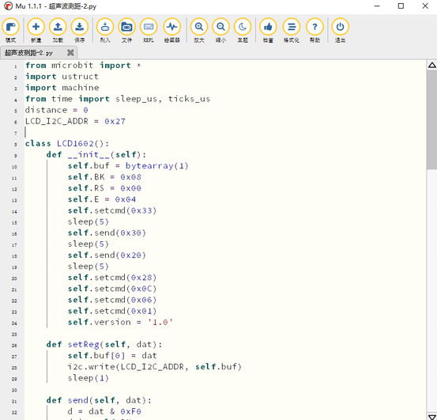

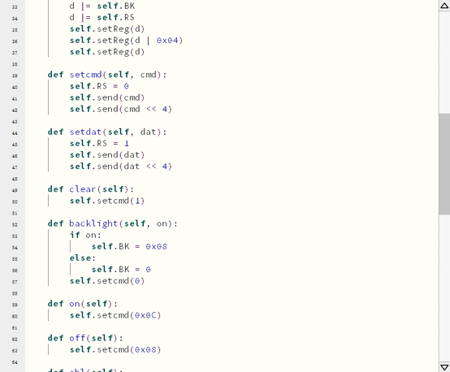

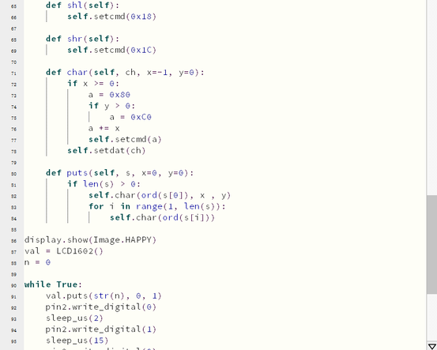

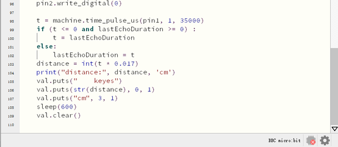

点击检查无报错再刷入

实验现象

按照接线图接好线，上传程序，上电后，我们可以看到OLED显示屏显示超声波模块检测到离障碍物的距离。

（注意：扩展板使用DC 7~9V的电源供电，V1/V2跳帽插在5V的位置，实验才能正常工作）

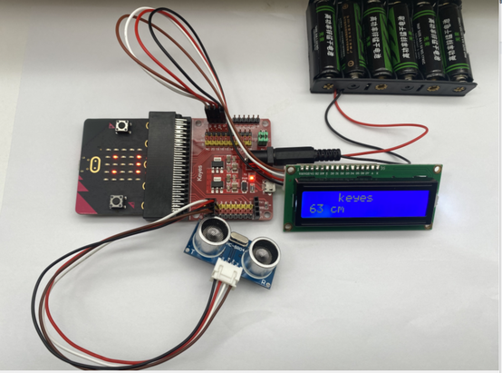

#### 第33课 无接触智能垃圾桶

实验说明

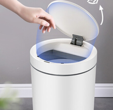接触传播是新冠病毒、细菌的传播途径之一。人们在扔垃圾时易触碰垃圾桶盖，如果一个感染新冠病毒的人触摸了盖子，另一个人紧接着再去触摸就有可能被传染。这节课我们用超声波、舵机、LCD传感器制作一个不需要接触就能打开盖子的垃圾桶。

实验器材：

||||||
|-|-|-|-|-|
|micro：bit主板1|扩展板×1|1602 LCD显示屏模块×1|4P 转杜邦线母×|舵机×1|
||||||
|micro USB数据线×1|6节5号AA电池盒×1|5号AA电池×6|keyes HC-SR04超声波传感器||

实验接线图：

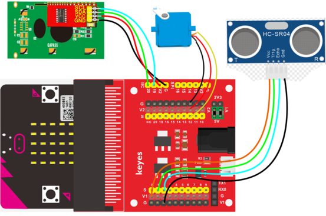

实验程序

用Mu软件打开“智能垃圾.py“文件。

你也可以打开Mu软件，在编辑窗口输入代码。（注意！所有英文及符号均须以英文填写，最后一行必须有空格。）

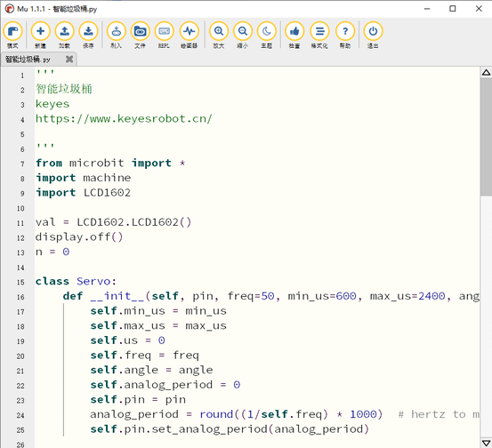

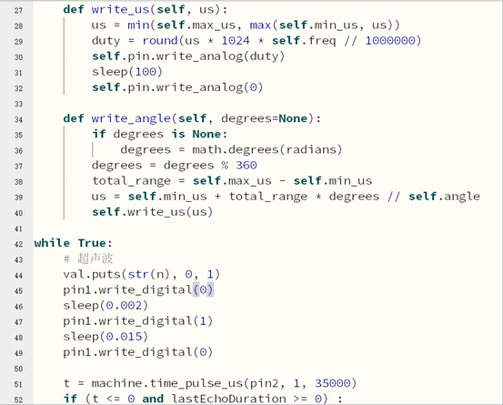

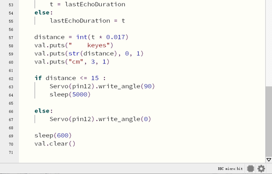

您需要单击“检查”按钮来检查代码是否有错误。如果一行出现光标或下划线，则表明该行的程序有错误。（图中红色框出来的部分可以忽略不管，这是因为MU软件没有识别到存在MicroPython里面集成的函数，实际它是可以正常执行的）

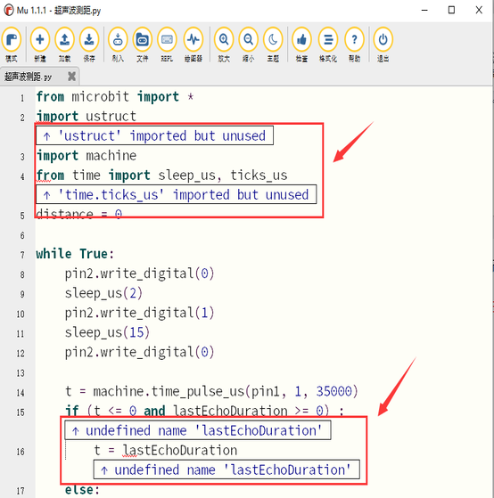

添加库文件

先不要点击“刷入”，因为你还需要做一些额外的工作：导入“LCD1602”库文件到micro:bit中。这个库文件包含了LCD1602的控制方法，我们将这些方法集成到一个库文件中，这使得您更容易通过Python代码来使用。这就像MakeCode代码中的扩展库文件一样。

操作

把库文件复制到MU软件的“Mu_code”目录下；

例如，在windows系统中，假设您的系统安装在电脑C驱动器上，则用户名为“Administrator”，那么“mu_code”目录的路径是“C:\Users\Administrator\mu\_
code”。在Linux系统上，“mu_code”目录的路径是“~/home/mu_code”

进入“mu_code”文件夹。

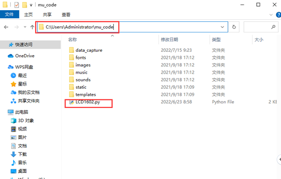

（2）先打开Mu软件并连接micro:bit到电脑，接着点击“文件”按钮，把“LCD1602”库文件到micro:bit中。(若点击“文件”，没有看到库文件，需要先刷入个程序再打开点击“文件”)

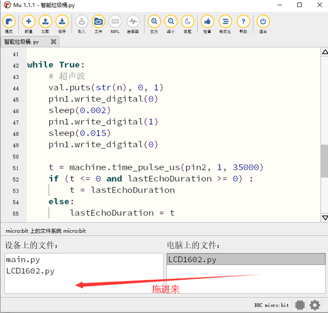

几秒钟后，导入完成。导入成功后，您将在左侧方框中可以看到它。

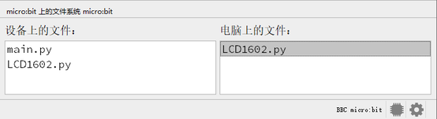

点击检查无其他报错再刷入

实验一结果

如图接好线，利用USB线连接micro:bit主板，代码成功下载到micro：bit主板之后。超声波检测到的距离在LCD1602上显示，当检测到的距离小于15cm时舵机转动到90度（模拟打开垃圾桶）延时5S转动到0度（关闭垃圾桶），大于15cm时转动到0度（关闭垃圾桶）如下所示：

（注意：扩展板使用DC 7~9V的电源供电，V1/V2跳帽插在5V的位置，实验才能正常工作）

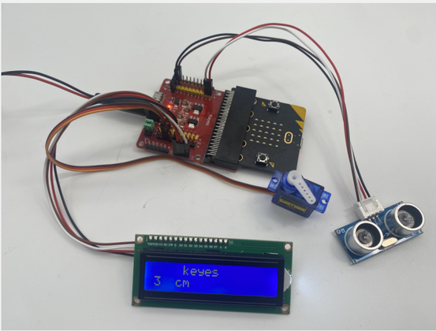

#### 第34课 综合实验

实验说明

在前面我们做了很多实验，每做一个实验，我们都需要重新上传一次代码。那我们可以把多个实验组合在一起吗？可以的，在这一实验中，我们将多个传感器组合实现多功能。

实验器材

|||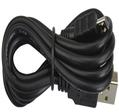|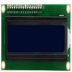||
|-|-|-|-|-|
|micro：bit主板×1|keyes micro bit 传感器V2扩展板|micro USB数据线×1|1602 LCD显示屏模块×1|keyes 4位数码管模块×1|
|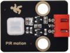|||||
|keyes人体红外传感器模块×1|keyes HC-SR04超声波传感器|舵机×1|声音传感器模块×1|keyes 1302时钟传感器|
|||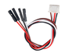|||
|5号AA电池×6|6节5号AA电池盒×1|4P 转杜邦线母×3|5P 转杜邦线母×1|3P 转杜邦线母×2|

实验接线图

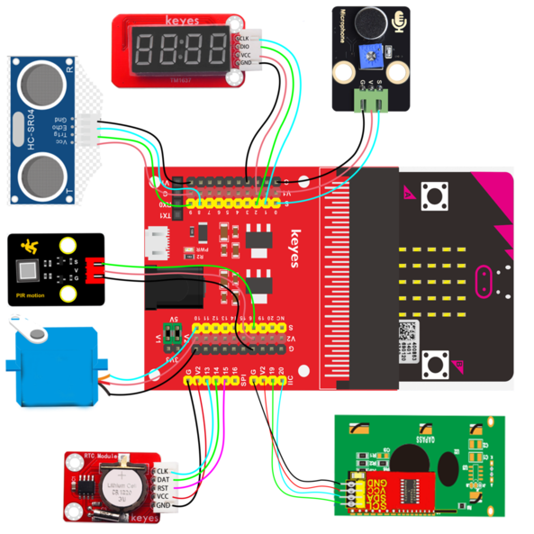

实验代码 

用Mu软件打开“综合实验.py“文件。

你也可以打开Mu软件，在编辑窗口输入代码。（注意！所有英文及符号均须以英文填写，最后一行必须有空格。）

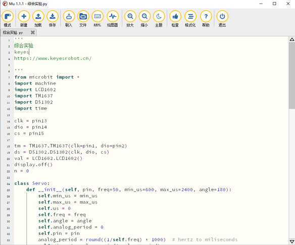

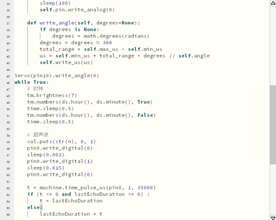

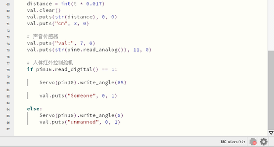

您需要单击“检查”按钮来检查代码是否有错误。如果一行出现光标或下划线，则表明该行的程序有错误。（图中红色框出来的部分可以忽略不管，这是因为MU软件没有识别到存在MicroPython里面集成的函数，实际它是可以正常执行的）

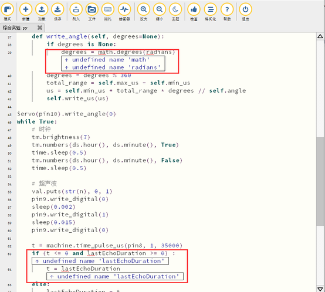

添加库文件

先不要点击“刷入”，因为你还需要做一些额外的工作：导入“TM1637.py“、“LCD1602”和“DS1302”库文件到micro:bit中。这个库文件包含了四位数码管和时钟的控制方法，我们将这些方法集成到一个库文件中，这使得您更容易通过Python代码来使用。这就像MakeCode代码中的扩展库文件一样。

操作

把库文件复制到MU软件的“Mu_code”目录下；

例如，在windows系统中，假设您的系统安装在电脑C驱动器上，则用户名为“Administrator”，那么“mu_code”目录的路径是“C:\Users\Administrator\mu\_
code”。在Linux系统上，“mu_code”目录的路径是“~/home/mu_code”

进入“mu_code”文件夹。

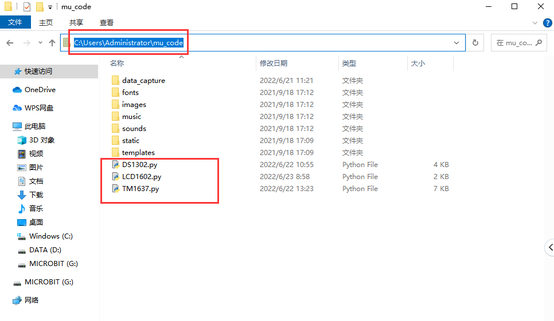

（2）先打开Mu软件并连接micro:bit到电脑，接着点击“文件”按钮，再拖着“TM1637.py“、“LCD1602”和“DS1302”库文件到micro:bit中。(若点击“文件”，没有看到库文件，需要先刷入个程序再打开点击“文件”)

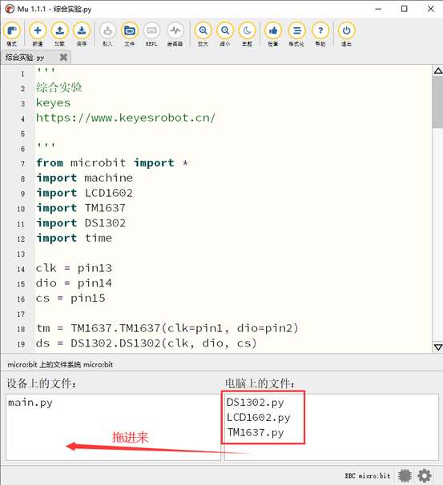

几秒钟后，导入完成。导入成功后，您将在左侧方框中可以看到它。

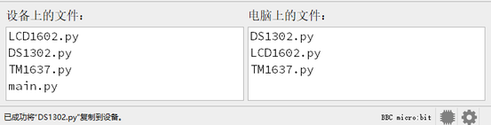

点击检查无其他报错再刷入

实验结果

按照接线图接好线，上传程序，上电后，LCD1602显示屏第一行显示超声波检测的距离和声音传感器检测的当前环境的声音数值。

当人体红外传感器检测到附近有人时LCD1602显示屏第二行显示“Someone”，舵机转到65度；当没有人时显示"unmanned"，舵机转到0度。

（3）四位数码管上显示时间。

（注意：扩展板使用DC 7~9V的电源供电，V1跳帽接到3.3V,V2跳帽插在5V的位置，实验才能正常工作）

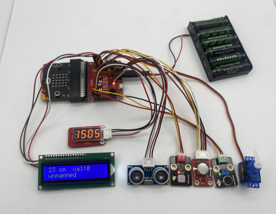
